# Mémo Cocos Creator

*par flashjaysan*

Ce mémo est une tentative de documenter en français les fonctionnalités du logiciel *Cocos Creator* (version 2.4.2). Ce document est par nature incomplet et ne remplace en aucun cas la documentation officielle. Des erreurs ou des imprécisions peuvent également être présentes. Cependant, la [documentation officielle anglaise](https://docs.cocos.com/creator/manual/en/) étant une traduction du chinois vers l'anglais, certaines sections sont difficiles à comprendre et j'espère que ce document aidera les francophones à se familiariser avec Cocos Creator.

**Note générale :** *Cocos Creator* utilise le système de coordonnées classique des mathématiques. L'axe vertical augmente vers le haut.

## Introduction

[Cocos Creator](https://www.cocos.com/en/creator) est un éditeur de jeu vidéo basé sur le moteur [cocos2d-js](https://github.com/cocos2d/cocos2d-js), la version *HTML5*, *JavaScript* et *TypeScript* de [cocos2d-x](https://www.cocos.com/en/cocos2dx). Il est disponible pour *Windows* et *Mac* et permet d'exporter vers le web, *Windows*, *Linux*, *Mac OS*, *iOS*, *Android* et de très nombreux stores.

## Installation

Cocos Creator utilise désormais un gestionnaire de projets appelé *dashboard*. Il permet également de télécharger les différentes versions de Cocos Creator afin de développer un projet sur une version fixe de Cocos Creator (vous pouvez toutefois toujours ouvrir un projet avec une version plus récente afin de convertir le projet pour cette nouvelle version).

### Installation du dashboard Cocos Creator

Rendez vous sur le site officiel de Cocos :

[https://www.cocos.com/](https://www.cocos.com/)

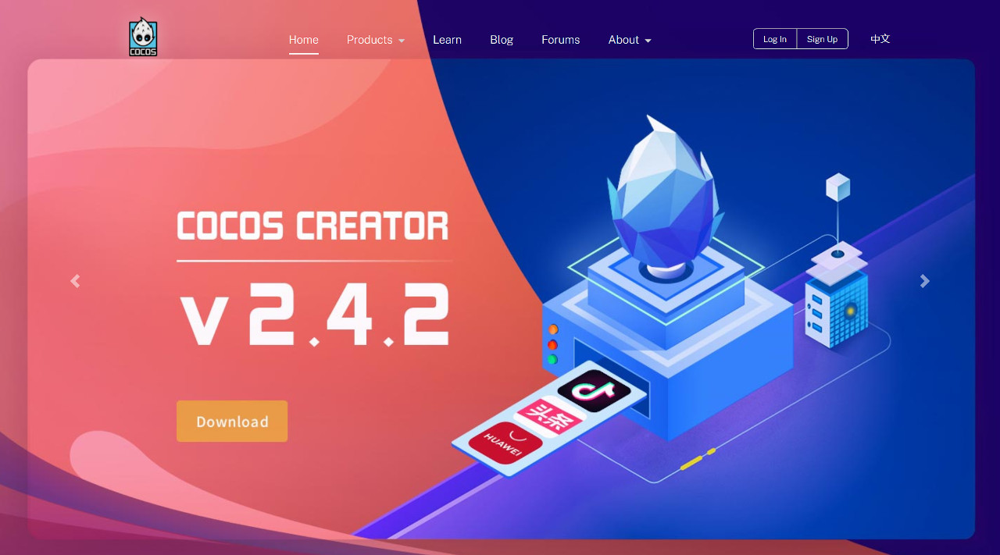

Cliquez sur le bouton `Download` de la section `Cocos Creator` (pas celui de la section `Cocos2d-x`).

Vous arrivez directement sur la page de [téléchargement de Cocos Creator](https://www.cocos.com/en/creator/download).

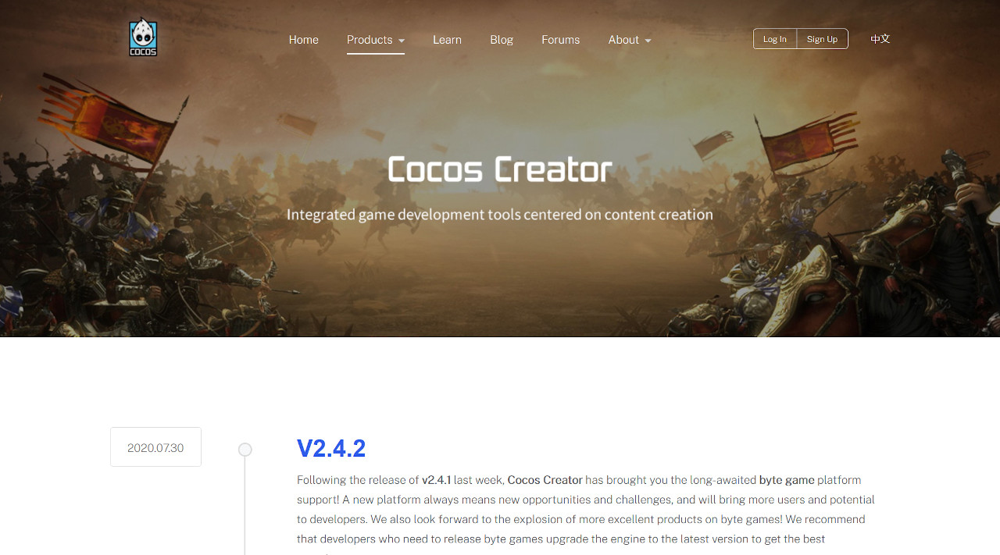

---

**Remarque :** Si vous avez utilisé le menu `Products > Cocos Creator`, vous arrivez sur la page dédiée à [Cocos Creator](https://www.cocos.com/en/creator) :

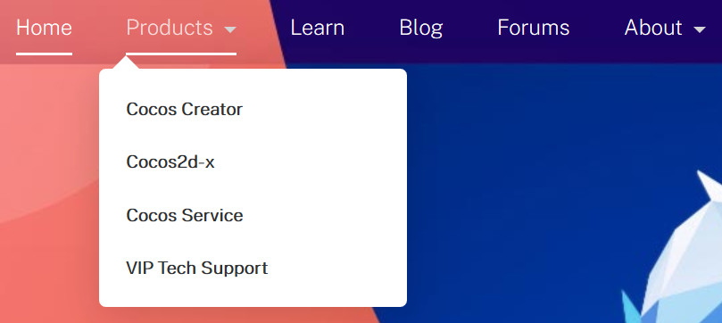


Depuis cette page, pour télécharger le dashboard Cocos Creator, vous devez faire défiler la page et cliquer sur le bouton `Download`.


---

Cliquez sur le bouton `DOWNLOAD DASHBOARD` de n'importe quelle version de Cocos Creator pour téléchargez le dashboard :

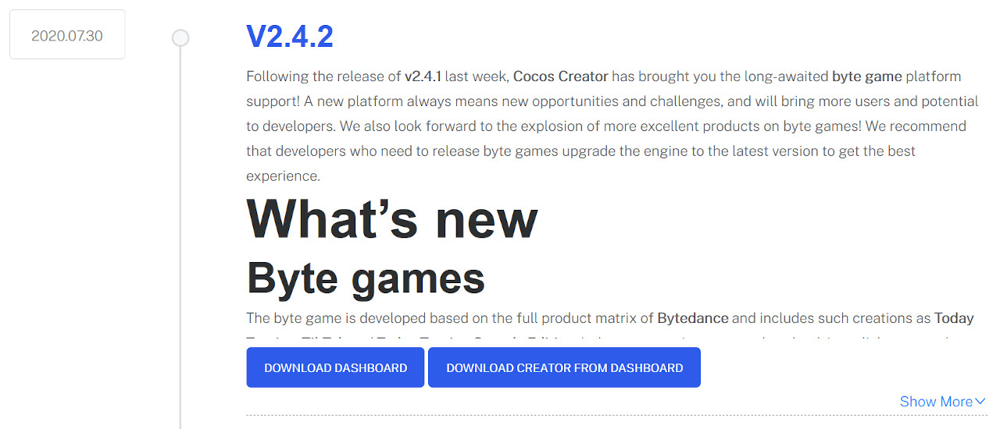

Installez et exécutez le dashboard Cocos Creator. Vous devez créer un compte Cocos Developer et saisir votre identifiant et votre mot de passe dans le dashboard puis cliquer sur le bouton `Sign in`.

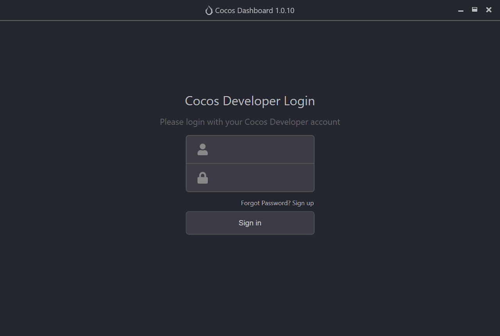

**Remarque :** Si vous ne possédez pas encore de compte Cocos Developer, cliquez sur le texte `Sign up` pour aller sur la page de création de compte. Si vous avez oublié votre mot de passe, cliquez sur le texte `Forgot password?` pour aller sur la page de récupération de mot de passe.


### Configuration de Visual Studio Code

*Cocos Creator* recommande d'utiliser conjointement l'éditeur de code *Visual Studio Code* pour éditer les scripts JavaScript ou TypeScript.

- Téléchargez et installez [Visual Studio Code](https://code.visualstudio.com/).
- Exécutez *Cocos Creator* et ouvrez ou créez n'importe quel projet (voir ci-dessous).
- Cliquez sur le menu `Developer -> VS Code Workflow -> Install VS Code Extension`.

Dans *Visual Studio Code* ouvrez le dossier racine du projet pour accéder à l'ensemble des fichiers.

**Optionnel :** Pour chacun de vos projets, si vous souhaitez avoir l'autocomplétion et le surlignage de syntaxe dans *Visual Studio Code*, cliquez sur le menu `Developer -> VS Code Workflow -> Update VS Code API Source`.

Dans *Visual Studio Code* les extensions `Cocos debug` et `cocos-creator` doivent apparaitre dans les extensions installées. 

## Dashboard

Le *dashboard* est l'écran d'accueil de *Cocos Creator* qui apparait au lancement du programme. Cette fenêtre affiche plusieurs onglets vous permettant de gérer vos projets.

L'onglet `Recent Projects` vous permet d'ouvrir un projet récemment ouvert avec *Cocos Creator* :

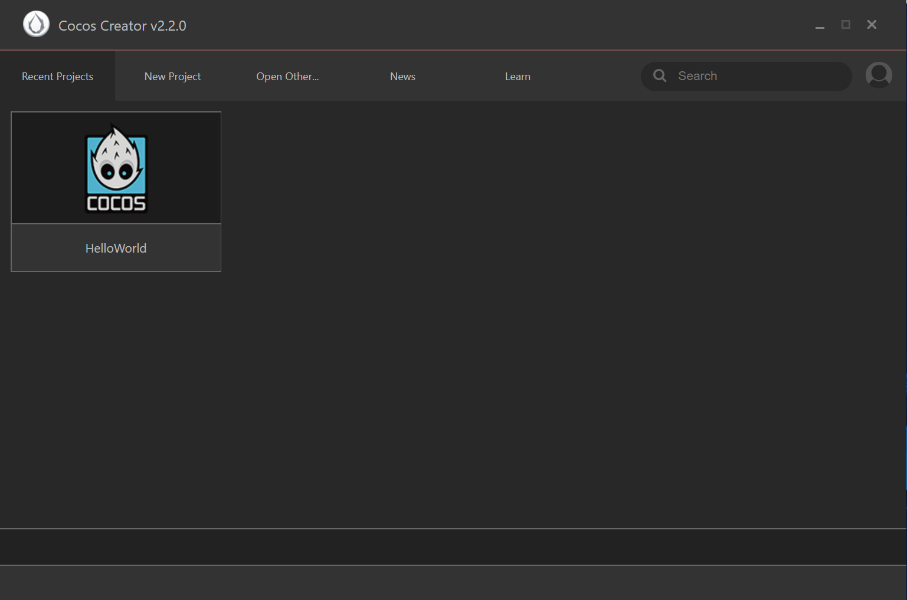

**Remarque :** Si vous n'avez pas de projet récent dans la fenêtre, *Cocos Creator* vous propose de créer un nouveau projet en cliquant sur le bouton `New Project`. Cela affiche l'onglet `New Project`.

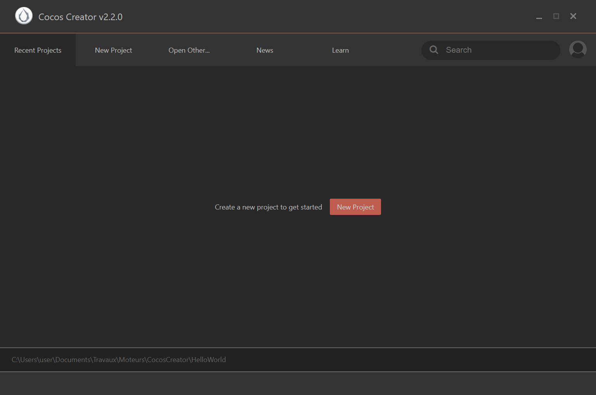

- Lorsque vous pointez sur un des projets de la liste, le chemin du projet s'affiche dans la fenêtre.
- Cliquez sur le bouton `Open` pour ouvrir le projet dans *Cocos Creator*.
- Cliquez sur la croix de fermeture pour supprimer le projet de la liste.


L'onglet `New Project` vous permet de créer un nouveau projet :

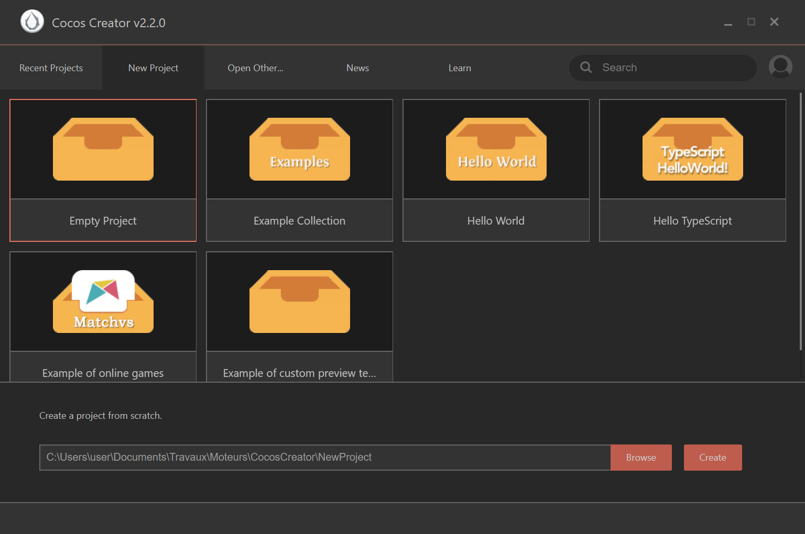

- Cliquez sur un des projets listés dans la fenêtre. Une description succinte s'affiche en bas de la fenêtre.
- Vous pouvez vérifier l'emplacement du projet en bas de la fenêtre. Si cet emplacement ne vous convient pas, cliquez sur le bouton `Browse` pour définir un nouvel emplacement pour votre projet. Notez que le chemin ne peut contenir aucun caractère *espace*.
- Pour créer votre projet, cliquez sur le bouton `Create`.

L'onglet `Open Other` vous permet d'ouvrir un projet stocké sur votre ordinateur (en particulier un projet non présent dans l'onglet `Recent Projects`). Un explorateur de fichier vous demande de sélectionner un dossier contenant un fichier `project.json` :

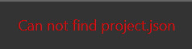

L'onglet `News` vous propose de consulter les dernières nouvelles relatives à *Cocos Creator* :

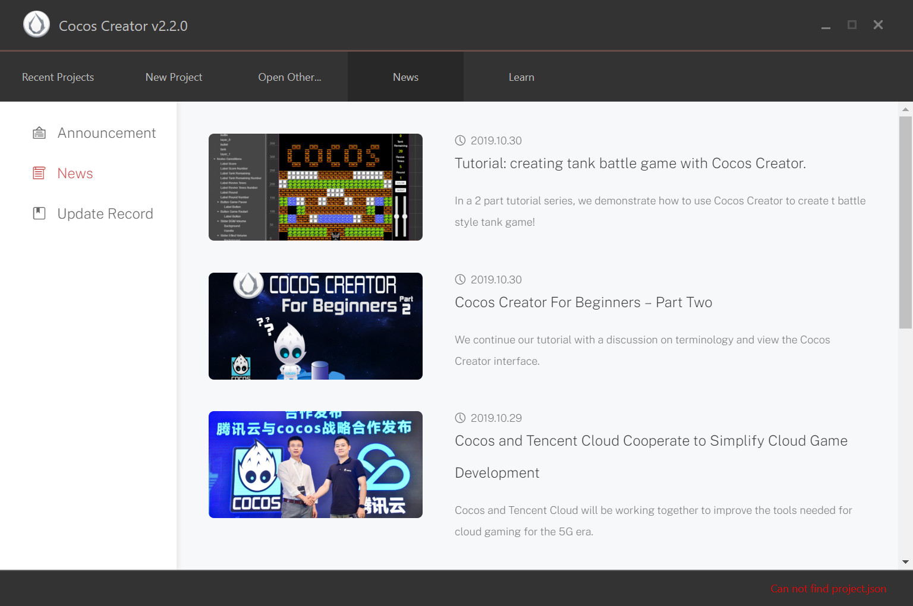

L'onglet `Learn` vous propose d'ouvrir différentes pages d'aides en ligne sur *Cocos Creator* :

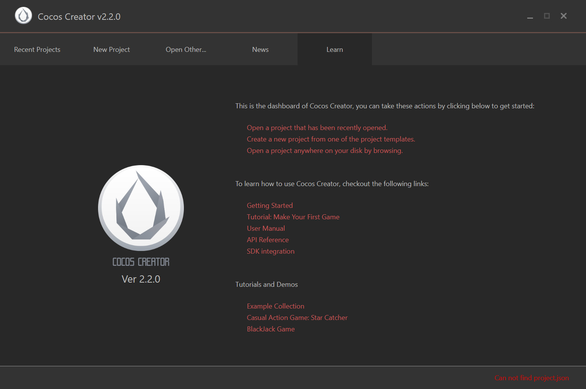

## Editeur

Une fois un nouveau projet créé ou un ancien projet ouvert, *Cocos Creator* charge le projet et affiche l'éditeur :

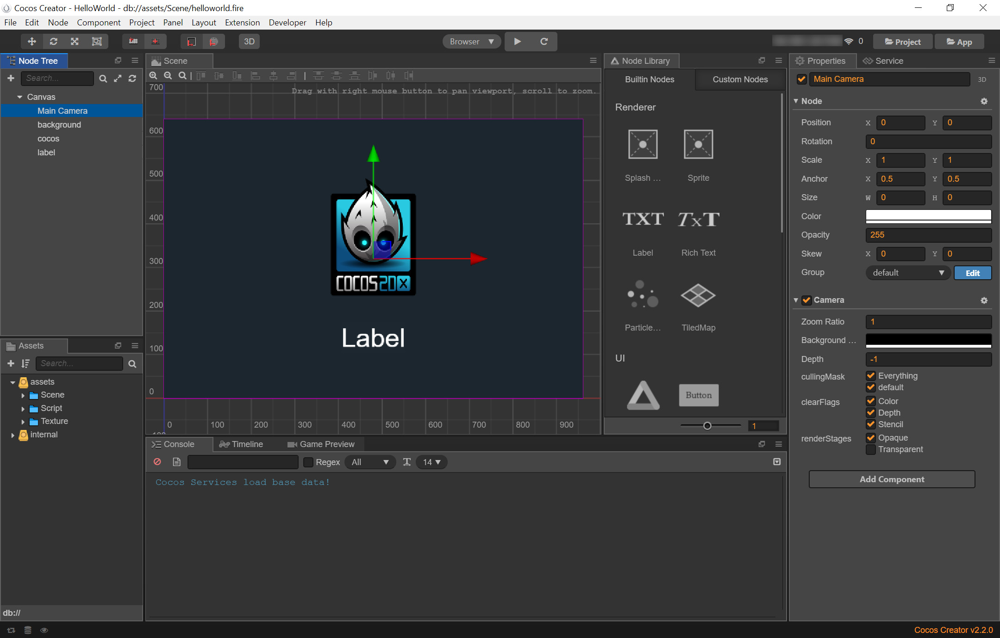

La barre de menus propose les menus suivants :

### Menu File

- Le menu `Open Project` ouvre un projet dans la fenêtre actuelle.
- Le menu `Open Project In New Window` ouvre un projet dans une nouvelle fenêtre indépendante.
- Le menu `Open Recent Items` ouvre un projet parmi une liste de projets récents.
- Le menu `New Scene` (`CTRL+N`) crée une nouvelle scène.
- Le menu `Save Scene` (`CTRL+S`) sauvegarde la scène en cours d'édition.
- Le menu `Import Asset` importe des ressources dans le projet.
- Le menu `Export Asset` exporte des ressources contenues dans le projet.
- Le menu `Settings...` configure *Cocos Creator* en ouvrant une fenêtre *Settings*.
- Le menu `Quit` (`CTRL+Q`) quitte *Cocos Creator*.
- Le menu `Import Project` importe et convertit un projet conçu avec un des ancêtres de *Cocos Creator*.
  - Le sous-menu `Import Cocos Studio Project (*.css)` importe un projet conçu avec *Cocos Studio*.
  - Le sous-menu `Import Cocos Builder Project (*.ccbproj)` importe un projet conçu avec *Cocos Builder*.

#### Fenêtre Settings

Cette fenêtre vous permet de configurer *Cocos Creator*. Elle est constituée de quatre onglets :

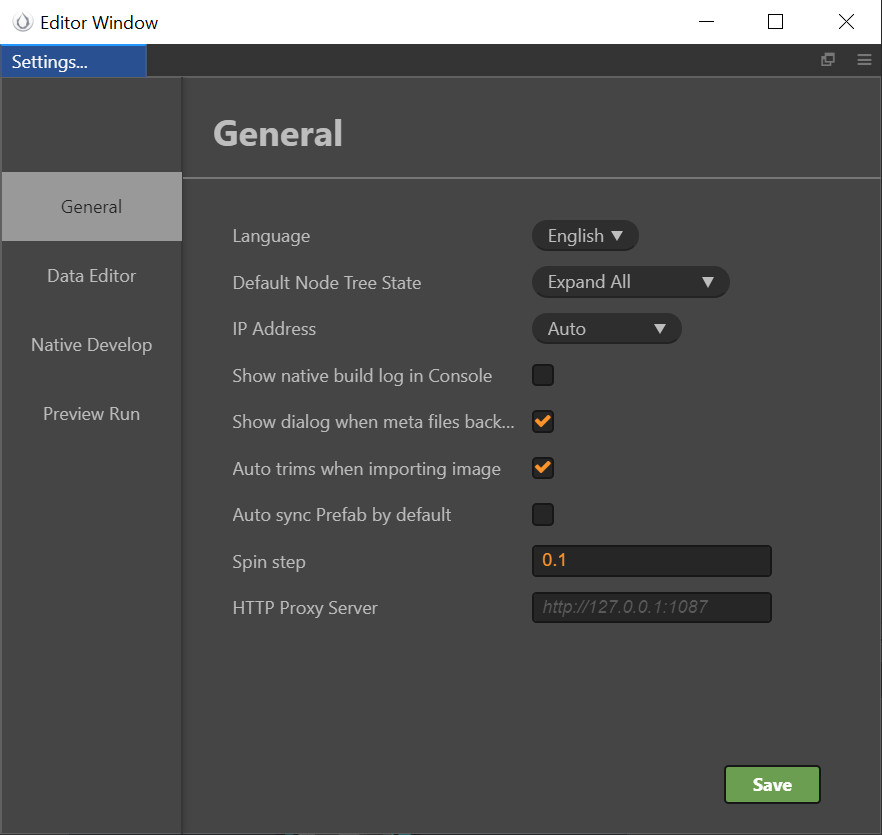

- L'onglet `General` contient les réglages généraux de *Cocos Creator* :
  - L'option `Language` vous permet de régler la langue de l'interface de *Cocos Creator*. `English` (anglais) (par défaut) ou `中文` (chinois).
  - L'option `Default Node Tree State` ????????????. `Expand All` (par défaut), `Collapse All`, `Memory Last State`.
  - L'option `IP Address` vous permet de sélectionner l'adresse *IP* de ?????. `Auto` (par défaut) ou l'adresse actuelle de votre machine.
  - La case `Show native build log in Console` vous permet de ????????????. Décochée par défaut.
  - La case `Show dialog when meta files backed up` vous permet de ???????????. Cochée par défaut.
  - La case `Auto trims when importing image` ????????????????????. Cochée par défaut.
  - La case `Auto sync Prefab by default` ????????????????????????. Décochée par défaut.
  - L'option `Spin step` ????????????????. `0.1` par défaut.
  - L'option `HTTP Proxy Server` vous permet de définir l'adresse IP du serveur proxy HTTP. Vide par défaut.

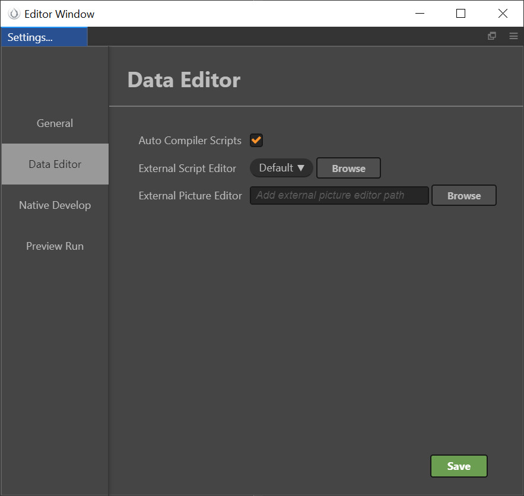

- L'onglet `Data Editor` contient les réglages concernant les éditeurs externes à *Cocos Creator* :
  - La case `Auto Compiler Scripts` ?????????????????. Cochée par défaut.
  - L'option `External Script Editor` vous permet de choisir l'éditeur de code externe à utiliser pour éditer les scripts de *Cocos Creator*. Le bouton `Browse` vous permet de choisir sur votre machine l'éditeur de code de votre choix. `Default` par défaut.
  - L'option `External Picture Editor` vous permet de choisir l'éditeur d'image externe à utiliser pour éditer les images de vos projets. Le bouton `Browse` vous permet de choisir sur votre machine l'éditeur d'image de votre choix. Vide par défaut.

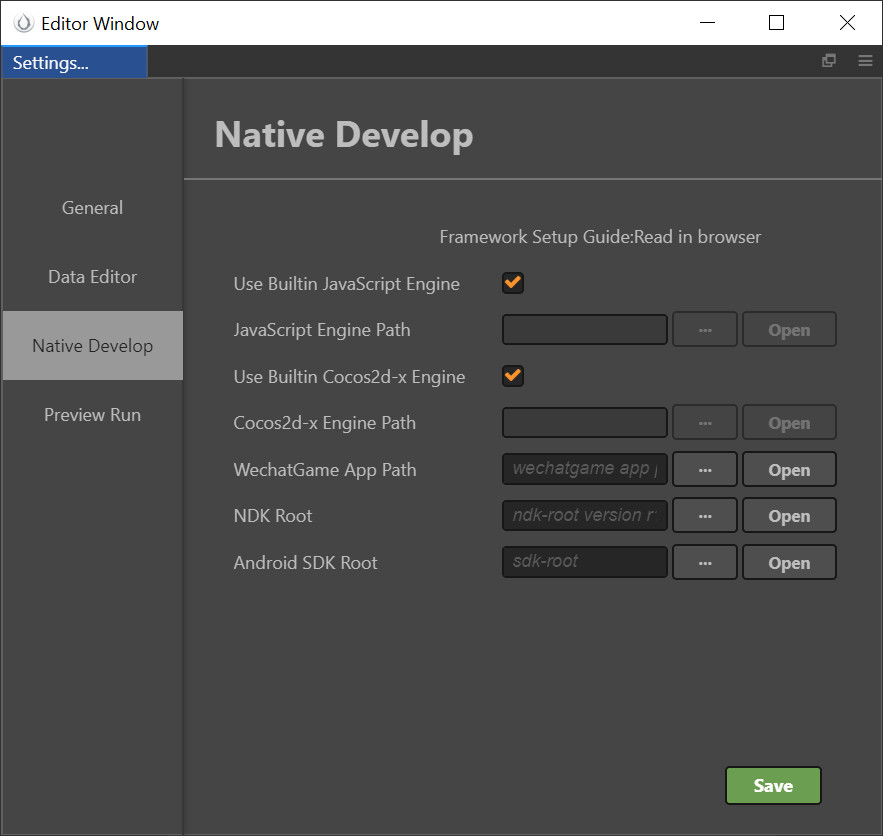

- L'onglet `Native Develop` contient les réglages concernant les moteurs à utiliser dans *Cocos Creator* ainsi que l'emplacement de divers moteurs ou bibliothèques :
  - La case `Use Builtin JavaScript Engine` vous permet de choisir si vous souhaitez utiliser le moteur Cocos2d JavaScript embarqué avec *Cocos Creator*. Cochée par défaut.
  - L'option `JavaScript Engine Path` vous permet de définir le chemin d'un moteur Cocos2d JavaScript personnalisé. Cliquez sur le bouton `...` pour sélectionner l'emplacement du moteur. Cliquez sur le bouton `Open` pour ouvrir un explorateur de fichier à l'emplacement indiqué. Vide par défaut.
  - La case `Use Builtin Cocos2d-x Engine` vous permet de choisir si vous souhaitez utiliser le moteur Cocos2d-x embarqué avec *Cocos Creator*. Cochée par défaut.
  - L'option `Cocos2d-x Engine Path` vous permet de définir le chemin du moteur Cocos2d-x personnalisé. Cliquez sur le bouton `...` pour sélectionner l'emplacement du moteur. Cliquez sur le bouton `Open` pour ouvrir un explorateur de fichier à l'emplacement indiqué. Vide par défaut.
  - L'option `WechatGame App Path` vous permet de définir le chemin de l'application *WechatGame*. Cliquez sur le bouton `...` pour sélectionner l'emplacement de l'application. Cliquez sur le bouton `Open` pour ouvrir un explorateur de fichier à l'emplacement indiqué. Vide par défaut.
  - L'option `NDK Root` vous permet de définir la racine du *NDK Android*. Cliquez sur le bouton `...` pour sélectionner l'emplacement de la bibliothèque. Cliquez sur le bouton `Open` pour ouvrir un explorateur de fichier à l'emplacement indiqué. Vide par défaut.
  - L'option `Android SDK Root` vous permet de définir la racine du *Android SDK*. Cliquez sur le bouton `...` pour sélectionner l'emplacement de la bibliothèque. Cliquez sur le bouton `Open` pour ouvrir un explorateur de fichier à l'emplacement indiqué. Vide par défaut.

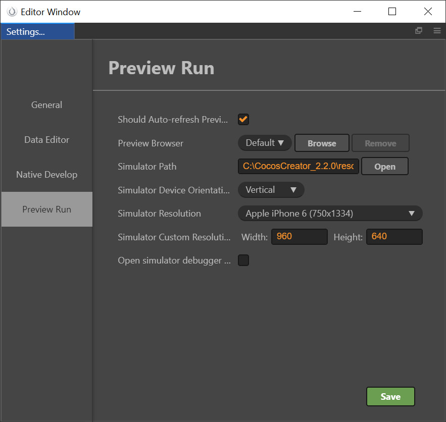

- L'onglet `Preview Run` contient les réglages liés au test de vos projets :
  - La case `Should Auto-refresh Preview?` vous permet de définir si la prévisualisation doit se mettre à jour automatiquement. Cochée par défaut.
  - L'option `Preview Browser` vous permet de définir le navigateur à utiliser pour tester le projet. Cliquez sur le bouton `Browse` pour choisir un navigateur sur votre machine. Cliquez sur le bouton `Remove` pour supprimer le navigateur de la liste. `Default` par défaut.
  - L'option `Simulator Path` indique le chemin du simulateur. Cliquez sur le bouton `Open` pour ouvrir un explorateur de fichiers à l'emplacement indiqué.
  - L'option `Simulator Device Orientation` vous permet de définir l'orientation du simulateur. `Vertical` (par défaut) ou `Horizontal`.
  - L'option `Simulator Resolution` vous permet de choisir une résolution prédéfinie parmi une liste d'appareils populaires ou une résolution personnalisée (`Custom`). Dans ce cas, c'est la résolution définie dans l'option suivante qui est prise en compte.
  - L'option `Simulator Custom Resolution` vous permet de définir la résolution du simulateur.
    - La sous-option `Width` définit la largeur d'écran en pixels du simulateur.
    - La sous-option `Height` définit la hauteur d'écran en pixels du simulateur.
  - La case `Open simulator debugger panel` vous permet de définir si le panneau du débugger du simulateur doit être ouvert ou non. Décochée par défaut.

**Attention !** Pensez à cliquer sur le bouton `Save` avant de fermer la fenêtre.

### Menu Edit

- Le menu `Undo` (`CTRL+Z`) annule la dernière action.
- Le menu `Redo` (`CTRL+MAJ+Z`) rétablit la dernière action annulée.
- Le menu `Copy` (`CTRL+C`) coupe le ou les éléments sélectionnés.
- Le menu `Paste` (`CTRL+V`) colle le ou les éléments copiés. 
- Le menu `Select All` (`CTRL+A`) sélectionne tous les éléments.

### Menu Node

- Le menu `Align With View` (`CTRL+MAJ+F`) ????????????????????????.
- Le menu `Convert to Regular Node` ?????????????????.
- Le menu `Connect Node to Prefab` ?????????????.
- Le menu `Create Empty Node` crée un noeud vide (sans composant). C'est utile pour créer un noeud destiné à contenir d'autres noeuds ou pour ajouter des composants manuellement.
- Le menu `Create Renderer Nodes` propose une liste de noeuds avec un composant graphique :
  - Le sous-menu `Sprite Node` crée un noeud avec un composant `Sprite`.
  - Le sous-menu `Sprite Node (Splash)` crée un noeud avec un composant `Sprite` destiné à un splash screen.
  - Le sous-menu `Node With Label` crée un noeud avec un composant `Label`.
  - Le sous-menu `Node With RichText` crée un noeud avec un composant `RichText`.
  - Le sous-menu `ParticleSystem Node` crée un noeud avec un composant `ParticleSystem`.
  - Le sous-menu `TiledMap Node` crée un noeud avec un composant `TiledMap`.
  - Le sous-menu `TiledTile Node` Crée un noeud avec un composant `TiledTile`.
- Le menu `Create UI Nodes` propose une liste de noeuds avec un composant UI :
  - Le sous-menu `Node With Layout` crée un noeud avec un composant `Layout` et un composant `Sprite`.
  - Le sous-menu `Node With Button` crée un noeud avec un composant `Button`.
  - Le sous-menu `Node With Canvas` crée un noeud avec un composant `Canvas`.
  - Le sous-menu `Node With ScrollView` crée un noeud avec un composant `ScrollView` et un composant `Sprite`.
  - Le sous-menu `Node With Slider` crée un noeud avec un composant `Slider`.
  - Le sous-menu `Node With PageView` crée un noeud avec un composant `PageView`.
  - Le sous-menu `Node With ProgressBar` crée un noeud avec un composant `ProgressBar` et un composant `Sprite`.
  - Le sous-menu `Node With Toggle` crée un noeud avec un composant `Toggle`.
  - Le sous-menu `Node With ToggleContainer` crée un noeud avec un composant `ToggleContainer`.
  - Le sous-menu `Node With ToggleGroup (Legacy)` crée un noeud avec un composant `ToggleGroup`.
  - Le sous-menu `Node With EditBox` crée un noeud avec un composant `EditBox`.
  - Le sous-menu `Node With VideoPlayer` crée un noeud avec un composant `VideoPlayer`.
  - Le sous-menu `Node With WebView` crée un noeud avec un composant `WebView`.
- Le menu `Create 3D Node` propose une liste de noeuds avec un composant `MeshRenderer` :
  - Le sous-menu `Box` crée un noeud avec un composant `MeshRenderer` avec une propriété `Mesh` réglée sur la ressource `box`.
  - Le sous-menu `Capsule` crée un noeud avec un composant `MeshRenderer` avec une propriété `Mesh` réglée sur la ressource `capsule`.
  - Le sous-menu `Cone` crée un noeud avec un composant `MeshRenderer` avec une propriété `Mesh` réglée sur la ressource `cone`.
  - Le sous-menu `Cylinder` crée un noeud avec un composant `MeshRenderer` avec une propriété `Mesh` réglée sur la ressource `cylinder`.
  - Le sous-menu `Plane` crée un noeud avec un composant `MeshRenderer` avec une propriété `Mesh` réglée sur la ressource `plane`.
  - Le sous-menu `Quad` crée un noeud avec un composant `MeshRenderer` avec une propriété `Mesh` réglée sur la ressource `quad`.
  - Le sous-menu `Sphere` crée un noeud avec un composant `MeshRenderer` avec une propriété `Mesh` réglée sur la ressource `sphere`.
  - Le sous-menu `Torus` crée un noeud avec un composant `MeshRenderer` avec une propriété `Mesh` réglée sur la ressource `torus`.
- Le menu `Create Camera` crée un noeud caméra.
- Le menu `Create Light` propose une liste de noeud avec un composant `Light` :
  - Le sous-menu `Directional` crée un noeud avec un composant `Light` avec une propriété `Type` réglée sur `DIRECTIONAL`.
  - Le sous-menu `Spot` crée un noeud avec un composant `Light` avec une propriété `Type` réglée sur `SPOT`.
  - Le sous-menu `Point` crée un noeud avec un composant `Light` avec une propriété `Type` réglée sur `POINT`.
  - Le sous-menu `Ambiant` crée un noeud avec un composant `Light` avec une propriété `Type` réglée sur `AMBIANT`.

**Remarque :** Au moment de leur création, les nouveaux noeuds sont attachés au noeud dernièrement sélectionné dans le panneau `Node Tree`.

### Menu Component

Ce menu vous permet d'ajouter des composants au noeud sélectionné.

- Le menu `Renderer Component` propose d'ajouter des composants graphiques :
  - Le sous-menu `Sprite` ajoute un composant `Sprite` au noeud sélectionné.
  - Le sous-menu `Label` ajoute un composant `Label` au noeud sélectionné.
  - Le sous-menu `Graphics` ajoute un composant `Graphics` au noeud sélectionné.
  - Le sous-menu `Mask` ajoute un composant `Mask` au noeud sélectionné.
  - Le sous-menu `LabelOutline` ajoute un composant `LabelOutline` au noeud sélectionné. Si le noeud n'a pas déjà un composant `Label`, ce dernier est également ajouté.
  - Le sous-menu `LabelShadow` ajoute un composant `LabelShadow` au noeud sélectionné. Si le noeud n'a pas déjà un composant `Label`, ce dernier est également ajouté.
  - Le sous-menu `RichText` ajoute un composant `RichText` au noeud sélectionné.
  - Le sous-menu `Light` ajoute un composant `Light` au noeud sélectionné.
  - Le sous-menu `PaticleSystem` ajoute un composant `PaticleSystem` au noeud sélectionné.
  - Le sous-menu `TiledTile` ajoute un composant `TiledTile` au noeud sélectionné.
  - Le sous-menu `TiledMap` ajoute un composant `TiledMap` au noeud sélectionné.
  - Le sous-menu `Spine Skeleton` ajoute un composant `Sp.Skeleton` au noeud sélectionné.
  - Le sous-menu `DragonBones` ajoute un composant `dragonBones.ArmatureDisplay` au noeud sélectionné.
- Le menu `Mesh Component` ??????????????????????.
  - Le sous-menu `Mesh Renderer` ajoute un composant `Mesh Renderer` au noeud sélectionné.
  - Le sous-menu `Skinned Mesh Renderer` ajoute un composant `Skinned Mesh Renderer` au noeud sélectionné.
- Le menu `UI Component` ??????????????????????????.
  - Le sous-menu `Widget` ajoute un composant `Widget` au noeud sélectionné.
  - Le sous-menu `Canvas` ajoute un composant `Canvas` au noeud sélectionné.
  - Le sous-menu `Button` ajoute un composant `Button` au noeud sélectionné.
  - Le sous-menu `ProgressBar` ajoute un composant `ProgressBar` au noeud sélectionné.
  - Le sous-menu `ScrollBar` ajoute un composant `ScrollBar` au noeud sélectionné.
  - Le sous-menu `ScrollView` ajoute un composant `ScrollView` au noeud sélectionné.
  - Le sous-menu `PageViewIndicator` ajoute un composant `PageViewIndicator` au noeud sélectionné.
  - Le sous-menu `PageView` ajoute un composant `PageView` au noeud sélectionné.
  - Le sous-menu `Slider` ajoute un composant `Slider` au noeud sélectionné.
  - Le sous-menu `Layout` ajoute un composant `Layout` au noeud sélectionné.
  - Le sous-menu `EditBox` ajoute un composant `EditBox` au noeud sélectionné.
  - Le sous-menu `ToggleContainer` ajoute un composant `ToggleContainer` au noeud sélectionné.
  - Le sous-menu `ToggleGroup (Legacy)` ajoute un composant `ToggleGroup` au noeud sélectionné.
  - Le sous-menu `Toggle` ajoute un composant `Toggle` au noeud sélectionné.
  - Le sous-menu `Block Input Events` ajoute un composant `BlockInputEvents` au noeud sélectionné.
  - Le sous-menu `VideoPlayer` ajoute un composant `VideoPlayer` au noeud sélectionné.
  - Le sous-menu `WebView` ajoute un composant `WebView` au noeud sélectionné.
- Le menu `Collider Component` ???????????????????.
  - Le sous-menu `Box Collider` ajoute un composant `Box Collider` au noeud sélectionné.
  - Le sous-menu `Circle Collider` ajoute un composant `Circle Collider` au noeud sélectionné.
  - Le sous-menu `Polygon Collider` ajoute un composant `Polygon Collider` au noeud sélectionné.
- Le menu `Physics Component` ??????????????????????.
  - Le sous-menu `Rigid Body` ajoute un composant `RigidBody` au noeud sélectionné.
  - Le sous-menu `Collider` ?????????????? :
    - Le sous-sous-menu `Chain` ajoute un composant `PhysicsChainCollider` au noeud sélectionné. Si le noeud n'a pas déjà un composant `RigidBody`, ce dernier est également ajouté.
    - Le sous-sous-menu `Circle` ajoute un composant `PhysicsCircleCollider` au noeud sélectionné. Si le noeud n'a pas déjà un composant `RigidBody`, ce dernier est également ajouté.
    - Le sous-sous-menu `Box` ajoute un composant `PhysicsBoxCollider` au noeud sélectionné. Si le noeud n'a pas déjà un composant `RigidBody`, ce dernier est également ajouté.
    - Le sous-sous-menu `Polygon` ajoute un composant `PhysicsPolygonCollider` au noeud sélectionné. Si le noeud n'a pas déjà un composant `RigidBody`, ce dernier est également ajouté.
  - Le sous-menu `Joint` .
    - Le sous-sous-menu `Distance` ajoute un composant `DistanceJoint` au noeud sélectionné. Si le noeud n'a pas déjà un composant `RigidBody`, ce dernier est également ajouté.
    - Le sous-sous-menu `Revolute` ajoute un composant `RevoluteJoint` au noeud sélectionné. Si le noeud n'a pas déjà un composant `RigidBody`, ce dernier est également ajouté.
    - Le sous-sous-menu `Mouse` ajoute un composant `MouseJoint` au noeud sélectionné. Si le noeud n'a pas déjà un composant `RigidBody`, ce dernier est également ajouté.
    - Le sous-sous-menu `Motor` ajoute un composant `MotorJoint` au noeud sélectionné. Si le noeud n'a pas déjà un composant `RigidBody`, ce dernier est également ajouté.
    - Le sous-sous-menu `PrismaticJoint` ajoute un composant `PrismaticJoint` au noeud sélectionné. Si le noeud n'a pas déjà un composant `RigidBody`, ce dernier est également ajouté.
    - Le sous-sous-menu `Weld` ajoute un composant `WeldJoint` au noeud sélectionné. Si le noeud n'a pas déjà un composant `RigidBody`, ce dernier est également ajouté.
    - Le sous-sous-menu `Wheel` ajoute un composant `WheelJoint` au noeud sélectionné. Si le noeud n'a pas déjà un composant `RigidBody`, ce dernier est également ajouté.
    - Le sous-sous-menu `Rope` ajoute un composant `RopeJoint` au noeud sélectionné. Si le noeud n'a pas déjà un composant `RigidBody`, ce dernier est également ajouté.
- Le menu `Other Component` ?????????????.
  - Le sous-menu `WXSubContextView` ajoute un composant `WXSubContextView` au noeud sélectionné.
  - Le sous-menu `SwanSubContextView` ajoute un composant `SwanSubContextView` au noeud sélectionné.
  - Le sous-menu `Camera` ajoute un composant `Camera` au noeud sélectionné.
  - Le sous-menu `AudioSource` ajoute un composant `AudioSource` au noeud sélectionné.
  - Le sous-menu `Animation` ajoute un composant `Animation` au noeud sélectionné.
  - Le sous-menu `MotionStreak` ajoute un composant `MotionStreak` au noeud sélectionné.
  - Le sous-menu `Skeleton Animation` ajoute un composant `Skeleton Animation` au noeud sélectionné.
- Le menu `Custom Component` Propose des composants personnalisés, si vous en avez créés.

**Attention !** Certains composants de la famille `Renderer` ne peuvent exister qu'en un seul exemplaire pour chaque noeud.

### Menu Project

- Le menu `Play On Device` (`CTRL+P`) ????????????????????????????.
- Le menu `Refresh Connected Device` (`CTRL+MAJ+P`) ??????????????????????????????.
- Le menu `Build...` (`CTRL+MAJ+B`) ?????????????????????????????????.
- Le menu `Project Settings...` ???????????????????????????????????.

#### La fenêtre Build

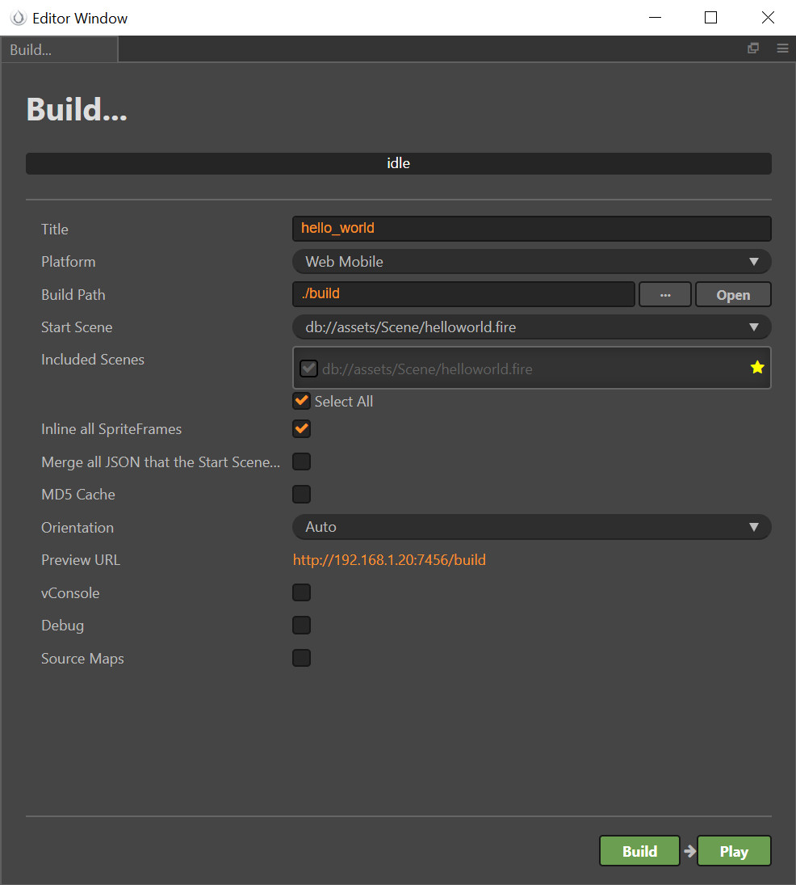

#### La fenêtre Project Settings

Cette fenêtre vous permet de configurer votre projet. Elle est constituée de cinq onglets :

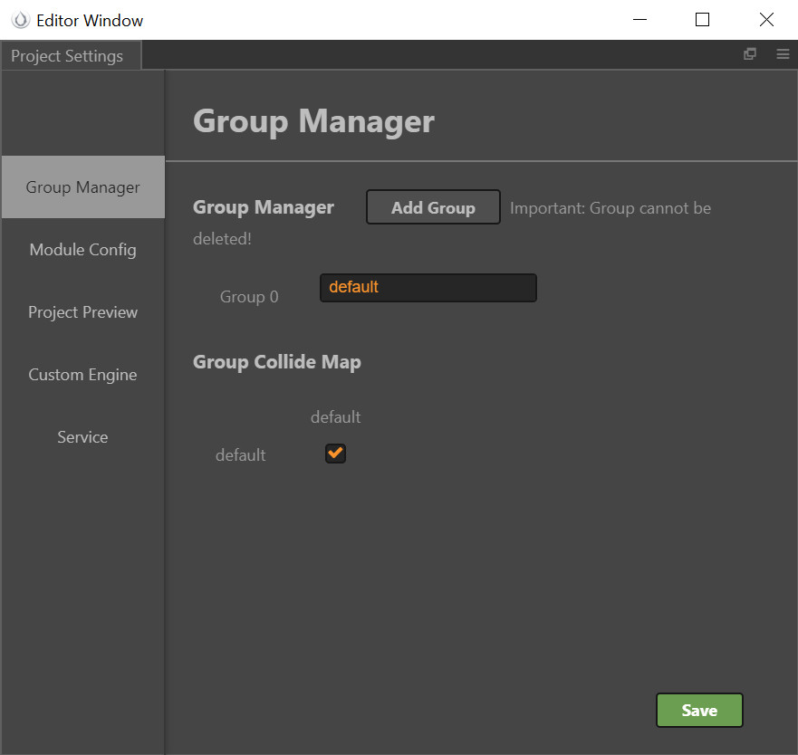

- L'onglet `Group Manager` contient les réglages ???????????? :
  - L'option `????????????` vous permet de ??????????????????????.

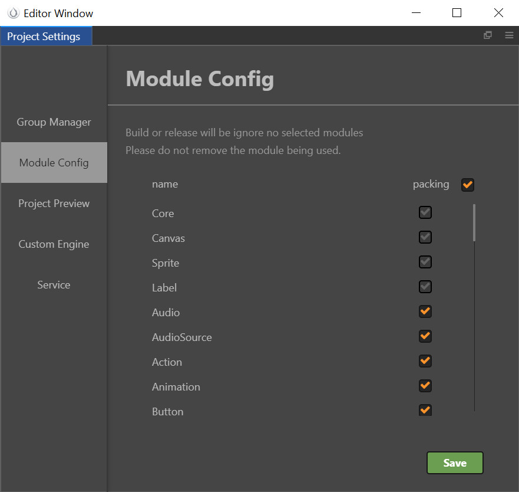

- L'onglet `Module Config` contient les réglages ???????????? :
  - L'option `????????????` vous permet de ??????????????????????.

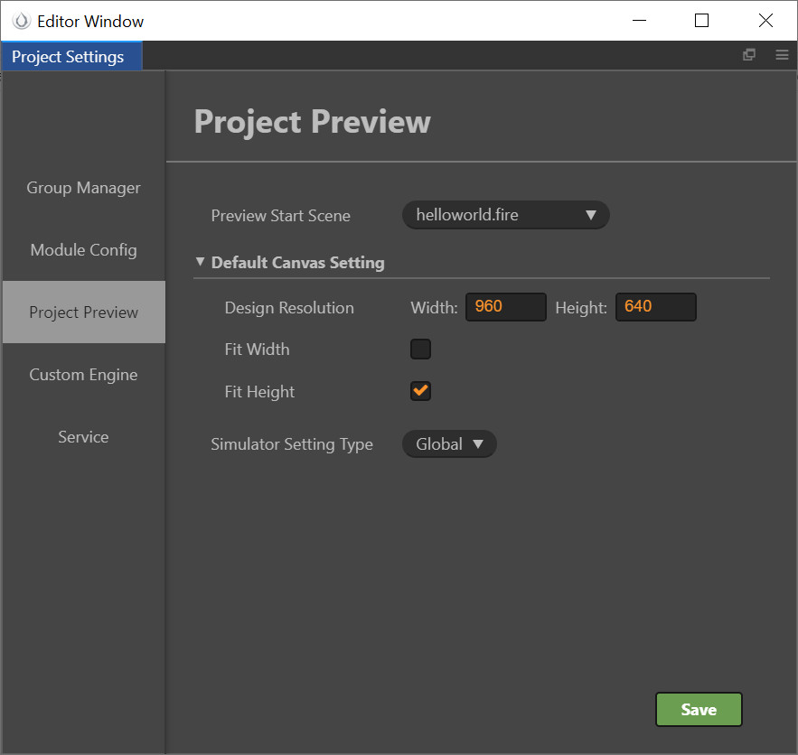

- L'onglet `Project Preview` contient les réglages ???????????? :
  - L'option `????????????` vous permet de ??????????????????????.

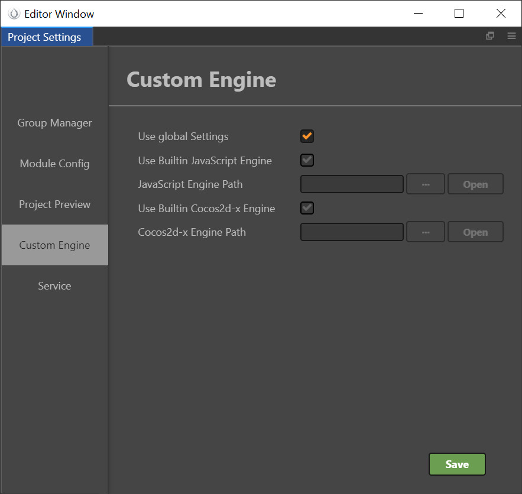

- L'onglet `Custom Engine` contient les réglages ???????????? :
  - L'option `????????????` vous permet de ??????????????????????.

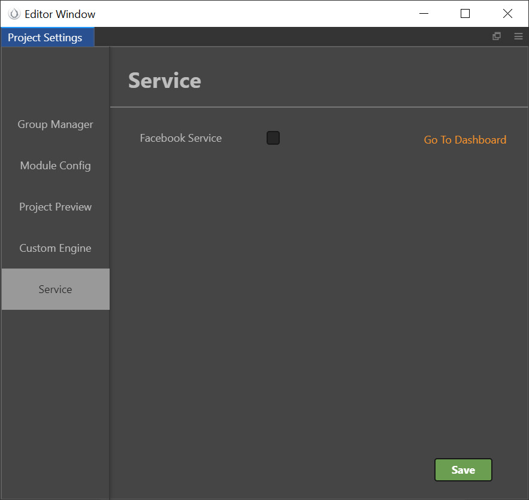

- L'onglet `Service` contient les réglages ???????????? :
  - L'option `????????????` vous permet de ??????????????????????.

### Menu Panel

- Le menu `Assets` (`CTRL+2`) affiche le panneau `Assets` s'il n'est pas déjà visible.
- Le menu `Service` (`CTRL+7`) affiche le panneau `Service` s'il n'est pas déjà visible.
- Le menu `Console` (`CTRL+0`) affiche le panneau `Console` s'il n'est pas déjà visible.
- Le menu `Game Preview` (`CTRL+8`) affiche le panneau `Game Preview` s'il n'est pas déjà visible.
- Le menu `Node Tree` (`CTRL+4`) affiche le panneau `Node Tree` s'il n'est pas déjà visible.
- Le menu `Properties` (`CTRL+3`) affiche le panneau `Properties` s'il n'est pas déjà visible.
- Le menu `Node Library` (`CTRL+5`) affiche le panneau `Node Library` s'il n'est pas déjà visible.
- Le menu `Scene` (`CTRL+1`) affiche le panneau `Scene` s'il n'est pas déjà visible.
- Le menu `Timeline` (`CTRL+6`) affiche le panneau `Timeline` s'il n'est pas déjà visible.

**Remarque :** Les panneaux peuvent s'afficher dans une fenêtre séparée. Cliquez sur leur onglet et faites le glisser dans *Cocos Creator* pour le positionner à votre convenance.

### Menu Layout

Ce menu propose trois dispositions différentes (`Default`, `Portrait` et `Classical`) des panneaux dans la fenêtre de *Cocos Creator*.

### Menu Extension

- Le menu `Create a New Extension...` ????????????????????????????? :
  - Le sous-menu `For all projects (in user profile folder)` ??????????????????????????.
  - Le sous-menu `For current project (in project folder)` ????????????????????????????.
- Le menu `SDKBox` ??????????????????????????.
  - Le sous-menu `Launch` ??????????????????????????.
- Le menu `Extension Store...` ????????????????????????.

### Menu Developer

- Le menu `VS Code Workflow` propose plusieurs options pour configurer l'éditeur de code *Visual Studio Code* :
  - Le sous-menu `Update VS Code API Source` ?????????????????.
  - Le sous-menu `Install VS Code Extension` installe l'extension *Cocos Creator* pour *Visual Studio Code*.
  - Le sous-menu `Add TypeScript Config` ajoute la configuration du langage *TypeScript* à *Visual Studio Code*.
  - Le sous-menu `Add Chrome Debug Setting` ?????????????????.
  - Le sous-menu `Add Compile Task` ajoute une tâche à *Visual Studio Code* pour compiler un projet *Cocos Creator*.
- Le menu `Command Palette` (`CTRL+MAJ+;`) affiche la palette de commandes de *Visual Studio Code*.
- Le menu `Reload` (`CTRL+R`) ??????????????????.
- Le menu `Compile User Scripts` (`F7`) compile les scripts du projet.
- Le menu `Compile Engine` (`CTRL+F7`) compile le moteur.
- Le menu `Inspect Element` (`CTRL+MAJ+C`) ?????????????????????.
- Le menu `Developer Tools` (`ALT+CTRL+I`) ??????????????.
- Le menu `Package Manager` ??????????????????.
- Le menu `UI-Kit Preview Extra` ????????????????????????.
- Le menu `UI-Kit Preview` ?????????????????????????????.
- Le menu `Human Tests` ,?????????????????????????? :
  - Le sous-menu `Test Export Assets` ????????????????????????.

### Menu Help

- Le menu `User Manual` ouvre dans votre navigateur la page du [manuel de l'utilisateur](https://docs.cocos.com/creator/manual/en/) de *Cocos Creator*.
- Le menu `API Reference` ouvre dans votre navigateur la page de l'[API](https://docs.cocos2d-x.org/creator/api/en/) de *Cocos Creator*.
- Le menu `Forum` ouvre dans votre navigateur la page du [forum](https://discuss.cocos2d-x.org/) dédié à *Cocos Creator*.
- Le menu `Release Notes` ouvre dans votre navigateur la page des [notes de mises à jour](https://discuss.cocos2d-x.org/c/announcements) de *Cocos Creator*.
- Le menu `Engine Repository` ouvre dans votre navigateur la [page GitHub](https://github.com/cocos-creator/engine) dédiée à *Cocos Creator*.
- Le menu `About Cocos Creator` ouvre une fenêtre avec des informations succintes à propos de *Cocos Creator*.
- Le menu `Welcome, User` ne fait rien.
- Le menu `Log Out` vous permet de vous déconnecter de *Cocos Creator* et d'afficher la fenêtre pour s'identifier. Cela peut être utile lorsque plusieurs utilisateurs utilisent *Cocos Creator* sur le même ordinateur.

### Barre d'outils

La barre d'outils se trouve au dessus des panneaux sous la barre de menus. Cette zone fournit quelques fonctions utiles.

Les premiers boutons sont détaillés dans la section traitant du *panneau Scene*.

La section centrale de la barre d'outils vous permet d'exécuter votre jeu :

- Le menu déroulant vous propose de choisir de tester votre jeu dans le simulateur embarqué avec *Cocos Creator* (`Simulator`) ou dans le navigateur (`Browser`).
- Le bouton `Run` lance l'exécution de votre jeu dans l'environnement défini dans le menu déroulant précédemment décrit.
- Le bouton `Reload` relance l'exécution de votre jeu.

La section à droite possède plusieurs sections:

- La première zone affiche l'adresse *IP* de votre machine.
- Le bouton `Project` ouvre un explorateur de fichiers à l'emplacement de votre projet.
- Le bouton `App` ouvre un explorateur de fichiers à l'emplacement d'installation de *Cocos Creator*.

### Panneaux

Divers panneaux sont disponibles dans l'éditeur. Cliquez sur le bouton en haut à droite d'un panneau pour le détacher de l'éditeur (`Pop Out`) ou pour le fermer (`Close`).

#### Panneau Assets

Le panneau `Assets` affiche sous forme d'arborescence la liste des ressources contenues dans le projet :

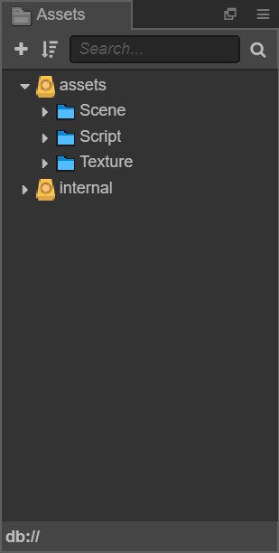

Pour importer une ressource, faites la glisser dans le panneau `Assets`. Une copie de la ressource originale est créée dans le dossier `assets` du projet.

Vous pouvez également placer manuellement la ressource dans le dossier `assets` du projet depuis votre système et Cocos Creator mettra automatiquement à jour le projet. Modifier une ressource dans Cocos Creator ou depuis votre système a le même effet.

Chaque ressource importée est associée à un fichier `.meta` situé dans le dossier `assets` du projet et invisible dans le panneau `Assets` de Cocos Creator. Une ressource possède alors un identifiant unique appelé `UUID`. Une ressource modifiée à l'extérieur de Cocos Creator se voit attribuer un nouveau fichier `.meta`. Les anciens fichiers `.meta` sont automatiquement détectés par Cocos Creator et il vous est proposé de les supprimer ou de les archiver dans un dossier `temp`.

Pour créer une ressource, cliquez sur le bouton `+` du panneau `Assets` ou faites un clic droit dans ce panneau à l'emplacement désiré et sélectionnez `Create`.

- L'option `Folder` crée un nouveau dossier.
- L'option `JavaScript` crée un fichier de script JavaScript (extension `.js`).
- L'option `TypeScript` crée un fichier de script TypeScript (extension `.ts`).
- L'option `Scene` crée un fichier scène (extension `.fire`).
- L'option `Animation Clip` crée un fichier clip d'animation (extension `.anim`).
- L'option `Auto Atlas` crée un fichier atlas automatique (extension `.pac`).
- L'option `Label Atlas` crée un fichier label atlas (extension `.labelatlas`).
- L'option `Material` crée un fichier matériau (extension `.mtl`).
- L'option `Effect` crée un fichier effet (extension `.effect`).
- L'option `Physics Material` crée un fichier métériau physique (extension `.pmtl`).

#### Panneau Node Tree

Le panneau `Node Tree` affiche l'arborescence des noeuds contenus dans la scène en cours d'édition :

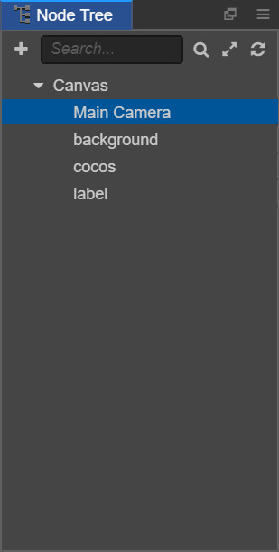

- Cliquez sur le bouton `+` pour ouvrir un menu déroulant offrant les mêmes fonctions que le menu `Node`.
- Une zone de recherche vous permet d'afficher une sélection de noeuds. Utile dans une scène complexe.

#### Panneau Scene

Le panneau `Scene` affiche la scène en cours d'édition :

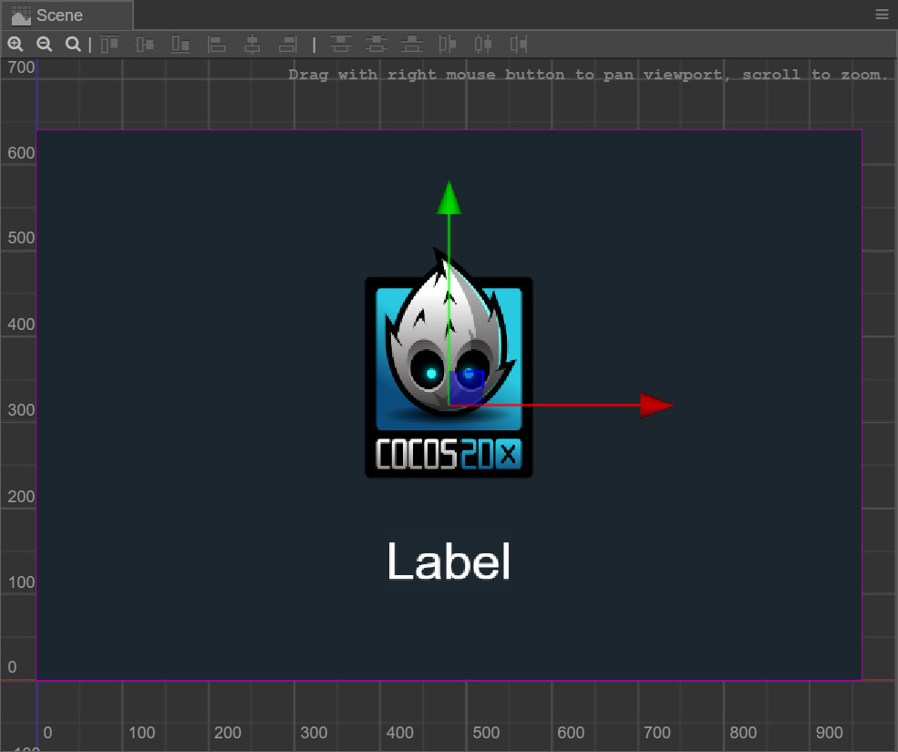

- Utilisez le bouton droit ou le bouton du milieu de la souris pour vous déplacer dans la vue.
- Utiisez la molette de la souris pour contrôler le zoom de la vue.
- Cliquez sur un élément pour le sélectionner.
- Cliquez glissez sur plusieurs éléments pour sélectionner le groupe.

##### Boutons de la barre d'outils liés au panneau Scene

Cliquez sur les boutons de transformation pour modifier les propriétés de transformation des éléments sélectionnés :

- Le bouton `Move` (`W`) affiche un gizmo de déplacement sur les éléments sélectionnés. Cliquez sur une des flèches pour déplacer les éléments sur un seul axe ou cliquez sur le carré central pour les déplacer librement. La propriété `Position` des éléments est modifiée.
- Le bouton `Rotate` (`E`) affiche un gizmo de rotation sur les éléments sélectionnés. Cliquez sur la flèche ou sur le cercle pour modifier l'angle des éléments sélectionnés. La propriété `Rotation` des éléments est modifiée.
- Le bouton `Scale` (`R`) affiche un gizmo de modification d'échelle sur les éléments sélectionnés. Cliquez sur une des flèches pour modifier l'échelle des éléments sur un seul axe ou cliquez sur le carré central pour modifier l'échelle des éléments proportionnellement. La propriété `Scale` des éléments est modifiée.
- Le bouton `Rect` (`T`) affiche un gizmo rectangulaire de transformation sur les éléments sélectionnés. Cliquez sur un des coins ou un des bords du rectangle pour modifier la position et l'echelle des éléments sélectionnés.
- Le bouton `Position the Gizmo at the actual anchor point of a Node` affiche les gizmos sur un point d'ancrage d'un des éléments sélectionnés. Désactive le bouton suivant. Activé par défaut.
- Le bouton `Position the Gizmo at the center of the object's rendered bounds` affiche les gizmos au centre du rectangle englobant les éléments sélectionnés. Désactive le précédent bouton.
- Le bouton `Gizmo's rotation is relative to the Node's` affiche les gizmos avec leurs contrôles tournés selon la rotation des éléments selectionnés. Désactive le bouton suivant. Activé par défaut.
- Le bouton `Gizmo's rotation stay the same as world space orientation` affiche les gizmos avec leurs contrôles toujours alignés sur les axes. Désactive le précédent bouton.
- Le bouton `3D` fait passer la vue en trois dimensions. Utilisez les touches `WASD` et la souris pour vous déplacer dans la vue. Désactivé par défaut. 

#### Panneau Node Library

Le panneau `Node Library` propose une liste de noeuds usuels à réutiliser dans votre projet :

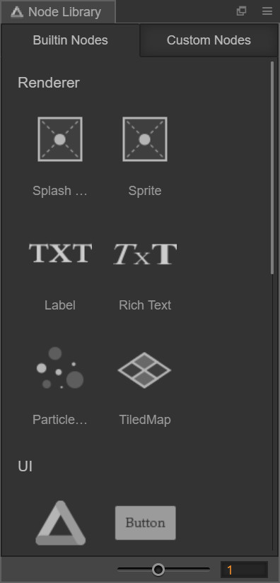

- L'onglet `Builtin Nodes` affiche la liste des noeuds prédéfinis par *Cocos Creator*.
- L'onglet `Custom Nodes` affiche la liste des noeuds personnalisés.

**Remarque :** Les noeuds proposés ne représentent qu'une petite partie des noeuds prédéfinis. Ceux-ci sont décrits dans la section *Menu Node*.

#### Panneau Properties

Le panneau `Properties` affiche la liste des propriétés du noeud sélectionné :

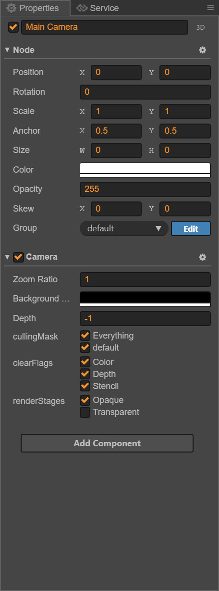

- Pour désactiver un noeud, décochez la case à gauche de son nom. Cochée par défaut.
- Pour renommer un noeud, saisissez son nouveau nom dans le premier champ du panneau.
- Cliquez sur le bouton `3D` pour faire passer les propriétés de transformation en mode *3D*. Des champs supplémentaires apparaissent alors dans le panneau. Désactivé par défaut.
- Chaque section peut être réduite en cliquant sur son nom.

##### Propriétés communes

Un noeud possède toujours au moins une section `Node` qui vous permet d'éditer les propriétés de transformation du noeud :

- Cliquez sur l'icône de roue dentée pour :
  - Réinitialiser le noeud (`Reset Node`).
  - Réinitialiser tous les composants (`Reset All`).
  - Coller un composant copié dans le presse papier dans le noeud (`Paste Component`).
- La propriété `Position` contrôle la position du noeud dans la scène.
  - `X` définit la position en abscisse du noeud. `0` par défaut.
  - `Y` définit la position en ordonnée du noeud. `0` par défaut.
- La propriété `Rotation` contrôle l'angle (en degrés) du noeud dans la scène. Dans *Cocos Creator*, le sens de rotation positif est antihoraire. `0` par défaut.
- La propriété `Scale` contrôle l'échelle du noeud dans la scène.
  - `X` définit l'échelle horizontale du noeud. Une valeur inférieure à `1` indique une taille inférieure à celle d'origine. Une valeur supérieure à `1` indique une taille supérieure à celle d'origine. Une valeur négative retourne le noeud horizontalement. `1` par défaut.
  - `Y` définit l'échelle verticale du noeud. Une valeur inférieure à `1` indique une taille inférieure à celle d'origine. Une valeur supérieure à `1` indique une taille supérieure à celle d'origine. Une valeur négative retourne le noeud verticalement. `1` par défaut.
- La propriété `Anchor` contrôle la position du point d'ancrage (le point d'origine) du noeud relativement à sa taille. Par défaut, le point d'ancrage est positionné au centre du rectangle definissant la taille du noeud. Les champs `X` et `Y` ont la valeur `0.5` par défaut. Pour positionner le point d'ancrage sur le coin inférieur gauche du rectangle, attribuez aux champs `X` et `Y` la valeur `0`. Pour positionner le point d'ancrage sur le coin supérieur droit du rectangle, attribuez aux champs `X` et `Y` la valeur `1`.
  - `X` définit la proportion horizontale du point d'ancrage.`0` désigne la position la plus à gauche du noeud. `1` désigne la position la plus à droite du noeud. `0.5` par défaut.
  - `Y` définit la proportion verticale du point d'ancrage.`0` désigne la position la plus basse du noeud. `1` désigne la position la plus haute du noeud. `0.5` par défaut.
- La propriété `Size` contrôle les dimensions du noeud dans la scène.
  - `W` définit la largeur en pixels du noeud.
  - `H` définit la hauteur en pixels du noeud.
- La propriété `Color` contrôle la teinte du noeud dans la scène. Cliquez sur le rectangle de couleur pour ouvrir un sélecteur de couleur.
- La propriété `Opacity` contrôle l'opacité du noeud dans la scène. La valeur est un entier compris entre `0` et `255`. `0` correspond à un noeud totalement transparent et `255` (par défaut) à un noeud totalement opaque.
- La propriété `Skew` contrôle la déformation du noeud.
  - `X` définit la déviation horizontale du noeud.
  - `Y` définit la déviation verticale du noeud.
- La propriété `Group` contrôle le groupe auquel appartient le noeud.
  - Le menu déroulant vous permet de sélectionner un des groupes existants.
  - Le bouton `Edit` vous permet ???????????????????????.

#### Panneau Console

Le panneau `Console` affiche les messages de la console intégrée à *Cocos Creator* :

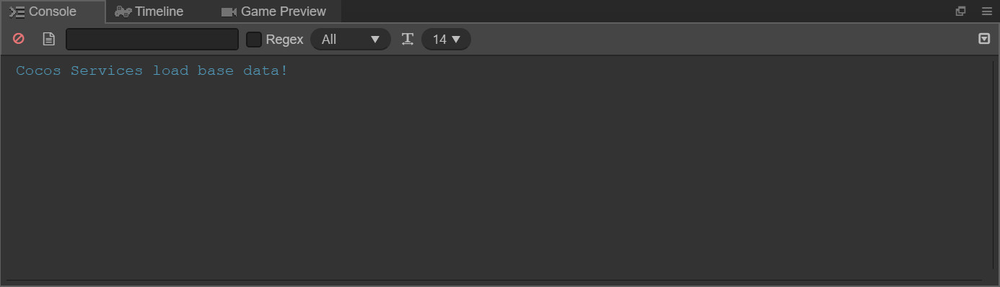

#### Panneau Timeline

Le panneau `Timeline` affiche un éditeur de courbes d'animations :

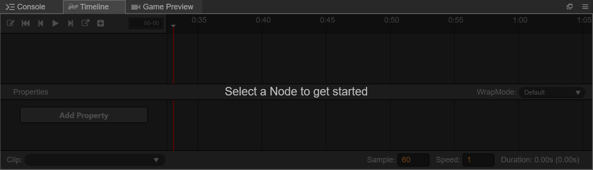

#### Panneau Game Preview

Le panneau `Game Preview` affiche un aperçu d'exécution de la scène en cours d'édition :

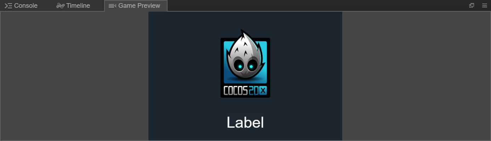

#### Panneau Service

Le panneau `Service` affiche des services proposés par *Cocos Creator* :

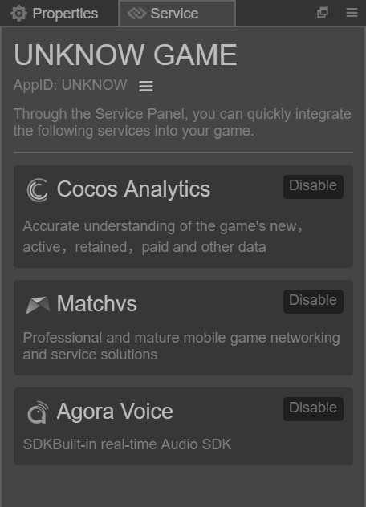

## Structure d'un projet

Un projet est organisé autour de scènes. Ces dernières peuvent être vues comme des écrans de jeu ou des niveaux différents. Une scène porte l'extension `.fire` et elle est représentée par l'icône  dans la vue `Assets`.

Chaque scène est composée d'une arborescence de noeuds d'objets. Cette arborescence est accessible depuis le panneau `Node Tree` lorsque la scène est ouverte dans l'éditeur.

Chaque noeud est constitué de composants divers. Tous les noeuds sont toujours attachés à un noeud parent à l'exception du noeud racine d'une scène. Les propriétés de transformation d'un noeud (visibles dans la section `Node` du panneau `Properties`) sont relatives à celles de son parent.

### Scènes

#### Créer une scène

Pour créer une scène :

- Cliquez sur le menu `File -> New Scene` (`CTRL+N`). Cette méthode ouvre une nouvelle scène dans l'éditeur mais ne crée pas de fichier dans le projet. Pensez à sauvegarder la scène avec le menu `File -> Save Scene` (`CTRL+S`).
- Cliquez sur le bouton `+` dans le panneau `Assets` et sélectionnez l'option `Scene`. Un fichier scène `.fire` est créé à l'emplacement sélectionné ou à la racine du dossier `assets` dans le cas contraire.
- Faites un clic droit dans le panneau `Assets` à l'emplacement de votre choix et sélectionnez l'option `Create -> Scene`. Un fichier scène `.fire` est créé à l'emplacement sélectionné.

#### Ouvrir une scène

Faites un double clic sur le fichier scène `.fire` dans le panneau `Assets`.

**Remarque :** Lorsque vous ouvrez une scène, le panneau `Properties` affiche les propriétés de la scène.

- La case `Auto Release Assets` est cochée par défaut. Lorsque le jeu change de scène, les ressources associées à la scène précédentes sont libérées de la mémoire. Si vous ne souhaitez pas que les ressources soient libérées automatiquement lors d'un changement de scène, décochez la case et cliquez sur le bouton `Apply`.
- La case `Async Load Assets` est décochée par défaut. 

## Les composants

*Cocos Creator* tourne autour du concept de noeuds composés de divers composants. Chaque composant ajoute au noeud des fonctionnalités supplémentaires. Le principe de création d'un jeu dans *Cocos Creator* consiste donc à attacher les bons composants à une arborescence de noeuds dans une scène et à contrôler ces derniers avec des scripts.

### Renderer Components

#### Sprite

- La propriété `Atlas` vous permet d'attribuer un atlas au sprite. Faites glisser l'atlas de votre choix depuis le panneau `Assets` vers la propriété. Le bouton `Select In Atlas` ouvre une fenêtre qui vous permet de sélectionner une des images de l'atlas en tant que texture pour le sprite.
- La propriété `Sprite Frame` vous permet d'attribuer une texture au sprite. Faites glisser la texture de votre choix depuis le panneau `Assets` vers la propriété. Le bouton `Edit` ouvre l'éditeur d'image défini dans les réglages de *Cocos Creator*.
- La propriété `Type` ??????????????????????. `SIMPLE`, `SLICED`, `TILED`, `FILLED`, `MESH`.
- La propriété `Size Mode` ?????????????????????. `CUSTOM`, `TRIMMED`, `RAW`.
- La case `Trim` réduit le rectangle englobant de l'image aux pixels visibles. Cochée par défaut.
- La section `Blend` ?????????????????? :
  - La propriété `Src Blend Factor` ??????????????????.
  - La propriété `Dst Blend Factor` ??????????????????????.
- La propriété `Materials` vous permet de sélectionner un index (un nombre entier) désignant un matériau  :
  - La sous-propriété `Materials` vous permet d'attribuer un fichier matériau au sprite. Faites glisser le matériau de votre choix depuis le panneau `Assets` vers la propriété.

#### Label

#### Graphics

#### Mask

#### LabelOutline

#### LabelShadow

#### RichText

#### Light

#### ParticleSystem

#### TiledTile

#### TiledMap

#### Spine Skeleton

#### Dragonbones

### Mesh Components

#### MeshRenderer

#### Skinned Mesh Renderer

### UI Components

#### Widget

#### Canvas

#### Button

#### ProgressBar

#### ScrollBar

#### ScrollView

#### PageViewIndicator

#### PageView

#### Slider

#### Layout

#### EditBox

#### ToggleContainer

#### ToggleGroup (Legacy)

#### Toggle

#### BlockInputEvents

#### VideoPlayer

#### WebView

### Collider Components

#### Box Collider

#### Circle Collider

#### Polygon Collider

### Physics Components

#### Rigid Body

#### Collider

##### Chain

##### Circle

##### Box

##### Polygon

#### Joint

##### Distance

##### Revolute

##### Mouse

##### Motor

##### PrismaticJoint

##### Weld

##### Wheel

##### Rope

### Other Components

#### WXSubContextView

#### SwanSubContextView

#### Camera

#### AudioSource

#### Animation

#### MotionStreak

#### Skeleton Animation

### Custom Components

## Scripts

Un fichier script est un composant qui étend la classe `cc.Component`.

Vous devez attacher un composant à un noeud pour lui donner un comportement. Créez un fichier JavaScript puis sélectionnez le noeud de votre choix. Dans le panneau `Properties`, cliquez sur le bouton `Add Component`, et choisissez le fichier script dans la section `Custom Component`.

## Afficher du texte dans la console de Cocos Creator

La fonction `cc.log` affiche ses paramètres dans la console de Cocos Creator.

## Fonctions de rappel

Cocos propose trois méthodes essentielles. 

- La méthode `onLoad` sert à charger les ressources nécessaires au noeud.
- La méthode `start` sert à définir les comportements du noeud au démarrage.
- La méthode `update` sert à définir les comportements du noeud dans la boucle de jeu.

## Accéder aux propriétés du noeud

La propriété `this.node` permet d'accéder aux propriétés du noeud.

- `this.node.x` représente la position `x` du noeud relativement à son parent.
- `this.node.y` représente la position `y` du noeud relativement à son parent.

## Accéder au clavier

Pour les événements liés à l'appui de touches du clavier, placez l'appel `cc.systemEvent.on(cc.SystemEvent.EventType.KEY_DOWN, this.onKeyDown, this);` dans la méthode `onLoad`. `this.onKeyDown` est la méthode qui sera appelée lorsqu'un événement `KEY_DOWN` se déclenchera.

Pour les événements liés au relâchement de touches du clavier, placez l'appel `cc.systemEvent.on(cc.SystemEvent.EventType.KEY_UP, this.onKeyUp, this);` dans la méthode `onLoad`. `this.onKeyUp` est la méthode qui sera appelée lorsqu'un événement `KEY_UP` se déclenchera.

```js
onLoad() {
  cc.systemEvent.on(cc.SystemEvent.EventType.KEY_DOWN, this.onKeyDown, this);
}

onKeyDown(event) {
  cc.log("Key pressed: " + event.keyCode);
}

onKeyUp(event) {
  cc.log("Key released: " + event.keyCode);
}
```

Le paramètre `e` est du type `cc.SystemEvent.EventCustom`.

Vous pouvez utiliser une `Map` pour stocker l'état des touches.

```js
public keys = new Map(); // TS type : Map<number, boolean>

onKeyDown(event) {
  this.keys.set(event.keyCode, true);
  cc.log("Key pressed: " + event.keyCode);
}

onKeyUp(event) {
  this.keys.delete(event.keyCode);
  cc.log("Key released: " + event.keyCode);
}
```

Cocos fournit les constantes liées au clavier dans l'énumération `cc.macro.KEY`.

## Accéder à la souris

Pour les événements liés à l'appui de touches du clavier, placez l'appel `this.node.on(cc.Node.EventType.MOUSE_DOWN, this.onMouseDown, this);` dans la méthode `onLoad`. `this.onMouseDown` est la méthode qui sera appelée lorsqu'un événement `KEY_DOWN` se déclenchera.

Pour les événements liés au relâchement de touches du clavier, placez l'appel `cc.systemEvent.on(cc.SystemEvent.EventType.KEY_UP, this.onKeyUp, this);` dans la méthode `onLoad`. `this.onKeyUp` est la méthode qui sera appelée lorsqu'un événement `KEY_UP` se déclenchera.

Les événements suivants sont disponibles pour la souris :

- `MOUSE_DOWN`
- `MOUSE_ENTER`
- `MOUSE_LEAVE`
- `MOUSE_MOVE`
- `MOUSE_UP`
- `MOUSE_WHEEL`

```js
onLoad() {
  this.node.on(cc.Node.EventType.MOUSE_DOWN, this.onMouseDown, this);
  this.node.on(cc.Node.EventType.MOUSE_UP, this.onMouseUp, this);
}

onMouseDown(event) {
  cc.log("Key pressed: " + event.keyCode);
}

onMouseUp(event) {
  cc.log("Key released: " + event.keyCode);
}
```

La souris n'interagit qu'avec le noeud qui a défini ces comportements. Cliquer ailleurs dans la fenêtre ne déclenchera pas d'événement.
