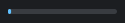
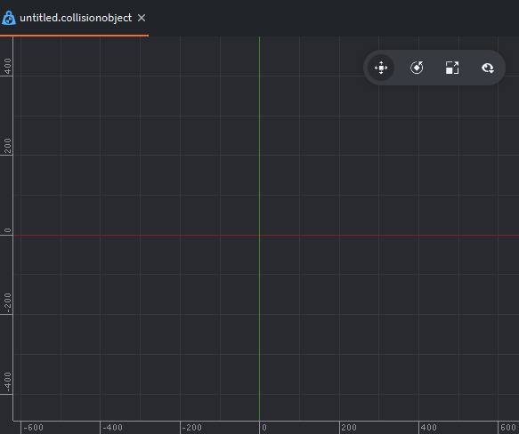
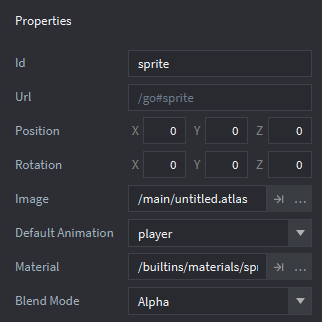
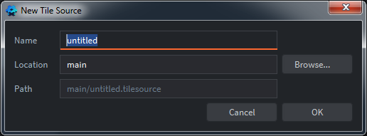
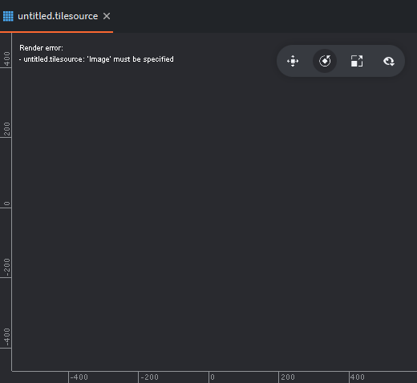

# Mémo Defold

*par flashjaysan*

Licence Creative Commons : Cette œuvre est mise à disposition selon les termes de la Licence Creative Commons Attribution - Pas d’Utilisation Commerciale 4.0 Internationale.


## Introduction

*Defold* est un logiciel gratuit (mais non open source) pour créer des jeux vidéos. La société *King* (*Candy Crush*) développe et utilise ce moteur pour créer certains de ses jeux et le fournit au public gratuitement, sans licence ni contrepartie. Les jeux créés avec *Defold* sont programmés en *Lua*, un langage de script facile à apprendre et puissant. Vous pouvez exporter vos jeux sur les plateformes *Windows*, *Mac OS X*, *Linux*, *Android*, *iOS* et *HTML*. Vous pouvez stocker vos projets sur le cloud dédié de *Defold* (ou un cloud compatible avec *Git*) et les partager avec d'autres membres de votre équipe ou, si vous préférez, sur votre propre ordinateur.

**Attention !** *Defold* nécessite de posséder un compte *Google*. Vous devrez en outre être connecté à *Internet* pour créer vos premiers projets (basés sur des modèles en ligne).

## Télécharger et installer Defold

Visitez le site de [Defold](https://www.defold.com/) et cliquez sur la section `Get Defold` :


Pour télécharger *Defold*, vous devez vous identifier avec un compte *Google* :


Une fois connecté, cliquez sur la section `Dashboard` :


Téléchargez la dernière version de *Defold* correspondante à votre système en cliquant sur le bouton `Download editor` :


- Sur *Windows*, décompressez l'intégralité du contenu du fichier téléchargé à l'emplacement de votre choix puis exécutez le fichier `Defold.exe`.
- Sur *Mac OS X*, montez le fichier téléchargé et faites glisser l'application `Defold` dans le dossier `Applications` puis lancez-la.
- Sur *Linux*, décompressez l'intégralité du contenu du fichier téléchargé à l'emplacement de votre choix puis exécutez le fichier `./Defold`.

## Mettre à jour Defold

Au démarrage de *Defold*, si une nouvelle version est disponible, le texte `Update Available` apparaît :


Cliquez dessus pour afficher la boîte de dialogue `Update Available` :


Cliquez alors sur le bouton `Download` pour télécharger et mettre à jour *Defold* ou sur le bouton `Not Now` pour annuler la procédure.

Si vous effectuez une mise à jour de *Defold*, une barre de chargement apparaît pour indiquer l'état d'avancement du téléchargement :



**Attention !** Le téléchargement d'une mise à jour est assez long.

**Remarque :** Vous pouvez continuer à utiliser *Defold* pendant le téléchargement de la mise à jour. Une barre de progression apparaît en bas de l'éditeur :
 


Lorsque le téléchargement est terminé, le texte `Restart to Update` s'affiche :


Cliquez dessus pour afficher la boîte de dialogue `Please Confirm` :


Cliquez alors sur le bouton `OK` pour redémarrer *Defold* et installer la mise à jour automatiquement ou sur le bouton `Cancel` pour annuler la procédure.

## Création et ouverture de projets

Lorsque vous démarrez *Defold*, l'écran de création et de sélection de projet s'affiche :


Sur la gauche, il y a trois options :
- Home (par défaut)
- New Project
- Import Project

### Home 

Si vous venez d'installer *Defold*, cette section est vide (voir image précédente). Cliquez sur le texte `Create New Project` pour créer un nouveau projet. La section `New Project` (voir section suivante) s'affiche alors. Par la suite, la section `Home` affichera la liste de vos projets déjà ouverts dans *Defold* et stockés sur votre ordinateur. Sélectionnez alors un des projets de la liste puis cliquez sur le bouton `Open Selected` pour ouvrir le projet dans l'éditeur.


#### Ouvrir un projet stocké localement

Le bouton `Open From Disk…` présent dans les deux cas de figure vous permet d'ouvrir un projet *Defold* situé sur votre ordinateur. Une boîte de dialogue s'ouvre alors et vous demande de sélectionner un fichier `game.project` associé à un projet.

### New Project

Cette section sert à créer de nouveaux projets.


**Attention !** Vous devez obligatoirement être connecté à *Internet* pour créer un nouveau projet depuis *Defold* car il se base sur des modèles stockés en ligne. 

Cliquez sur l'un des trois onglets :
- From Template (par défaut)
- From Tutorial
- From Sample

**Conseil :** Si vous voulez créer un nouveau projet sans connexion *Internet*, créez des modèles de projets lorsque vous êtes connecté et sauvegardez-les sur votre ordinateur. Vous n'aurez plus qu'à les copier et à ouvrir ces copies de projets dans *Defold*. Une autre possibilté est de vous rendre sur le site [*GitHub* de *Defold*](https://github.com/defold) et de télécharger un des projets `template` puis de l'ouvrir dans *Defold* avec l'option `Open From Disk...`.

**Remarque :** N'oubliez pas de choisir un nom de projet et de définir son emplacement sur votre ordinateur en bas de la fenêtre de *Defold*.

#### From Template

Cette option crée un nouveau projet à partir de modèles pré-existants (voir image précédente). Cliquez sur l'une des options proposées :
- **Empty project :** Cette option crée un projet vide générique. Vous devez tout paramétrer vous-même.
- **Mobile game :** Cette option crée un projet adapté aux smartphones ou aux tablettes.
- **Desktop game :** Cette option crée un projet adapté aux ordinateurs de bureau classiques.
- **Basic 3D project :** Cette option crée un projet de jeu en 3D.

#### From Tutorial

Cette option crée un projet destiné à apprendre à utiliser *Defold*. Chaque projet vous apprend une technique différente. Choisissez un des projets proposés et suivez les instructions (en anglais) contenues dans le fichier `README.md` situé dans la vue `Assets` (voir section **Editeur** plus loin).


#### From Sample

Cette option crée un projet à partir de projets exemples divers. Choisissez un des projets proposés et examinez les différents éléments les constituants pour étudier leur structure.


**Remarque :** N'oubliez pas de choisir un nom de projet et de définir son emplacement sur votre ordinateur en bas de la fenêtre de *Defold*.

### Import Project

Cette section est utilisée pour importer un de vos projets stockés en ligne (par défaut sur le cloud de *Defold* mais vous pouvez paramétrer un autre cloud *Git*). Ces projets peuvent être partagés avec d'autres personnes.


**Attention !** Vous devez vous connecter à *Defold* avec votre compte *Google* pour utiliser cette option. Celle-ci vous permet de télécharger un des projets stockés en ligne et de travailler localement dessus. C'est utile si vous travaillez à plusieurs sur le projet ou si vous utilisez plusieurs machines pour développer votre jeu. Cliquez sur le bouton `Sign in with Google` pour vous connecter ou sur le texte `Create Account` pour créer un nouveau compte. Une fois connecté, *Defold* affiche la liste des projets stockés en ligne. Sélectionnez alors un des projets de la liste puis cliquez sur le bouton `Import Project` pour télécharger et ouvrir le projet dans l'éditeur.


**Remarque :** N'oubliez pas de choisir un emplacement sur votre ordinateur en bas de la fenêtre de *Defold*.

## Editeur

Une fois un projet ouvert, vous vous retrouvez devant la fenêtre de l'éditeur. Elle se compose de nombreuses sections :


**Remarque :** Le système de coordonnées de *Defold* est le même qu'en mathématiques. L'axe *Y* augmente vers le haut.

### Vue Assets

Cette vue liste les fichiers ressources importés, les collections et les fichiers ressources créés dans *Defold* et utilisés dans votre projet.


  - Faites un clic droit pour créer des dossiers (`New Folder`) ou des éléments (`New` puis un des nombreux choix) utiles à votre jeu.
  - Vous pouvez couper (`Cut`), copier (`Copy`), coller (`Paste`), effacer (`Delete`) ou renommer (`Rename…`) des fichiers.
  - Vous pouvez afficher un dossier dans l'explorateur de votre système (`Show In Desktop`).
  - Double cliquez sur un fichier pour l'ouvrir dans l'éditeur (pour les fichiers créés par *Defold*) ou un programme externe (pour les fichiers importés).
  - Cliquez sur la flèche à gauche d'un nom de dossier pour le déplier ou le replier.
  - Faites glisser des fichiers externes depuis votre système dans cette vue pour les importer (ils sont copiés) dans votre projet.
  - Déplacez des fichiers dans la liste à un autre emplacement pour réorganiser votre projet.
  
**Attention !** Le dossier `builtins` est en lecture seule. Vous ne pouvez pas éditer les fichiers qui s'y trouvent. Vous pouvez toutefois les copier dans un autre emplacement pour vous en servir de modèles.

### Vue Changed Files

Cette vue affiche les fichiers qui ont changé depuis la dernière synchronisation avec les fichiers stockés en ligne. En synchronisant le projet régulièrement, vous pouvez garder votre copie locale à jour avec ce qui est stocké sur le *repository Git* du projet. De cette façon, vous pouvez collaborer avec une équipe et vous ne perdrez pas votre travail si des problèmes techniques venaient à survenir. 


  - Les fichiers modifiés depuis la dernière synchronisation sont précédés du signe `*`.
  - Les fichiers créés depuis la dernière synchronisation sont précédés du signe `+`.
  - Les fichiers supprimés depuis la dernière synchronisation sont précédés du signe `-`.
  - Les fichiers déplacés depuis la dernière synchronisation sont précédés du signe `>>`.

Cliquez sur le bouton `Diff` pour voir les modifications effectuées sur un fichier.
Cliquez sur le bouton `Revert` pour rétablir l'état initial.
Faites un clic droit sur un fichier pour afficher un menu où vous pouvez ouvrir une fenêtre affichant les différences, annuler toutes les modifications effectuées sur le fichier, trouver son emplacement, etc...

**Remarque :** Cette vue ne fonctionne que si vous avez déjà synchronisé au moins une fois votre projet en ligne.

### Vue Outline

Cette vue montre la structure d'une collection ou d'une ressource ouverte (onglet actif) dans la vue `Editor` de *Defold*.


Faites un clic droit puis sélectionnez l'option `New` pour créer de nouveaux éléments enfants (des sous-collections, des game objects ou des components).

### Vue Properties

Cette vue affiche la liste des propriétés de l'élément sélectionné dans la vue `Outline` ou la vue `Editor`.


Vous pouvez éditer la plupart des propriétés de l'élément sélectionné dans cette vue. Les propriétés grisées sont en lecture seule.

### Vue Tools

Cette vue affiche plusieurs outils utiles au développement du jeu dans des onglets spécifiques :


  - **Onglet Console :** Affiche les traces des scripts avec les fonctions prédéfinies de *Lua* `print` et `pprint`. Également utilisé pour interagir avec le débogueur intégré.
  - **Onglet Curve Editor :** Affiche un éditeur de courbes pour contrôler précisément l'animation des propriétés des effets de particules.
  - **Onglet Build Errors :** Affiche les erreurs lors de la construction du projet.
  - **Onglet Search Results :** Affiche les recherches diverses.
  
  **Remarque :** La console Fonctionne également avec les appareils connectés exécutants le jeu.

### Vue Editor

Double cliquez sur un fichier existant dans la vue `Assets` (ou créez-en un nouveau) pour ouvrir l'éditeur correspondant. Selon le fichier ouvert, la vue `Editor` affiche un éditeur différent. Chaque fichier s'ouvre dans son propre onglet :


Faites un clic droit sur un onglet et sélectionnez :

- L'option `Move to other tab pane` pour scinder la vue en deux et travailler avec deux fichiers ouverts en même temps (par exemple, pour lire le tutoriel d'un fichier `README.md` tout en effectuant les consignes).
- L'option `Swap with other tab pane` pour inverser le contenu des deux panneaux de la vue `Editor`.
- L'option `Join tab panes` pour rassembler les deux panneaux en un seul.

#### Editeur de collections et de ressources

Double cliquez sur un fichier collection, ou la plupart des fichiers ressources dans la vue `Assets` pour ouvrir l'éditeur général :


Pour sélectionner un élément, cliquez dessus dans l'éditeur de scène ou dans l'arborescence de la vue `Outline`.
Un objet sélectionné est encadré d'un contour coloré (par défaut de couleur verte) dans la vue `Editor` et l'object correspondant est surligné dans la vue `Outline`.
Sélectionnez plusieurs éléments par cliqué glissé dans la vue `Editor` ou utilisez la touche `SHIFT` ou `CTRL` combinée à un clic dans la vue `Editor` ou la vue `Outline`.
Pour déplacer un élément sélectionné, activez le mode `Move` (touche `W`). Cliquez glissez sur une des flèches du gizmo (le manipulateur graphique) pour déplacer l'élément sur un seul axe. Faites de même sur les carrés pour déplacer l'élément librement.
Pour faire tourner un élément sélectionné, activez le mode `Rotate` (touche `E`). Cliquez glissez sur une des lignes colorées du gizmo pour faire tourner l'élément sur un seul axe ou sur le cercle pour faire tourner l'élément librement.
Pour redimensionner un élément sélectionné, activez le mode `Scale` (touche `R`). Cliquez glissez sur un des carrés du gizmo pour redimensionner l'élément sur un seul axe ou proportionnellement.

##### Filtres d'affichages

Cliquez sur l'icône en forme d'oeil dans la vue `Editor` pour afficher un menu qui vous permet d'activer ou de désactiver les filtres d'affichages de certains éléments :


#### Editeur de code

Lorsque vous double-cliquez sur un fichier script *Lua* dans la vue `Assets`, l'éditeur de code intégré à *Defold* ouvre le script :


**Remarque :** Vous pouvez configurer *Defold* pour ouvrir les fichiers scripts dans un éditeur de code externe. Pour cela utilisez le menu `File` > `Preferences`. Pour plus de détails, consultez la section `Menus` de ce document.

#### Editeur de configuration du projet

Tous les paramètres du projet sont définis dans un fichier de configuration appelé `game.project`. Dans la vue `Assets`, double cliquez sur ce fichier pour l'ouvrir et afficher un formulaire éditable dans la vue `Editor` qui vous permet de contrôler tous les paramètres de configuration. Les paramètres ayant des valeurs modifiées ont un bouton en forme de flèche circulaire pour rétablir leur valeur par défaut. Ils sont classés par catégories.


Si vous utilisez l'éditeur standard de *Defold* pour ouvrir ce fichier, vous pouvez voir une description d'un paramètre en le survolant avec la souris.

**Attention !** Ce fichier doit rester à la racine du projet et ne doit pas être renommé.

**Remarque :** Vous pouvez éditer ce fichier avec un éditeur de texte externe. Seuls les attributs ayant déjà été modifiés (qui n'ont pas leur valeur par défaut) sont visibles. Vous pouvez également ouvrir ce fichier dans *Defold* en tant que fichier texte par un clic droit sur ce fichier dans la vue `Assets` puis en choisissant `Open As` > `Text`. Le format des données dans le fichier texte est le suivant :

```
[catégorie1]
réglage1 = valeur1
réglage2 = valeur2
[catégorie2]
...
```

Voici un exemple :

```
[bootstrap]
main_collection = /main/main.collectionc
```

Cela indique que le paramètre `main_collection` appartient à la catégorie `bootstrap`. Quand une référence à un fichier est utilisée (comme dans le cas précédent), le chemin doit être suivi du caractère `'c'` pour indiquer que l'on fait référence à une version compilée du fichier. Le caractère `'/'` initial indique que le chemin part de la racine du projet.

##### Liste des paramètres

*Project*

- **Title :** Le titre de l'application. Apparaît dans la barre de la fenêtre du jeu et comme nom de projet dans la liste des projets récents à l'ouverture de *Defold*.
- **Version :** Version de l'application. Utile pour les mises à jour du jeu. Augmentez le numéro de version à chaque fois que vous mettez à jour votre jeu. Utilisez par exemple la convention suivante : [gestion sémantique de version](https://semver.org/lang/fr/).
- **Write Log :** Cochez cette option pour que *Defold* crée un fichier `log.txt` dans la racine du projet. Sur *iOS*, le fichier `log` peut être accédé avec *iTunes* et l'onglet `App` dans la section `Partage de Fichier`. Sur *Android*, le fichier est stocké dans un emplacement externe à l'application. Lorsque vous exécutez l'application de développement `dmengine`, vous pouvez voir le `log` avec la commande :

`$ adb shell cat /mnt/sdcard/Android/data/com.defold.dmengine/files/log.txt`

- **Compress Archive :** Cochez cette case pour activer la compression des archives lors du paquetage du jeu. Cela s'applique à toutes les plateformes à l'exception d'*Android* où une `apk` est sytématiquement compressée.
- **Dependencies :** Définit la liste des adresses *URL* des bibliothèques du projet. Pour les projets stockés sur le site de *Defold*, l'*URL* se trouve sur la page du projet dans le *dashboard*. Vous devez avoir un accès en lecture à cette `URL`. Pour les projets stockés sur le site de *Defold*, cela signifie que vous devez en être un membre. Utilisez ensuite le menu `Project` > `Fetch Libraries` pour télécharger dans votre projet les fichiers de ces bibliothèques.
- **Custom Resources :** Définit une liste de ressources (séparées par des virgules) qui doivent être incluses dans le paquetage lors de l'exportation du jeu. Si des dossiers sont spécifiés, tous les sous-éléments sont inclus récursivement.
- **bundle_resources (paramètre caché) :** Définit un dossier contenant des fichiers de ressources et de sous-dossiers qui devront être copiés tels quels dans le paquetage lors de l'exportation du jeu. Le répertoire est spécifié par un chemin absolu par rapport à la racine du projet (par exemple `/res`). Le répertoire de ressource doit contenir des sous-dossiers par plateforme cible ou par architecture de plateforme. Les plateformes acceptées sont *ios*, *android*, *osx*, *win32*, *linux*, *web*. Les architectures de plateformes sont *armv7-ios*, *arm64-ios*, *armv7-android*, *x86-osx*, *x86_64-osx*, *x86-win32*, *x86_64-win32*, *x86-linux*, *x86_64-linux*, *js-web*. Un sous-dossier nommé `common` (contenant les fichiers de ressources communs à toutes les plateformes) est également accepté.
- **bundle_exclude_resources (paramètre caché) :** Définit une liste de ressources (séparées par des virgules) qui ne devraient pas être incluses dans le paquetage lors de l'exportation du jeu.

*Bootstrap*

- **Main Collection :** Définit le fichier collection à ouvrir au lancement du jeu. Par défaut : `/logic/main.collection`. Ce paramètre doit impérativement être définit.
- **Render :** Définit quel pipeline de rendu utiliser pour afficher le jeu. Par défaut, utilise le fichier situé à l'emplacement `/builtins/render/default.render`.

*Library*

- **Include Dirs :** Définit une liste de dossiers (séparés par un espace) à partager depuis votre projet via le partage de bibliothèque.

*Script*

- **Shared State :** Cochez cette case si vous souhaitez partager un seul état *Lua* entre tous les types de scripts (standards, GUI et Render). Par défaut, non coché.

*Tracking*

- **App Id :** Définit un identifiant unique de suivi pour ce projet. Cet identifiant peut être obtenu sur le dashboard du projet (sur le site de *Defold*).

*Display*

- **Width :** La largeur en pixels de votre fenêtre de jeu.
- **Height :** La hauteur en pixels de votre fenêtre de jeu.
- **High Dpi :** Crée un tampon vidéo haute résolution sur les écran qui le supportent. Typiquement, le jeu sera rendu au double de la résolution spécifiée avec les réglages `Width` et `Height` qui seront utilisés dans les scripts et les propriétés.
- **Samples :** Combien d'échantillons utiliser pour l’anti-crénelage de super échantillonnage (*SSAA*). Cela a pour effet de paramètrer la valeur `GLFW_FSAA_SAMPLES` de la bibliothèque *OpenGL*. Par défaut, vaut `0`, ce qui veut dire que l'anti-crénelage n'est pas activé.
- **Fullscreen :** Cocher cette option si vous souhaitez que votre jeu démarre en mode plein écran. Par défaut, décoché. Le jeu démarre en mode fenêtré.
- **Update Frequency :** Fréquence de rafraîchissement en images par secondes. Par défaut : `60`. Les valeurs autorisées sont : `60`, `30`, `20`, `15`, `12`, `10`, `6`, `5`, `4`, `3`, `2` ou `1`.
- **Variable Dt :** Cochez la case si vous voulez que le pas de temps soit mesuré contre le temps réel passé dans la boucle *update*. Décochez la case si vous voulez un pas de temps fixe (réglé dans le paramètre `update_frequency`).
- **Display Profiles :** Spécifie quel fichier de profil d'affichage utiliser. `/builtins/render/default.display_profilesc` par défaut.
- **Dynamic Orientation :** Cochez la case si l'application devrait changer d'orientation dynamiquement lors de la rotation de l'appareil. L'application de développement ne respecte pas ce réglage.

*Physics*

- **Type :** Quel type de moteur physique utiliser. `2D` (par defaut) or `3D`.
- **Gravity Y :** La valeur de gravité du monde le long de l'axe *Y*. -10 par défaut (gravité naturelle).
- **Debug :** Cochez la case si vous souhaitez voir les objets responsables de la physique lors du débogage.
- **Debug Alpha :** Définit la valeur de la composante transparente `Alpha` des objets responsables de la physique. Doit être comprise entre `0` et `1`. `0.9` par défaut.
- **World Count :** Nombre maximal de mondes physiques pouvant s'exécuter en même temps. 4 par défaut. si vous chargez plus de 4 mondes simultanément au travers de collection proxies, vous devez augmenter cette valeur. Sachez toutefois que chaque monde de physique réserve une quantité importante de mémoire.
- **Gravity X :** La valeur de gravité du monde le long de l'axe *X*. `0` par défaut.
- **Gravity Z :** La valeur de gravité du monde le long de l'axe *Z*. `0` par défaut.
- **Scale :** Pour la précision numérique, définit l'échelle utilisée par le moteur physique par rapport au monde de jeu. Doit être comprise entre `0.01` et `1.0`. Si la valeur est réglée sur `0.02`, cela veut dire que le moteur physique considère 50 unités comme étant équivalentes à un mètre (1 / 0.021 / 0.02). `1.0` par défaut.
- **Debug Scale :** Définit la taille des objets unitaires [????] (telles que les triades et les normales) dans le moteur physique. `30` par défaut.
- **Max Collisions :** Combien de collisions seront transmises aux scripts. `64` par défaut.
- **Max Contacts :** Combien de points de contact seront transmis aux scripts. `128` par défaut.
- **Contact Impulse Limit :** Ignore les impulsions de contact ayant des valeurs inférieures à ce paramètre. `0.0` par défaut.
- **Ray Cast Limit 2d :** Le nombre maximum de requètes de lancers de rayons 2d par affichage. `64` par défaut.
- **Ray Cast Limit 3d :** Le nombre maximum de requètes de lancers de rayons 3d par affichage. `128` par défaut.
- **Trigger Overlap Capacity :** Le nombre maximum de déclencheurs de physique qui se chevauchent. `16` par défaut.

*Graphics*

- **Default Texture Min Filter :** Spécifie quel type de filtre utiliser pour le filtrage de réduction de texture. `linear` (par défaut) pour des images haute résolution ou `nearest` pour des images en pixel art.
- **Default Texture Mag Filter :** Spécifie quel type de filtre utiliser pour le filtrage d'augmentation de texture. `linear` (par défaut) pour des images haute résolution ou `nearest` pour des images en pixel art.
- **Max Draw Calls :** Le nombre maximum d'appels de rendu. `1024` par défaut.
- **Max Characters :** Le nombre de caractères pré-alloués dans le tampon de rendu de texte (le nombre de caractères qui peuvent être affichés à chaque affichage). `8192` par défaut.
- **Max Debug Vertices :** Le nombre maximum de vertices de débogage. Utilisé entre autre pour le rendu de formes de physique. `10000` par défaut.
- **Texture Profiles :** Le fichier de profil de texture à utiliser pour le projet. `/builtins/graphics/default.texture_profiles` par défaut.

*Input*

- **Repeat Delay :** La durée (en secondes) à attendre avant qu'une entrée maintenue commence à se répéter. `0.5` par défaut.
- **Repeat Interval :** La durée (en secondes) à attendre entre chaque répétition d'une entrée maintenue. `0.2` par défaut.
- **Gamepads :** Référence au fichier de configuration des gamepads qui associe les signaux de gamepad au système. `/builtins/input/default.gamepads` par défaut.
- **Game Binding :** Référence au fichier de configuration d'entrée qui associe les entrées hardware aux actions. `/input/game.input_binding` par défaut.
- **Use Accelerometer :** Cochez la case pour que le moteur reçoive les évènements d'entrée de l'accéléromètre à chaque affichage. Désactiver l'entrée de l'accéléromètre peut améliorer les performanches. Cochée par défaut.

*Resource*

- **Http Cache :** Si cochée, un tampon HTTP est activé pour un chargement plus rapide des ressources depuis le réseau vers le moteur d'exécution de l'appareil. Décoché par défaut.
- **Uri :** Où trouver les données de construction du projet, au format *URI*.
- **Max Resources :** Le nombre maximum de ressource qui peuvent être chargées en même temps. `1024` par défaut.

*Network*

- **Http Timeout :** La temporisation HTTP en secondes. `0` pour désactiver la temporisation (par défaut).

*Collection*

- **Max Instances :** Le nombre maximum d'instances de game objects dans une collection. `1024` par défaut.

*Sound*

- **Gain :** Gain global (volume). Doit être compris entre `0` et `1`. `1` par défaut.
- **Max Sound Data :** Le nombre maximum de ressources de sons (le nombre de fichiers sons uniques à l'exécution). `128` par défaut.
- **Max Sound Buffers :** (non utilisé) Le nombre maximum de tampons de sons concurrents. `32` par défaut.
- **Max Sound Sources :** (non utilisé) Le nombre maximum de sons joués en même temps. `16` par défaut.
- **Max Sound Instances :** Le nombre maximum d'instances de sons concurrentes (les sons réels joués en même temps). `256` par défaut.

*Sprite*

- **Max Count :** Le nombre maximum de sprites. `128` par défaut.
- **Subpixels :** Cochez la case pour permettre aux sprites d'apparaître non alignés sur les pixels. Cochée par défaut.

*Spine*

- **Max Count :** Le nombre maximum de modèles *Spine*. `128` par défaut.

*model*

- **Max Count :** Le nombre maximum de modèles 3d. `128` par défaut.

*GUI*

- **Max Count :** Le nombre maximum de components *GUI*. `64` par défaut.
- **Max Particlefx Count :** Le nombre maximum d'émetteurs concurrents. `64` par défaut.
- **Max Particle Count :** Le nombre maximum de particules concurrentes. `1024` par défaut.

*Label*

- **Max Count :** Le nombre maximum de labels. `64` par défaut.
- **Subpixels :** Cochez la case pour permettre aux labels d'apparaître non alignés sur les pixels. Cochée par défaut.

*Particle FX*

- **Max Count :** Le nombre maximum d'émetteurs simultanés. `64` par défaut.
- **Max Particle Count :** Le nombre maximum de particules simultanées. `1024` par défaut.

*Collection proxy*

- **Max Count :** Le nombre maximum de collection proxies. `8` par défaut.

*Collection factory*

- **Max Count :** Le nombre maximum de collection factories. `128` par défaut.

*Factory*

- **Max Count :** Le nombre maximum de factories. `128` par défaut.

*iOS*

- **App Icon 57x57–180x180 :** Fichier image à utiliser en tant qu'icône d'application aux dimensions (*largeur* X *hauteur*) données.
- **Launch Image 320x480–2436x1125 :** Fichier image à utiliser en tant qu'image de lancement d'application aux dimensions (*largeur*x*hauteur*) données. *iOS* sélectionne la résolution d'affichage selon l'image de lancement.
- **Pre Rendered Icons :** (*iOS 6* et plus ancien) Cochez la case si vos icônes sont pré-rendues. Si la case est décochée, les icônes se verront ajouter un reflet brillant automatiquement.
- **Bundle Identifier :** L'identifiant de paquetage permet à *iOS* de reconnaître toute mise à jour de votre application. Votre identifiant de paquetage doit être enregistré auprès d'*Apple* et être unique à votre application. Vous ne pouvez pas utiliser le même identifiant pour des applications *iOS* et *OS X*.
- **Info.plist :** Si spécifié, utilise le fichier `info.plist` lorsque le jeu est exporté.

*Android*

- **App Icon 36x36–192x192 :** Fichier image à utiliser en tant qu'icône d'application aux dimensions (*largeur*x*hauteur*) données.
- **Push Icon Small–LargeXxxhdpi :** Fichiers images à utiliser en tant qu'icônes de notifications *push* sur *Android*. Les icônes seront automatiquement utilisées pour les notifications locales et à distances. Si non spécifiées, l'icône d'application sera utilisée par défaut.
- **Push Field Title :** Spécifie quel champ `JSON` de *payload* devrait être utilisé en tant que titre de notification. Laissez ce paramètre vide pour attribuer par défaut au titre de la notification le nom de l'application.
- **Push Field Text :** Spécifie quel champ `JSON` de *payload* devrait être utilisé en tant que texte de notification. Laissez ce paramètre vide pour attribuer par défaut au texte le champ `alert` comme sur *iOS*.
- **Version Code :** Une valeur entière qui indique la version de l'application. Augmentez la valeur à chaque mise à jour.
- **Package :** Identifiant du package.
- **Gcm Sender Id :** Identifiant *Google Cloud Messaging Sender*. Attribuez à ce paramètre la chaîne de caractères donnée par Google pour permettre les notifications *push*.
- **Manifest :** Si spécifié, utilise le fichier *manifest XML Android* lorsque le jeu est exporté.
- **Iap Provider :** Spécifie quel magasin utiliser. Les options valides sont `Amazon` et `GooglePlay` (par défaut).
- **Input Method :** Spécifie quelle méthode utiliser pour obtenir les entrées de clavier sur les appareils *Android*. Les options valides sont `KeyEvent` (ancienne méthode) et HiddenInputField (nouvelle méthode). `KeyEvent` par défaut.
- **Immersive Mode :** Si spécifié, masque la barre de navigation ainsi que la barre de status et permet à votre application de capturer tous les évènements tactiles sur l'écran.

*MacOS / OS X*

- **App Icon :** Fichier image à utiliser en tant qu'icône d'application sur *MacOS*.
- **Info.plist :** Si spécifié, utilise le fichier `info.plist` lorsque le jeu est exporté.
- **Bundle Identifier :** L'identificateur de paquetage permet à OS X de reconnaître toute mise à jour de votre application. Votre identificateur de paquetage doit être enregistré auprès d'*Apple* et être unique à votre application. Vous ne pouvez pas utiliser le même identificateur pour des applications *iOS* et *OS X*.

*Windows*

- **App Icon :** Fichier image à utiliser en tant qu'icône d'application sur  *Windows*.
- **Iap Provider :** Spécifie quel magasin utiliser. Les options valides sont `None` (aucune) et `Gameroom`. `None` par défaut.

*HTML5*

- **Set Custom Heap Size :** Si spécifié, *Emscripten* alloue au tas de l'application le nombre d'octets de la propriété `custom_heap_size`.
- **Custom Heap Size :** Définit la taille personnalisée du tas (en nombre d'octets) à utiliser par *Emscripten* si le paramètre `set_custom_heap_size` est spécifié. Si non défini, `256 Mo` sont alloués au tas de l'application.
- **Include Dev Tool :** Inclus un outil de développement visuel dans l'application qui permet de suivre l'utilisation de la mémoire.
- **.html Shell :** Si défini, utilise le modèle *HTML* spécifié lors de l'exportation.
- **Custom .css :** Si défini, utilise le fichier *CSS* spécifié lors de l'exportation.
- **Splash Image :** Si défini, utilise l'image splash spécifié au démarrage lors de l'exportation.
- **Archive Location Prefix :** Lors de l'export vers le *HTML5*, les données de jeu sont découpées en un ou plusieurs fichiers de données archivées. Lorsque le moteur démarre le jeu, ces fichiers archives sont chargés en mémoire. Utilisez ce paramètre pour spécifier l'emplacement de la donnée. `archive` par défaut.
- **Archive Location Suffix :** Suffixe à ajouter à la fin des fichiers archive. Utile par exemple pour forcer le contenu non mis en mémoire cache depuis un *CDN* [??] (`?version2` par exemple).

*Facebook*

- **Appid :** L'identifiant de l'application attribué par *Facebook*.

*IAP*

- **Auto Finish Transactions :** Cochez la case pour terminer automatiquement les transactions *IAP*. Si décochée, vous devez explicitement appeler `iap.finish()` après une transaction réussi. Cochée par défaut.

*native_extension*

- **App Manifest :** Si défini, utilise le manifest de l'application pour personnaliser le build du moteur. Cela vous permet de retirer des parties non désirées du moteur et d'en réduire la taille binaire finale. Cette fonctionnalité est en phase de test *alpha*. Veuillez visiter le forum pour plus d'informations sur la procédure. Vide par défaut.

*profiler*

- **TrackCpu :** Si cochée, active le profilage du *CPU* dans les versions *release* des builds. Normalement, vous ne pouvez accéder aux informations de profilage que dans les builds *debug*. Désactivé par défaut.

*Live update*

- **Private Key :** Si défini, utilise le fichier de clé privée spécifié lors de l'export de contenu de mise à jour *live*. Si aucun fichier de clé n'est spécifié, une clé est générée.
- **Public Key :** Si défini, utilise le fichier de clé publique lors de l'export de contenu de mise à jour *live*. Si aucun fichier de clé n'est spécifié, une clé est générée.

##### Paramétrer les propriétés de configuration au démarrage du moteur

Lorsque le moteur démarre, vous pouvez fournir des valeurs de configuration depuis la ligne de commande pour remplacer les paramètres de configuration définis dans le fichier `game.project` :

```
# Spécifie une collection bootstap
$ dmengine --config=bootstrap.main_collection=/my.collectionc

# Paramètre la valeur personnalisée "test.ma_valeur"
$ dmengine --config=test.ma_valeur=4711
```

Les valeurs personnalisées peuvent être lues (comme toute autre valeur de configuration) depuis la fonction `sys.get_config()`.

## Menus

Voici une présentation des menus de *Defold* :

### Menu `File`


- L'option `New...` (ou le raccourci `CTRL+N`) ouvre la boîte de dialogue `New...` et vous permet de créer une nouvelle ressource parmi celles proposées dans la liste. Cela a le même effet que d'effectuer un clic droit dans la vue `Assets` puis de choisir l'option `New...` suivie d'une des ressources de la liste. Consultez la section `Fichiers ressources` pour plus d'informations sur ces derniers.
- L'option `Open` (ou le raccourci `CTRL+O`) vous permet d'ouvrir la ou les ressources sélectionnées dans la vue `Assets`. En général, un double clic sur une ressource dans cette vue est plus rapide.
- L'option `Synchronize...` vous permet de synchroniser le projet ouvert dans *Defold* avec celui stocké sur le cloud. La vue `Changed Files` peut vous être utile dans ce cas. Gardez à l'esprit que pour utiliser cette fonctionnalité, vous devez être connecté à votre compte.
- L'option `Save All` (ou le raccourci `CTRL+S`) vous permet de sauvegarder toutes les ressources ouvertes dans l'éditeur.
- L'option `Open Assets...` (ou le raccourci `CTRL+SHIFT+R`) ouvre la boîte de dialogue `Open Assets` pour vous permettre d'ouvrir une ou plusieurs ressources.
- L'option `Search in Files...` (ou le raccourci `CTRL+SHIFT+F`) ouvre la boîte de dialogue `Search in Files` et vous permet de rechercher un ou plusieurs mots dans les fichiers ressources.
- L'option `Close` (ou le raccourci `CTRL+W`) vous permet de fermer l'onglet actif de la vue `Editor`.
- L'option `Close All` (ou le raccourci `CTRL+SHIFT+W`) vous permet de fermer tous les onglets ouverts dans la vue `Editor`.
- L'option `Close Others` vous permet de fermer tous les onglets ouverts dans la vue `Editor` à l'exception de celui actif.
- L'option `Referencing Files...` vous permet de visualiser quels sont les collections ou les fichiers ressources qui font référence à l'élément sélectionné dans la vue `Assets`.
- L'option `Dependencies...` à l'inverse du menu précédent vous permet de visualiser quels sont les fichiers ressources utilisés dans l'élément sélectionné dans la vue `Assets`.
- L'option `Hot Reload` (ou le raccourci `CTRL+R`) vous permet de recharger le jeu s'il est déjà ouvert pour tester les effets de la modification d'un script.
- L'option `Sign Out` vous permet de vous déconnecter de votre compte dans *Defold*.
- L'option `Preferences...` (ou le raccourci `CTRL+,`) ouvre la boîte de dialogue `Preferences` et vous permet de configurer *Defold* (voir section suivante).
- L'option `Quit` (ou le raccourci `CTRL+Q`) vous permet de quitter *Defold*. Si votre projet n'est pas sauvegardé, une demande de confirmation apparaît.

**Remarque :** Certaines options ne sont pas toujours accessibles selon le contexte dans lequel se trouve l'éditeur.

#### Boîte de dialogue `Preferences`


- Onglet `General`
  - La case `Enable Texture Compression:` si cochée, vous permet d'activer l'utilisation d'un fichier ressource `.texture_profiles` (profil de texture) spécifié dans le fichier de configuration `game.project` à la section `Graphics` > `Texture Profiles`. Pour plus d'information, consultez la section `Texture Profiles`. Décochée par défaut.
  - La case `Escape Quits Game:` si cochée, vous permet de quitter le jeu avec la touche `ECHAP` lorsque vous testez le jeu dans *Defold*. Cochée par défaut. Ne fonctionne pas dans une version publiée du jeu.
  - La case `Track Active Tab in Asset Browser:` si cochée, vous permet de sélectionner automatiquement le fichier dans la vue `Assets` lorsque vous changez d'onglet dans la vue `Editor`. Décochée par défaut.
- Onglet `Scene` (supprimé dans les dernières versions de *Defold*)
  - Le menu déroulant `Selection Color:` vous permet de définir une couleur pour les éléments sélectionnés dans la vue `Editor`. `Lime` par défaut. Non fonctionnel.
  - Le menu déroulant `Grid:` vous permet de choisir les options `Auto` ou `Manual` pour la grille. J'ignore ce que c'est censé faire. `Auto` par défaut. Non fonctionnel.
  - Le menu déroulant `Grid Size:` vous permet de choisir la taille des cases la grille. `100` par défaut. Non fonctionnel.
  - Le menu déroulant `Grid Color:` vous permet de définir une couleur pour la grille. `#999999` par défaut. Non fonctionnel.
- Onglet `Code`
  - Le champ `Custom Editor:` vous permet de définir un éditeur de code externe à *Defold* (par exemple, `Sublime Text`, `Atom` ou `VS Code`). Vide par défaut. Collez simplement dans ce champ le chemin vers le fichier de l'exécutable de l'éditeur.
  - Le champ `Open File:` définit le fichier à ouvrir lors de l'ouverture de l'éditeur de code externe. `{file}` par défaut.
  - Le champ `Open File at Line:` définit le fichier à ouvrir et la ligne à l'intérieur lors de l'ouverture de l'éditeur de code externe. `{file}:{line}` par défaut.
- Onglet `Extensions`
  - Le champ `Build Server:` vous permet de définir l'adresse du serveur de construction des extensions natives. `https://build.defold.com` par défaut. Pour plus d'informations, consultez la documentation de *Defold* sur les [extensions natives](https://www.defold.com/manuals/extensions/).

### Menu `Edit`


- L'option `Undo` (ou le raccourci `CTRL+Z`) vous permet d'annuler la dernière action effectuée.
- L'option `Redo` (ou le raccourci `CTRL+SHIFT+Z`) vous permet de rétablir la dernière action annulée.
- L'option `Cut` (ou le raccourci `CTRL+X`) vous permet de couper le ou les éléments sélectionnés.
- L'option `Copy` (ou le raccourci `CTRL+C`) vous permet de copier le ou les éléments sélectionnés.
- L'option `Paste` (ou le raccourci `CTRL+V`) vous permet de coller à l'endroit sélectionné, le ou les éléments coupés ou copiés.
- L'option `Delete` (ou le raccourci `SUPPR`) vous permet d'effacer ou de supprimer le ou les éléments sélectionnés. Une boîte de dialogue vous demander de confirmer la suppression.
- L'option `World Space` vous permet de modifier les objets dans la vue `Editor` dans les coordonnées globales du monde du jeu. Activée par défaut. Si cette option est activée, l'option `Local Space` est désactivée.
- L'option `Local Space` vous permet de modifier les objets dans la vue `Editor` dans les coordonnées locales au game object. Inactivée par défaut.  Si cette option est activée, l'option `World Space` est désactivée.
- L'option `Move Whole Pixels` vous permet de déplacer les éléments au pixel près dans la vue `Editor`. Actif par défaut.

**Remarque :** Certaines options ne sont pas toujours accessibles selon le contexte dans lequel se trouve l'éditeur.

### Menu `View`


- L'option `Toggle Assets Pane` (ou le raccourci `F6`) vous permet d'afficher ou de masquer la vue `Assets`.
- L'option `Toggle Tools Pane` (ou le raccourci `F7`) vous permet d'afficher ou de masquer la vue `Tools` contenant les onglets `Console`, `Curve Editor`, `Build Errors` et `Search Results`. Il est souvent plus simple d'afficher la vue `Tools` et de cliquer sur l'onglet désiré.
- L'option `toggle Properties Pane` (ou le raccourci `F8`) vous permet d'afficher ou de masquer les vues `Outline` et `Properties`.
- L'option `Show Console` vous permet d'afficher la vue `Tools` sur l'onglet `Console`.
- L'option `Show Curve Editor` vous permet d'afficher la vue `Tools` sur l'onglet `Curve Editor`.
- L'option `Show Build Errors` vous permet d'afficher la vue `Tools` sur l'onglet `Build Errors`.
- L'option `Show Search Results` vous permet d'afficher la vue `Tools` sur l'onglet `Search Results`.
- L'option `Toggle Visibility Filters` (ou le raccourci `CTRL+SHIFT+I`) vous permet d'activer ou de désactiver les filtres d'affichage de certains éléments dans la vue `Editor`. consultez la section `Filtres d'affichage` pour voir la liste des filtres disponibles.
- L'option `Toggle Component Guides` (ou le raccourci `CTRL+H`) vous permet d'afficher ou de masquer les contours des objets dans la vue `Editor`. Cela peut être utile lorsque la vue contient beaucoup d'éléments.
- L'option `Toggle Grid` vous permet d'afficher ou de masquer la grille.
- L'option `Hide Selected Objects` (ou le raccourci `CTRL+E`) vous permet de masquer les objets sélectionnés.
- L'option `Hide Unselected Objects`  vous permet de masquer les objets non sélectionnés.
- L'option `Show Selected Objects`  vous permet d'afficher les objets sélectionnés.
- L'option `Show Last hidden Objects` (ou le raccourci CTRL+SHIFT+E) vous permet d'afficher les derniers objets masqués.
- L'option `Show All Hidden Objects` vous permet d'afficher tous les objects masqués.
- L'option `Frame Selection` (ou le raccourci `F`) vous permet de centrer la vue `Editor` sur le ou les objets sélectionnés.
- L'option `Realign Camera` (ou le raccourci `.`) vous permet de réajuster la caméra de la vue `Editor` sur l'axe *Z*.

**Remarque :** Certaines options ne sont pas toujours accessibles selon le contexte dans lequel se trouve l'éditeur.

### Menu `Project`


- L'option `Build` (ou le raccourci `CTRL+B`) vous permet de compiler et d'exécuter votre jeu. S'il a déjà été compilé, seuls les fichiers modifiés sont recompilés.  Cela permet de tester plus rapidement votre jeu.
- L'option `Rebuild` (ou le raccourci `CTRL+SHIFT+B`) vous permet de compiler et d'exécuter votre jeu. Cette commande recompile entièrement tous les fichiers du projet à chaque fois.
- L'option `Build HTML5` vous permet de compiler et de tester votre jeu au format HTML5 dans votre navigateur par défaut.
- L'option `Bundle` vous permet de configurer et d'exporter votre jeu sur la plateforme de votre choix. Pour plus d'informations, consultez la section `Exporter votre jeu`.
- L'option `Rebundle` (ou le raccourci `CTRL+U`) vous permet d'exporter votre jeu avec les derniers paramètres utilisés avec l'option `Bundle`. Cela vous évite de les ressaisir pour un nouvel export avec les mêmes réglages.
- L'option `Fetch Libraries` vous permet de télécharger les bibliothèques spécifiées dans le fichier de configuration `game.project` à la section `Project` > `Dependencies` et que vous souhaitez inclure dans votre projet.
- L'option `Live Update Settings` vous permet de configurer les paramètres liés aux mises à jour *live*. Si un fichier `liveupdate.settings` n'existe pas encore dans le projet, un nouveau fichier est créé. Consultez la documentation de *Defold* sur les [mises à jour *live*](https://www.defold.com/manuals/live-update/).
- L'option `Target` vous permet de sélectionner l'appareil cible (connecté sur le même réseau wifi que votre ordinateur) à utiliser pour tester votre jeu.
  - L'option `New Local Engine` vous permet de sélectionner un nouveau moteur local plutôt qu'un déjà existant ou un appareil connecté.
  - La liste de vos appareils reconnus apparaît ensuite ainsi que le ou les moteurs locaux s'exécutants sur votre ordinateur.
- L'option `Enter Target IP` vous permet de définir l'adresse *IP* de l'appareil cible.
- L'option `Target Discovery Log` permet d'afficher le fichier de *log* que *Defold* génère pour suivre les appareils connectés. L'éditeur recherche continuellement les versions de *Defold* que vous pouver cibler. Cela est utile si vous avez des problèmes à trouver les moteurs qui s'éxécutent.

#### Bibliothèques supplémentaires

*Defold* vous permet de partager des données entre projets grâce à un méchanisme puissant de bibliothèques. Vous pouvez l'utiliser pour paramétrer les bibliothèques partagées accessibles depuis tous vos projets, pour vous ou pour l'équipe entière. Pour plus d'informations, consultez la documentation sur les [bibliothèques](https://www.defold.com/manuals/libraries/).

#### Exporter le jeu

Le menu `Bundle` propose plusieurs plateforme cibles pour exporter votre jeu :


- L'option `Android Application...` ouvre la boîte de dialogue `Bundle Application` pour la plateforme *Android* :


- L'option `macOS Application...` ouvre la boîte de dialogue `Bundle Application` pour la plateforme *macOS* :


- L'option `Windows Application...` ouvre la boîte de dialogue `Bundle Application` pour la plateforme *Windows* :


- L'option `Linux Application...` ouvre la boîte de dialogue `Bundle Application` pour la plateforme *Linux* :


- L'option `HTML5 Application...` ouvre la boîte de dialogue `Bundle Application` pour la plateforme *HTML5* :


Toutes ces boîtes de dialogue proposent des réglages communs en plus de ceux spécifiques à la plateforme cible :

- Le menu déroulant `Variant` permet de définir le type de paquetage à produire. `Release` (par défaut) exporte une version optimisée sans fonctionnalités de débogage. C'est la version à fournir aux utilisateurs. `Debug` exporte une version intégrant des fonctionnalités de débogage en vue de tester le jeu. `Headless` (inaccesible pour l'export HTML5) [????].
- La case `Generate build report` si cochée permet à *Defold* de générer un fichier rapport de *build* `report.html`. Cela vous permet de vérifier la taille des fichiers et d'autres informations utiles. Décochée par défaut. Pour plus d'informations, consultez la documentation de *Defold* sur le [rapport de *build*](https://www.defold.com/manuals/profiling/#_build_reports).
- La case `Publish Live Update content` si cochée vous permet d'exporter les fichiers exclus du paquetage selon les réglages choisis dans les mises à jour *live*. Décochée par défaut. Pour plus d'informations, consultez la documentation de *Defold* sur les [mises à jour *live*](https://www.defold.com/manuals/live-update/#_bundling_with_live_update).

### Menu `Debug`


- L'option `Start / Attach` (ou le raccourci `F5`) [????].
- L'option `Break` [????].
- L'option `Step Over` (ou le raccourci `F10`) [????].
- L'option `Step Into` (ou le raccourci `F11`) [????].
- L'option `Step Out` (ou le raccourci `SHIFT+F11`) [????].
- L'option `Detach Debugger` [????].
- L'option `Stop Debugger` (ou le raccourci `SHIFT+F5`) [????].
- L'option `Open Web Profiler` [????].
- L'option `Simulate Resolution` [????].

### Menu `Help`


- L'option `Profiler` vous permet de choisir entre deux sous-options :
  - L'option `Measure` [????].
  - L'option `Measure and Show` [????].
- L'option `Reload Stylesheet` [????].
- L'option `Show Logs` ouvre le répertoire contenant les fichiers *logs* de *Defold* sur votre ordinateur.
- L'option `Documentation` (ou le raccourci `F1`) ouvre votre navigateur par défaut sur la page de la documentation de *Defold*.
- L'option `Support Forum`  ouvre votre navigateur par défaut sur la page du forum de *Defold*.
- L'option `Find Assets`  ouvre votre navigateur par défaut sur le portail des *assets* de la communauté de *Defold*.
- L'option `Report Issue` vous permet d'envoyer aux développeurs de *Defold* des problèmes que vous auriez notés dans *Defold*.
- L'option `Report Suggestion` vous permet d'envoyer aux développeurs de *Defold* des suggestions pour améliorer ce dernier.
- L'option `Search Issues` vous permet d'effectuer des recherches d problèmes.
- L'option `About` affiche une fenêtre contenant les informations sur la version de *Defold* que vous utilisez.

## Etapes dans la création d'un projet

Voici un découpage grossier des étapes de création d'un jeu avec *Defold* :

- Importation des ressources externes nécessaires au projet (images, sons, modèles, etc...).
- Création des fichiers ressources dans *Defold* (atlas, tile sources, etc...).
- Création et organisation de la structure de la collection principale.
- Répétition jusqu'à obtention d'un résultat satisfaisant des étapes suivantes :
  - Création et organisation des sous éléments constitutifs du jeu (sous-collections, game objects, components, etc...) et nécessaires aux diverses collections utilisées dans le jeu.
  - Ajout de fonctionnalités et programmation de la logique du jeu.
  - Test et débogage.
- Export du jeu sur les plateformes cibles.
- Publication du jeu.

**Remarque :** Il va sans dire que dans un projet commercial, d'autres étapes (comme le marketing du jeu) sont essentielles.

## Importer les ressources externes

*Defold* suppose que les ressources externes (images, sons, polices de caractères, modèles *Spine*, modèles 3D) nécessaires au projet soient finalisées. Vous devez donc commencer par les importer dans votre projet ou à défaut, utiliser des ressources temporaires.

**Remarque :** Si vous utilisez des ressources externes temporaires, cela peut vous compliquer les choses par la suite car vous devrez faire de nombreux ajustements et modifications (atlas, tile source, références aux fichiers dans les components, etc...).

### Importer des images

Pour importer des images dans votre projet, faites simplement glisser depuis votre système les fichiers images (au format `.png` ou `.jpg`) dans la vue `Assets` à l'emplacement désiré. Les fichiers sont dupliqués dans le projet. Les images originales sont donc toujours accessibles à leur emplacement d'origine.

**Remarque :** N'oubliez pas que vous pouvez supprimer les fichiers ressources inutiles dans la vue `Assets` par un clic droit suivi de l'option `Delete`.

*Defold* propose deux façons de gérer les images selon qu'elles sont rassemblées ou non dans un même fichier.

#### Gérer des images individuelles

Les images individuelles ne peuvent pas être directement utilisées dans *Defold*. Elles doivent d'abord être intégrées à un fichier ressource `Atlas`. Ce dernier rassemble plusieurs images individuelles dans une seule texture (une image chargée en mémoire vidéo) pour optimiser le jeu (principalement pour économiser la mémoire et améliorer la performance d'accès à ces images). Un atlas peut posséder une série d'images individuelles ayant chacune un identifiant unique mais il peut également posséder des groupes d'animations qui contiennent à leur tour une série d'images définissant une animation. Pour plus d'informations, consultez la section `Atlas` de ce document.

**Remarque :** *Defold* ne permet pas d'importer un atlas préparé depuis un outil externe. Vous devez importer les images séparément puis les ajouter à un fichier ressource atlas dans *Defold*.

#### Gérer des tilesheet ou spritesheet

Si un fichier image contient plusieurs images disposées sur une grille uniforme (chaque image est placé dans une case de taille identique aux autres), créez un fichier ressource `Tile Source` dans la vue `Assets`. Cette ressource permet de définir des tuiles et des animations dans l'image. Pour plus d'informations, consultez la section `Tile Source` de ce document.

**Remarque :** *Defold* ne permet pas d'importer de spritesheet ou de tilesheet composées d'images disposées dans des cases de dimensions différentes. Vous devez importer chaque image séparément puis les ajouter à un fichier ressource atlas dans *Defold*. Certains logiciels permettent d'extraire les images individuelles de spritesheets (par exemple l'excellent [ShoeBox](https://renderhjs.net/shoebox/)).

### Importer des modèles Spine

*Defold* est compatible avec les modèles d'animation exportés au format *Spine JSON* par le logiciel [Spine](http://fr.esotericsoftware.com/). Ce dernier vous permet d'animer un groupe d'images associées à un squelette. C'est utile si vous souhaitez donner du mouvement à des images fixes plutôt que de créer une série d'images pour définir une animation. Pour plus d'informations, référez-vous à la documentation de *Defold* sur les [modèles Spine](https://www.defold.com/manuals/spine/).

### Importer des sons et des musiques

Pour importer des sons ou des musiques dans votre projet, faites simplement glisser depuis votre système les fichiers audios (au format `.wav` (*WAVE*) ou `.ogg` (*OGG Vorbis*)) dans la vue `Assets` à l'emplacement désiré. Les fichiers sont dupliqués dans le projet. Les fichiers originaux sont donc toujours accessibles à leur emplacement d'origine. Pour les sons courts, préférez le format `.wav` qui est non compressé mais prend plus de place. Pour les musiques et les sons longs, préférez le format `.ogg` qui demande plus de ressources pour décompresser l'audio mais prend moins de place.

**Remarque :** N'oubliez pas que vous pouvez supprimer les fichiers ressources inutiles dans la vue `Assets` par un clic droit suivi de l'option `Delete`.

### Importer des polices de caractères

Pour importer des polices de caractères dans votre projet, faites simplement glisser depuis une fenêtre de votre système les fichiers de police (au format `.ttf` (*TrueType*), `.otf` (*OpenType*) ou `.fnt` (*BMFont*)) dans la vue `Assets` à l'emplacement désiré. Les fichiers sont dupliqués dans le projet. Les fichiers originaux sont donc toujours accessibles à leur emplacement d'origine. Pour les polices au format *BMFont*, n'oubliez pas d'importer le fichier image associé (au format `.png`) dans le même dossier que le fichier `.fnt`.

**Remarque :** N'oubliez pas que vous pouvez supprimer les fichiers ressources inutiles dans la vue `Assets` par un clic droit suivi de l'option `Delete`.

### Importer des modèles 3D

*Defold* est compatible avec les modèles 3D exportés au format *Collada* (`.dae`). Ces derniers peuvent stocker des informations d'un modèle mais également des informations d'animations (utile pour la ressource `Animation Set`), de matériaux, etc...

**Remarque :** Je n'utilise pas ce genre de modèles. Pour plus d'informations, référez-vous à la documentation de *Defold* sur les [modèles 3D](https://www.defold.com/manuals/model/).

## Structure du jeu

Dans *Defold*, un écran de jeu est représenté par une *collection*. Une collection est toujours stockée dans un fichier portant l'extension `.collection` qui est introduit statiquement dans le jeu en le plaçant manuellement dans l'éditeur ou dynamiquement grâce à des scripts ou des components `Collection Factory` ou `Collection Proxy`. Dans le fichier de configuration `game.project`, un fichier collection doit impérativement définir la collection de démarrage du jeu (section `Bootstrap` > `Main collection`).

**Remarque :** Par défaut, *Defold* crée automatiquement un fichier `main.collection` défini comme collection de démarrage dans le fichier de configuration de tout nouveau projet.

Une collection définit un modèle (ce que d'autres moteurs appellent *prefabs*) constitué d'une hiérarchie de game objects pouvant être réutilisée. Les collections sont des structures *arbre* qui contiennent des game objects et d'autres collections.

Une collection est constituée de sous-éléments (de sous-collections et de game objects) qui définissent les éléments essentiels du jeu. Ces derniers sont à leur tour constitués de sous-éléments constituant ainsi une arborescence. Une collection ouverte dans l'éditeur affiche la hiérarchie de ses éléments dans la vue `Outline`. Une sous-collection peut servir à définir un ensemble de game objects constituant un élément du jeu. Elle peut ensuite être attachée à une collection mère qui constituera un écran de jeu complet (ou un niveau).

Un game object est un conteneur à components. Il ne possède par défaut que des propriétés de transformations (position, rotation, échelle). Il est destiné à recevoir des components qui vont étendre ses fonctionnalités ou ses comportements. Vous pouvez intégrer des game objects directement dans une collection (*en place*) où les sauvegarder en tant que fichier de ressource portant l'extension `.go` et les charger dynamiquement à l'éxécution avec des components `Factory`.

Les components sont les éléments essentiels au jeu. Ils sont utilisés pour donner des fonctionnalités spécifiques aux game objects (comme des graphismes, des animations, des sons ou des comportements programmés). Ils sont obligatoirement rattachés à un game object. Il en existe une multitude et certains peuvent être créés en place alors que d'autres sont obligatoirement créés sous forme de fichier ressource. Consultez la section `fichiers ressources` pour plus d'informations.

Enfin, certains components peuvent avoir comme enfants des fichiers ressources particuliers (par exemple, les components `Collision Object` ont en principe un élément enfant de type `Shape`).

Tous les fichiers qui ne sont pas des collections sont considérés comme des ressources et peuvent être référencés dans les collections. Il apparaissent alors avec le chemin du fichier écrit en italique à côté de leur nom (`Id`) dans la vue `Outline`.

## Fichiers ressources

En plus des fichiers externes importés, *Defold* vous permet de créer de nombreux fichiers ressources différents. Faites un clic droit dans la vue `Assets` à l'endroit souhaité, sélectionnez l'option `New...` puis choisissez la ressource désirée dans la liste :


### Propriétés communes aux components

*Defold* vous permet d'attacher directement en place à un game object certains components (`Camera`, `Collection Factory`, `Collection Proxy`, `Collision Object`, `Factory`, `Label`, `Model`, Sound, `Spine Model` et `Sprite`). Tous les components attachés en place à un game object ont les propriétés suivantes :


- Le champ `Id` vous permet de définir le nom de référence du component dans l'arborescence. Ce nom permettra aux scripts d'envoyer des messages à ce component.
- Le champ `Url` indique le chemin d'accès du component (relatif à l'arborescence indiquée dans la vue `Outline`) à utiliser depuis un script (lecture seule).

Tous les autres types de components doivent être attachés à un game object à partir de fichiers ressources components. Ils ont en commun les propriétés suivantes :


- Le champ `Path` vous permet de redéfinir le fichier ressource correspondant au component. Cliquez sur le bouton `...` pour sélectionner le fichier. Lorsque vous attachez à un game object un component depuis une fichier ressource, ce champ est déjà défini. Utilisez-le si vous souhaitez modifier la référence au fichier ressource.
- Le champ `Id` vous permet de définir le nom de référence du component dans l'arborescence. Ce nom permettra aux scripts d'envoyer des messages au component. *Defold* ne permet pas de définir deux entités ayant le même nom à la même position dans l'arborescence. Si vous créez plusieurs entités au même niveau et à partir d'un même fichier ressource, *Defold* ajoutera automatiquement un index (un numéro) à la fin de chaque nouvelle entité pour les différencier.
- Le champ `Url` indique le chemin d'accès du component (relatif à l'arborescence indiquée dans la vue `Outline`) à utiliser depuis un script (lecture seule).

### Animation Set

Une ressource `Animation Set` contient une ou plusieurs animations (sous forme de fichers `.dae`) d'un même modèle 3D. Référencez cette ressource depuis la propriété `Animations` d'un component `Model`. Consultez la section `Model` pour plus d'informations.

Pour créer un nouveau fichier ressource animation set, faites un clic droit dans la vue `Assets` à l'emplacement désiré puis choisissez l'option `New...` > `Animation Set`. La boîte de dialogue `New Animation Set` apparaît :


- Le champ `Name` vous permet de définir le nom de l'animation set.
- Le champ `Location` et le bouton `Browse...` vous permettent de définir l'emplacement de l'animation set.
- Le champ `Path` vous indique le chemin complet de l'animation set (lecture seule).

Cliquez sur le bouton `OK` pour créer l'animation set ou le bouton `Cancel` pour annuler. Un nouvel animation set vide apparaît dans la vue `Editor` :


#### Ajouter une animation à un animation set

Pour ajouter une animation, cliquez sur le bouton `+` dans la vue `Editor` pour ouvrir la boîte de dialogue `Select Resource` :


Sélectionnez le fichier ressource animation 3D (au format *Collada* `.dae`) à ajouter à l'animation set puis cliquez sur le bouton `OK` pour valider.

**Remarque :** Vous pouvez également ajouter un autre fichier ressource animation set (`.animationset`) à un animation set plus large pour organiser vos animations en sous-groupes. Cela peut être utile si vous partagez des animations partielles communes à plusieurs modèles.

#### Supprimer une animation à un animation set

Pour supprimer une des animations de la liste, sélectionnez l'animation à supprimer puis cliquez sur le bouton `-` dans la vue `Editor`.

### Atlas

Une ressource `Atlas` sert à rassembler automatiquement un ensemble d'images séparées (importées dans *Defold*) en une texture unique pour des raisons de performance et de mémoire (en particulier sur les mobiles et tablettes). Elle peut contenir des images fixes individuelles ou une série d'images représentant une animation image par image. Les atlas sont utilisés par les components `GUI`, `Sprite`, `Spine Model` et `ParticleFX` pour partager les ressources graphiques. Consultez les sections correspondantes pour plus d'informations sur ces components.

#### Créer un fichier ressource atlas

Pour créer un nouveau fichier ressource atlas, faites un clic droit dans la vue `Assets` à l'emplacement désiré puis choisissez l'option `New...` > `Atlas`. La boîte de dialogue `New Atlas` apparaît :


- Le champ `Name` vous permet de définir le nom de l'atlas.
- Le champ `Location` et le bouton `Browse...` vous permettent de définir l'emplacement de l'atlas.
- Le champ `Path` vous indique le chemin complet de l'atlas (lecture seule).

Cliquez sur le bouton `OK` pour créer l'atlas ou le bouton `Cancel` pour annuler. Un nouvel atlas vide apparaît dans la vue `Editor` :


La vue `Properties` vous permet de définir les propriétés de l'atlas :


- Les champs `W` (largeur) et `H` (hauteur) de la section `Size` indiquent les dimensions en pixels de l'atlas (lecture seule). Elles s'adaptent automatiquement selon les images ajoutées à la valeur la plus proche d'une puissance de deux pouvant contenir toutes les images.
- Le champ `Margin` vous permet de définir la marge en pixels que l'atlas doit ajouter autour des images.
- Le champ `Inner Padding` vous permet de définir l'espacement en pixels que l'atlas doit ajouter entre chaque image.
- Le champ `Extrude Borders` vous permet de définir la taille en pixels du débordement à effectuer autour de chaque image de l'atlas. *Defold* reproduit les pixels des images touchant les bords un nombre de pixels spécifié dans cette section. Cela est utile lorsque le *fragment shader* échantillonne les pixels au bord d'une image, car les pixels de l'image voisine peuvent apparaître et causer des problèmes d'affichage. Cette option permet d'éviter ce problème.


**Remarque :** Si vous avez activé la compression de texture dans les paramètres du projet, certains formats imposent que la largeur et la hauteur de l'atlas soient identiques.

#### Ajouter des images à un atlas

Pour ajouter des images à un atlas, assurez vous de les avoir ajoutées au projet puis faites un clic droit sur l'atlas dans la vue `Outline` et choisissez l'option `Add Images...` :


La boîte de dialogue `Select Images` apparaît :


Sélectionnez la ou les images à ajouter à l'atlas puis cliquez sur le bouton `OK`.

**Remarque :** Vous pouvez filtrer la liste des ressources en saisissant un texte dans le champ `Type to filter`.

La vue `Editor` affiche les images contenues dans l'atlas et la vue `Outline` affiche la liste des fichiers ressources images (en *italique* suivi de leur chemin complet) :


**Remarque :** Vous pouvez recentrer la vue `Editor` sur l'atlas en pressant la touche `F`.

#### Créer un groupe d'animation

Un atlas peut également contenir des groupes d'animation. Ceux-ci sont composés d'une série d'images définissant une animation image par image. Pour ajouter un nouveau groupe d'animation à un atlas, faites un clic droit sur l'atlas dans la vue `Outline` et choisissez l'option `Add Animation Group` (touche `A`) :


Dans la vue `Outline`, un nouveau groupe d'animation apparaît :


**Remarque :** N'oubliez pas de renommer le groupe d'animation dans la vue `Properties` si besoin.

##### Ajouter des images à un groupe d'animation

Pour ajouter des images à un groupe d'animation, faites un clic droit sur celui-ci dans la vue `Outline` puis sélectionnez l'option `Add Images...` :


La boîte de dialogue `Select Images` apparaît :


Sélectionnez les images à ajouter au groupe d'animation de l'atlas puis cliquez sur le bouton `OK`.

**Remarque :** Vous pouvez filtrer la liste des ressources en saisissant un texte dans le champ `Type to filter`.

La vue `Editor` affiche les images contenues dans l'atlas et la vue `Outline` affiche la liste des ressources images (en *italique* suivi de leur chemin complet) sous le groupe d'animation :


**Remarque :** Si les images du groupe d'animation ne sont pas dans l'ordre, vous pouvez les déplacer en les sélectionnant dans la vue `Outline` puis en utilisant le raccourci `ALT+HAUT` ou `ALT+BAS`. Vous pouvez également recentrer la vue `Editor` sur l'atlas en pressant la touche `F`.

Si vous sélectionnez un groupe d'animation dans la vue `Outline`, la vue `Properties` affiche ses propriétés :


- Le champ `Id` vous permet de définir le nom du groupe d'animation. Donnez un nom significatif à chaque groupe d'animation pour bien les différencier.
- Le champ `Fps` vous permet de définir la vitesse d'animation (en images par secondes). `60` par défaut.
- La case `Flip Horizontal` vous permet de définir si l'animation doit être retournée horizontalement (cochée) ou non (décochée par défaut).
- La case `Flip Vertical` vous permet de définir si l'animation doit être retournée verticalement (cochée) ou non (décochée par défaut).
- Le menu déroulant `Playback` vous permet de définir la façon dont est lue l'animation :
  - L'option `None` bloque l'animation sur la première image.
  - L'option `Once Forward` lit l'animation en avant une seule fois.
  - L'option `One Backward` lit l'animation en arrière une seule fois.
  - L'option `Once Ping Pong` lit l'animation en avant puis en arrière une seule fois.
  - L'option `Loop Forward` (par défaut) lit l'animation en avant indéfiniment.
  - L'option `Loop Backward` lit l'animation en arrière indéfiniment.
  - L'option `Loop Ping Pong` lit l'animation en avant puis en arrière indéfiniment.

**Remarque :** Sélectionnez une animation dans la vue `Outline` et appuyez sur la touche `ESPACE` pour la lire dans la vue `Editor`.

### Camera

Le component `Camera` permet de déterminer quelle partie du monde de jeu doit être visible et comment elle devrait être projetée sur l'écran. Un cas classique est d'attacher une caméra au game object représentant le joueur ou de définir un game object séparé possédant un component caméra qui suit le joueur selon un algorithme pour fluidifier le déplacement.

Dans *Defold*, une caméra est un component qui gère la vue dans le jeu. Par défaut, il n'y a pas besoin de caméra, mais si votre jeu nécessite de déplacer la vue dans un niveau, *Defold* fournit un component de base appelé `Camera`. Les caméras ont une position dans l'espace. Elles peuvent être déplacées en manipulant leur game object parent. Elle incluent un script de rendu avec les données nécessaires pour rendre la vue correctement. *Defold* utilise *OpenGL* qui définit les caméras par un système de coordonnées composé d'un observateur (ou oeil), d'une position, et de deux plans limites de vue de près et de loin. Le plan de près est le plan de projection visible (ou l'écran).

Une caméra 3D en perpective possède un volume de vue (un *frustum*) qui a la forme d'une pyramide rectangulaire tronquée. Tout ce qui est en dehors de cette zone n'est pas visible. Les objets les plus éloignés de la caméra apparaissent plus petits. Plus le champ de vision est large, plus la caméra voit de parties de la scène et plus la différence entre des objets éloignés est importante. La perspective est réaliste.


Une projection orthographique n'est pas réaliste mais peut être utile pour une vue classique en 2D :


**Attention !** Une caméra en vue orthographique définit sa position par rapport au coin inférieur gauche de sa vue et non son centre.

#### Créer un fichier ressource caméra

Pour créer un fichier ressource caméra, faites un clic droit dans la vue `Assets` à l'emplacement désiré et choisissez l'option `New...` > `Camera`. La boîte de dialogue `New Camera` apparaît :


**Remarque :** Ce component peut être attaché en place à un game object. Pour attacher en place un component `Camera` à un game object, dans la vue `Outline` faites un clic droit sur le game object puis choisissez l'option `Add Component` > `Camera`.

- Le champ `Name` vous permet de définir le nom de la caméra.
- Le champ `Location` et le bouton `Browse...` vous permettent de définir l'emplacement de la caméra.
- Le champ `Path` vous indique le chemin complet de la caméra (lecture seule).

Cliquez sur le bouton `OK` pour créer la caméra ou le bouton `Cancel` pour annuler. Un nouvel atlas vide apparaît dans la vue `Editor` :


#### Propriétés de caméra

Outre la vue `Editor`, la vue `Properties` vous permet également de définir les propriétés de la caméra pour configurer son *frustum* (uniquement pour un rendu en perspective) :


- Le champ `Aspect Ratio` définit le rapport entre la largeur et la hauteur du *frustum*. Une valeur de `1.0` suppose une vue carrée (par défaut). `1.33` est adaptée à une vue au format 4/3. `1.78` est adaptée à une vue au format 16/9.
- Le champ `Fov` définit la largeur du champ de vision (en radians). La valeur par défaut `45` est trompeuse car elle suggère une valeur exprimée en degrés. Pour une largeur de `45` degrés, définissez la valeur `0.785` (*PI / 4*).
- Le champ `Near-Z` définit la limite du plan visible le plus proche sur l'axe *Z*. `0.1` par défaut.
- Le champ `Far-Z` définit la limite du plan visible le plus éloigné sur l'axe *Z*. `1000` par défaut.
- La case `Auto Aspect Ratio` si cochée laisse la caméra régler le rapport entre la largeur et la hauteur du *frustum* automatiquement suivant les réglages de l'écran du jeu. Décochée par défaut.

#### Activer une caméra

Pour activer une caméra envoyez-lui le message `acquire_camera_focus` :

```lua
msg.post("#camera", "acquire_camera_focus")
```

Dès que le component caméra est activé, il envoit le message `set_view_projection` au socket `@render` (au script de rendu) à chaque *frame* :

```lua
-- example.render_script

function update(self)
    ...
    render.set_view(self.view)
    render.set_projection(self.projection)
    ...
end

function on_message(self, message_id, message)
    if message_id == hash("set_view_projection") then
        -- La vue et la projection de caméra arrivent ici. Stockez les.
        self.view = message.view
        self.projection = message.projection
    end
end
```

Le message envoyé par le component caméra inclut une matrice de vue et une matrice de projection.

[A EDITER]

If you use both camera view and projection in your render script you will get a camera view into your game world with 3D perspective, even if your game content is strictly 2D. This is sometimes useful. You can, for instance, move the camera back to reveal more of the level. A simple camera script that measures the current camera move speed and pulls it back relative that speed could look like this:

```lua
-- camera.script

function init(self)
    msg.post("#camera", "acquire_camera_focus")
    -- Track current position and where someone told us to look at.
    self.pos = go.get_world_position()
    self.look_at = self.pos
end

function update(self, dt)
    -- Calculate a new position based on current pos interpolated towards current
    -- target position.
    self.pos = vmath.lerp(0.03, self.pos, self.look_at)
    -- Measure speed on the 2D plane (zero Z)
    local v1 = go.get_world_position()
    v1.z = 0
    local v2 = self.pos
    v2.z = 0
    local speed = vmath.length(v2 - v1)
    -- Depending on how fast player is moving, pull camera back or push it forward.
    self.pos.z = 500 + speed * speed * 10
    go.set_position(self.pos)
end

function on_message(self, message_id, message, sender)
    -- This camera reacts to "look_at" messages with a position as where
    -- to go.
    if message_id == hash("look_at") then
        self.look_at = message.position
    end
end
```

#### Camera speed distance 

Of course, we’re not limited to moving the camera around. We can also rotate it along its X, Y and Z axis.

```lua
-- 0.314 radians is about 18 degrees.
go.set_rotation(vmath.quat_rotation_z(0.314) * vmath.quat_rotation_y(0.314))
```

#### Rotated camera

[VIDE]

#### Orthographic projection

For many 2D games, the business of having a camera that can move back and forth becomes a problem, especially if you have content that you would like to render pixel perfect. Instead of trying to place your camera at the perfect Z distance to get the view you want, you should instead set up a camera with orthographic projection. This means that the view of the camera is no longer dictated by a frustum, but by a much simpler box.

Orthographic projection 

Orthographic projection is unrealistic in that it does not alter the size of objects based on their distance. A person standing 10000 meters away will still render at the same size as the person standing right in front of the camera. However, this method of projecting graphics is sometimes useful and 2D games often benefit from using it. To use orthographic projection you just have to modify your render script:

```lua
-- example.render_script

function update(self)
    ...
    render.set_view(self.view)
    -- Set up an orthographic projection based on the width and height of the
    -- game window.
    local w = render.get_width()
    local h = render.get_height()
    render.set_projection(vmath.matrix4_orthographic(- w / 2, w / 2, -h / 2, h / 2, -1000, 1000))
    ...
end

function on_message(self, message_id, message)
    if message_id == hash("set_view_projection") then
        -- Camera view and projection arrives here. We only need the view.
        self.view = message.view
    end
end
```

This is almost what the default render script does, with the difference that the above example centers the screen at the camera position.

### Collection

Un jeu ne peut pas fonctionner sans collection. En effet, ces dernières rassemblent dans une arborescence tous les éléments nécessaires à un écran du jeu. Une collection est toujours définie sous la forme d'un fichier. Elle fournit un mécanisme puissant pour créer un modèle réutilisable dans *Defold*. Une collection peut être placée directement dans une arborescence statique dans l'éditeur ou elle peut être insérée dynamiquement dans votre jeu.

**Remarque :** Pour générer dynamiquement une collection durant l'exécution du jeu, utilisez un component `Collection Factory`. Consultez la section dédiée.

#### Créer une collection

Pour créer une nouvelle collection, dans la vue `Assets`, faites un clic droit à l'emplacement de votre choix, choisissez `New` > `Collection`. La boîte de dialogue `New Collection` apparaît :


- Le champ `Name` vous permet de définir le nom de la collection.
- Le champ `Location` et le bouton `Browse…` vous permettent de définir l'emplacement de la collection dans votre projet.
- Le champ `Path` indique le chemin complet de la collection (lecture seule).

Cliquez sur le bouton `OK` pour créer la collection ou le bouton `Cancel` pour annuler. La vue `Editor` affiche un onglet contenant la nouvelle collection :


**Remarque :** *Defold* utilise l'extension `.collection` pour les fichiers collection.

La vue `Outline` montre que celle-ci ne possède pour le moment aucun sous-élément :


Vous pouvez désormais attacher des sous-collections ou des game objects (en place ou externes) à cette collection par un clic droit dans la vue `Outline`.

#### Attacher un game object en place à une collection

Pour attacher un game object en place à une collection, dans la vue `Outline`, faites un clic droit sur la collection et choisissez l'option `Add Game Object` (touche `A`) :


Le nouveau game object apparaît dans l'arborescence de la vue `Outline` et ses propriétés s'affichent dans la vue `Properties` :


Vous pouvez désormais attacher des components ou des sous-game objects (en place ou externes) à ce game object par un clic droit dans la vue `Outline`.

#### Attacher une sous-collection ou un fichier ressource game object à une collection

Si vous voulez attacher une sous-collection ou un fichier ressource game object à une collection, faites un clic droit sur la collection dans la vue `Outline`, choisissez l'option `Add Collection File` ou `Add Game Object File` puis choisissez le fichier désiré.

### Collection Factory

Le component `Collection Factory` est utilisé pour générer dynamiquement toute une arborescence de game objects contenue dans un fichier collection. Il permet d'insérer dans votre jeu une collection associée (appelée `prototype`) servant de modèle.

Avec un component collection factory, vous pouvez générer le contenu d'un fichier collection dans le monde de jeu. Cela est plus simple que de générer plusieurs game objects grâce à un component `Factory` puis de construire une hiérarchie entre ces objets. Un cas typique d'utilisation est de générer des ennemis composés de multiples game objects (par exemple, un ennemi et son arme).

**Attention !** Ne confondez pas le component `Collection Proxy` et le component `Collection Factory`. Un collection proxy génère une instance de collection dans un nouveau monde de jeu avec un nouvel espace mémoire en plus de celui existant auparavant, de nouvelles règles physiques, etc... Une collection factory génère une instance de collection dans le monde de jeu existant.

#### Créer un fichier ressource Collection Factory 

Pour créer un fichier ressource collection factory, faites un clic droit dans la vue `Assets` à l'emplacement désiré et choisissez l'option `New...` > `Collection Factory`.  La boîte de dialogue `New Collection Factory` apparaît :


- Le champ `Name` vous permet de définir le nom de la collection factory.
- Le champ `Location` et le bouton `Browse…` vous permettent de définir l'emplacement de la collection factory dans votre projet.
- Le champ `Path` indique le chemin complet de la collection factory (lecture seule).

Cliquez sur le bouton `OK` pour créer la collection factory ou le bouton `Cancel` pour annuler. La vue `Editor` affiche un onglet contenant la nouvelle collection factory :


**Remarque :** Ce component peut être attaché en place à un game object.

#### Propriétés de Collection Factory

Les propriétés suivantes sont accessibles dans la vue `Properties` ainsi que dans la vue `Editor` :


- Le champ `Prototype` vous permet de définir le fichier collection à utiliser comme modèle de production de la collection factory.
- La case `Load Dynamically` (inaccessible si le component est créé en place) vous permet de définir si la collection modèle ne doit pas être chargée en mémoire (cochée) ou si elle est chargée (décochée) automatiquement lors du chargement de la collection factory. Par défaut, décochée. Dans ce cas, les ressources sont donc immédiatement accessibles. Si la case est cochée, c'est au programmeur de gérer manuellement le chargement en mémoire de la collection modèle.

**Remarque :** N'oubliez par d'assigner un fichier collection existant contenant l'arborescence modèle à générer.

### Collection Proxy

Le component `Collection Proxy` est utilisé pour créer un nouveau monde de jeu (y compris un monde physique séparé) basé sur une collection modèle. Le nouveau monde est accessible via un nouveau `socket`. Toutes les ressources contenues dans la collection sont chargées au travers du proxy lorsque vous envoyez un message à ce dernier pour commencer le chargement. Cela rend ce component très utile pour, par exemple, changer de niveau dans un jeu. Néanmoins, les nouveaux mondes de jeu demandent un coùt important en ressources lors de l'exécution alors ne nes utilisez pas à la légère. Par exemple, pour charger dynamiquement des petites choses, utilisez plutôt le component `Collection Factory`.

**Attention !** Ne confondez pas le component `Collection Proxy` et le component `Collection Factory`. Un collection proxy génère une instance de collection dans un nouveau monde de jeu avec  un nouvel espace mémoire en plus de celui existant auparavant, de nouvelles règles physiques, etc... Une collection factory génère une instance de collection dans le monde de jeu existant.

#### Créer un fichier ressource Collection Proxy

Pour créer un fichier ressource collection proxy, faites un clic droit dans la vue `Assets` à l'emplacement désiré et choisissez l'option `New...` > `Collection Proxy`. La boîte de dialogue `New Collection Proxy` s'affiche :


- Le champ `Name` vous permet de définir le nom du collection proxy.
- Le champ `Location` et le bouton `Browse…` vous permettent de définir l'emplacement du collection proxy dans votre projet.
- Le champ `Path` indique le chemin complet du collection proxy (lecture seule).

Cliquez sur le bouton `OK` pour créer le collection proxy ou le bouton `Cancel` pour annuler. La vue `Editor` affiche un onglet contenant le nouveau collection proxy :


**Remarque :** Ce component peut également être attaché en place à un game object.

#### Propriétés de Collection Proxy

Les propriétés suivantes sont accessibles dans la vue `Properties` :


- Le champ `Collection` vous permet de définir le fichier collection à utiliser comme modèle de production du collection proxy.
- La case `Exclude` vous permet d'exclure la collection spécifiée dans le champ `Collection` du jeu. Vous pourrez par la suite téléchargez cette collection depuis un script de mise à jour live.

### Collision Object

Les components `Collision Object` étendent les game objects avec des propriétés physiques (telles que des formes spaciales, des masses, des frictions et des restitutions). Ces propriétés gouvernent la façon dont le collision object entre en collision avec d'autres collision objects. Les types les plus communs des collision objects sont les *kinematic*, *dynamic* et *trigger*. Un objet *kinematic* transmet des informations de collision détaillées que vous devez gérer manuellement. Un objet *dynamic* est automatiquement géré par le moteur physique pour obéir aux lois Newtoniennes de la physique. Les objets *trigger* sont de simples formes qui détèctent si d'autres formes sont entrées en contact ou sorties de leur zone. Utilisez un component `Collision Object` pour attribuer un comportement physique à un game object.

#### Créer un fichier ressource Collision Object

Pour créer un fichier ressource collision object, faites un clic droit dans la vue `Assets` à l'emplacement désiré et choisissez l'option `New...` > `Collision Object`. La boîte de dialogue `New Collision Object` s'affiche :


- Le champ `Name` vous permet de définir le nom du collision object.
- Le champ `Location` et le bouton `Browse…` vous permettent de définir l'emplacement du collision object dans votre projet.
- Le champ `Path` indique le chemin complet du collision object (lecture seule).

Cliquez sur le bouton `OK` pour créer le collision object ou le bouton `Cancel` pour annuler. La vue `Editor` affiche un onglet contenant le nouveau collision object :



**Remarque :** Ce component peut également être attaché en place à un game object.

#### Propriétés des collision objects

Les propriétés suivantes sont accessibles dans la vue `Properties` :


- Le champ `Collision Shape` vous permet de définir le fichier ressource tile map possédant une collision shape. Ne fonctionne que si le game object associé possède également un component `Tile Map`. Dans le cas contraire, laissez cette propriété vide et attachez des ressources `Shape` au collision object.
- Le menu déroulant `Type` vous permet de définir le type de comportement physique du game object associé :
  - L'option `Dynamic` définit un objet physique qui simule un comportement semi-réaliste d'un objet réel.
  - L'option `Kinematic` définit un objet dont la gestion de la physique est dépendante du programmeur. C'est le type idéal pour un object contrôlé par le joueur.
  - L'option `Static` définit un objet physique immobile (par exemple, un mur) qui ne réagit pas aux contacts des autres objects mais qui a une influence sur leur physique.
  - L'option `Trigger` définit un object sans comportement physique mais qui déclenche un évènement en cas de contact.
- Le champ `Mass` vous permet de définir la masse du collision object. Si son type est `Dynamic` vous devez attribuer une masse non nulle.
- Le champ `Friction` vous permet de définir l'intensité de la friction du game object associé au moment d'un contact avec un autre game object appartenant au groupe de collision défini dans la propriété `Mask`. La valeur doit être comprise entre `0` (pas de friction) et `1` (friction maximale). La propriété de chaque collision object en contact est multipliée pour donner la valeur finale. Ce qui veut dire qu'un objet ayant une friction nulle donnera une valeur finale nulle.
- Le champ `Restitution` vous permet de définir l'intensité du rebond du game object associé au moment du contact avec un autre game object appartenant au groupe de collision défini dans la propriété `Mask`. La valeur doit être comprise entre `0` (pas de rebond) et `1` (rebond maximal). La valeur finale sera celle de l'objet en contact ayant la valeur la plus élevée.
- Le champ `Linear Damping` vous permet de définir l'intensité de la réduction de vélocité du game object associé à chaque affichage. La valeur doit être comprise entre `0` (pas de réduction) et `1` (réduction maximale).
- Le champ `Angular Damping` vous permet de définir l'intensité de la réduction de la rotation du game object associé à chaque affichage. La valeur doit être comprise entre `0` (pas de réduction) et `1` (réduction maximale).
- La case `Locked Rotation` (si cochée) vous permet d'empêcher la rotation du game object associé lors des collisions. Par défaut décochée.
- Le champ `Group` vous permet de définir le groupe de collision auquel appartient le collision object (inutile pour les tilemaps car la propriété est déjà définie dans la tile source). Vous pouvez définir jusqu'à 16 groupes dans un projet.
- Le champ `Mask` vous permet de définir la liste des groupes de collision qui peuvent intéragir avec le collision object. Séparez les groupes par une virgule. Si ce champ est vide, aucune collision n'est prise en compte.

**Remarque :** Pour plus d'information sur la gestion de la physique dans *Defold*, consultez la section de la documentation sur la [physique](https://www.defold.com/manuals/physics/).

#### Ajouter des ressources Shapes au collision object

Si le game object associé n'a pas de tile map, pour que ce component fonctionne avec le moteur physique, vous devez lui attacher une ou plusieurs ressources `Shape`. Faites un clic droit dans la vue `Outline` sur le collision object, choisissez `Add Shape` puis choisissez la forme `Box` (rectangle), `Capsule` ou `Sphere`. Dans la vue `Editor`, modifiez la position, la taille et / ou l'échelle des shapes avec les outils de manipulation. Vous pouvez également utiliser la vue `Properties` pour paramétrer précisément les propriétés.

### Cubemap

[A EDITER]

A cubemap is a special type of texture that consists of 6 different textures that are mapped on the sides of a cube. This is useful for rendering skyboxes and different kinds of reflection and illumination maps.

[VIDE]

### Display Profiles

[A EDITER]

The display profiles resource file is used for specifying GUI layouts depends on the orientation, aspect ratio or device model. It helps to adapt your UI for any kind of devices.

[VIDE]

### Factory

[A EDITER]

In some situations you cannot manually place all needed game objects in a collection, you have to create the game objects dynamically, on the fly. For instance, a player might fire bullets and each shot should be dynamically spawned and sent off whenever the player presses the trigger. To create game objects dynamically (from a pre-allocated pool of objects), you use a factory component.

#### Créer un fichier ressource Factory

Pour créer un fichier ressource Factory, faites un clic droit dans la vue `Assets` à l'emplacement désiré et choisissez l'option `New...` > `Factory`.

**Remarque :** Ce component peut être attaché en place à un game object.

#### Propriétés de Factory

Les propriétés suivantes sont accessibles dans la vue `Properties` :


[VIDE]

### Font

[A EDITER]

A Font resource is built from a TrueType or OpenType font file. The Font specifies which size to render the font in and what type of decoration (outline and shadow) the rendered font should have. Fonts are used by GUI and Label components.

[VIDE]

### Fragment Program

[A EDITER]

This is a program that is run on the graphics processor for each pixel (fragment) in a polygon when it is drawn to the screen. The purpose of the fragment shader is to decide the color of each resulting fragment. This is done by calculation, texture lookups (one or several) or a combination of lookups and computations. 

[VIDE]

### Game Object

Vous pouvez créer un fichier ressource game object réutilisable en faisant un clic droit dans la vue `Assets` et choisissez `New` > `game object` et donnez-lui un nom. *Defold* utilse l'extension `.go` pour les fichiers ressources game object.
Vous pouvez également créer un `game object` intégré en l'attachant à une collection ou à un autre `game object` directement dans la vue `Outline`.

#### Créer un game object en place

[VIDE]

#### Créer un fichier ressource Game Object

Pour créer un fichier ressource `Game Object`, dans la vue `Assets` faites un clic droit à l'endroit où vous souhaitez créer le game object et choisissez l'option `New...` > `Game Object`.

La boîte de dialogue `New Game Object` apparaît :


- Le champ `Name` vous permet de définir le nom du game object.
- Le champ `Location` et le bouton `Browse…` vous permettent de définir l'emplacement du game object dans votre projet.
- Le champ `Path` indique le chemin complet du game object.

Cliquez sur le bouton `OK` pour créer le game object ou le bouton `Cancel` pour annuler. La vue `Editor` affiche un onglet contenant le nouveau game object.


La vue `Outline` montre que celui-ci ne possède pour le moment aucun component.


Vous pouvez désormais attacher des sous-collections ou des game objects (en place ou externes) à cette collection par un clic droit dans la vue `Outline`.

#### Attacher un component à un game object

Dans la vue `Editor`, l'onglet actif doit être un game object ou une collection pour que la vue `Outline` en affiche la structure. Pour attacher en place un component à un game object, dans la vue `Outline`, faites un clic droit sur le game object, choisissez l'option `Add Component` puis choisissez un component à attacher (c'est-à-dire directement intégré au fichier ressource contenant le game object) au game object sélectionné.


Le component attaché en place apparaît dans la vue `Outline`.


**Remarque :** Seuls les components de type `Camera`, `Collection Factory`, `Collection Proxy`, `Collision Object`, `Factory`, `Label`, `Model`, `Sound`, `Spine Model` et `Sprite` peuvent être attachés en place à un game object.


Si vous voulez attacher un fichier ressource component préexistant (par exemple, pour le réutiliser dans plusieurs game objects) dans la vue `Assets`, faites un clic droit sur le game object ouvert dans la vue `Outline` et choisissez l'option `Add Component File` :


La boîte de dialogue `Select Component File` apparaît. Choisissez alors le fichier correspondant à la ressource à attacher au game object selectionné :


Contrairement à un component attaché en place, un component défini dans un fichier ressource apparaît en *italique* suivi du chemin du fichier dans la vue `Outline` :


**Conseil :** Utilisez les components définis dans des fichiers ressources lorsque vous souhaitez les réutiliser dans plusieurs game objects.

### Gamepads

[A EDITER]

A gamepads resource file defines how specific gamepad device input is mapped to gamepad input triggers on a certain platform. See the Input manual for details.

[VIDE]

### Gui

[A EDITER]

A GUI component contains elements used to construct user interfaces: text and colored and/or textured blocks. Elements can be organized into hierarchical structures, scripted and animated. GUI components are typically used to create heads-up displays, menu systems and on-screen notifications. GUI components are controlled with GUI scripts that define the behavior of the GUI and control the user interaction with it. Read more in the GUI documentation.

[VIDE]

### Gui Script

[A EDITER]

GUI scripts are used to control the behaviour of GUI components. They control GUI animations and how the user interacts with the GUI. See the Lua in Defold manual for details on how Lua scripts are used in Defold.

[VIDE]

### Input Binding

[A EDITER]

[????] Input binding files define how the game should interpret hardware input (mouse, keyboard, touchscreen and gamepad). The file binds hardware input to high level input actions like “jump” and “move_forward”. In script components that listen to input you are able to script the actions the game or app should take given certain input. See the Input documentation for details.

[VIDE]

### Label

[A EDITER]

[????] The label component allows you to attach text content to any game object. It renders a piece of text with a particular font, on screen, in game space. See the Label manual for more information.

#### Créer un fichier ressource Label

Pour créer un fichier ressource Label, faites un clic droit dans la vue `Assets` à l'emplacement désiré et choisissez l'option `New...` > `Label`.

**Remarque :** Ce component peut être attaché en place à un game object.

#### Propriétés de Label

Les propriétés suivantes sont accessibles dans la vue `Properties` :


[VIDE]

### Lua Module

[A EDITER]

Lua modules allow you to structure your project and create reusable library code. Read more about it in the Lua modules manual.

[VIDE]

### Material

[A EDITER]

Materials define how different objects should be rendered by specifying shaders and their properties. See the Material manual for more information.

[VIDE]

### Model

[A EDITER]

With the 3D model component can import Collada mesh, skeleton and animation assets into your game. See the Model manual for more information.

#### Créer un fichier ressource Model

Pour créer un fichier ressource Model, faites un clic droit dans la vue `Assets` à l'emplacement désiré et choisissez l'option `New...` > `Model`.

**Remarque :** Ce component peut être attaché en place à un game object.

#### Propriétés de Model

Les propriétés suivantes sont accessibles dans la vue `Properties` :


[VIDE]

### Particle FX

[A EDITER]

Particles are very useful for creating nice visual effects, particularly in games. you can use them to create fog, smoke, fire, rain or falling leaves. Defold contains a powerful particle effects editor that allows you to build and tweak effects while you run them real time in your game. The ParticleFX documentation gives you the details on how that works.

[VIDE]

### Render

[A EDITER]

Render files contain settings used when rendering the game to the screen. Render files define which Render script to use for rendering and which materials to use. See the Render manual for more details.

[VIDE]

### Render Script

[A EDITER]

A Render script is a Lua script that controls how the game or app should be rendered to the screen. There is a default Render script that covers most common cases, but you can write your own if you need custom lighting models and other effects. See the Render manual for more details on how the render pipeline works, and the Lua in Defold manual for details on how Lua scripts are used in Defold.

[VIDE]

### Script

[A EDITER]

A script is a component that contains a program that defines game object behaviors. With scripts you can specify the rules of your game, how objects should respond to various interactions (with the player as well as other objects). All scripts are written in the Lua programming language. To be able to work with Defold, you or someone on your team needs to learn how to program in Lua. See the Lua in Defold manual for an overview on Lua and details on how Lua scripts are used in Defold.

#### Créer un fichier ressource Script

Pour créer un fichier ressource Script, faites un clic droit dans la vue `Assets` à l'emplacement désiré et choisissez l'option `New...` > `Script`.

[VIDE]

### Sound

[A EDITER]

The sound component is responsible for playing a specific sound. Currently, Defold supports sound files in the WAV and Ogg Vorbis formats. See the Sound manual for more information.

#### Créer un fichier ressource Sound

Pour créer un fichier ressource Sound, faites un clic droit dans la vue `Assets` à l'emplacement désiré et choisissez l'option `New...` > `Sound`.

**Remarque :** Ce component peut être attaché en place à un game object.

#### Propriétés de Sound

Les propriétés suivantes sont accessibles dans la vue `Properties` :


[VIDE]

### Spine Model

[A EDITER]

The Spine model component is used to bring Spine skeletal animations to life in Defold. Read more about how to use it in the Spine model manual.

#### Créer un fichier ressource Spine Model

Pour créer un fichier ressource Spine Model, faites un clic droit dans la vue `Assets` à l'emplacement désiré et choisissez l'option `New...` > `Spine Model`.

**Remarque :** Ce component peut être attaché en place à un game object.

#### Propriétés de Spine Model

Les propriétés suivantes sont accessibles dans la vue `Properties` :


[VIDE]

### Spine Scene

[A EDITER]

The Spine scene resource ties together the Spine JSON data file and the Defold image atlas file that is used to fill bone slots with graphics. The Spine animation manual contains more information.

[VIDE]

### Sprite

[A EDITER]

A sprite is a component that extends game objects with graphics. It displays an image either from a Tile source or from an Atlas. Sprites have built-in support for flip-book and bone animation. Sprites are usually used for characters and items.

#### Créer un fichier ressource Sprite

Pour créer un fichier ressource Sprite, faites un clic droit dans la vue `Assets` à l'emplacement désiré et choisissez l'option `New...` > `Sprite`.

**Remarque :** Ce component peut être attaché en place à un game object.

#### Propriétés de Sprite

Les propriétés suivantes sont accessibles dans la vue `Properties` :



[VIDE]

### Texture Profiles

[A EDITER]

The texture profiles resource file is used in the bundling process to automatically process and compress image data (in Atlas, Tile sources, Cubemaps and stand-alone textures used for models, GUI etc). Read more in the Texture profiles manual.

[VIDE]

### Tile Map

[A EDITER]

Tile map components display images from a tile source in one or more overlaid grids. They are most commonly used to build game environments: ground, walls, buildings and obstacles. A tile map can display several layers aligned on top of each other with a specified blend mode. This is useful to, for example, put foliage on top of grass background tiles. It is also possible to dynamically change the displayed image in a tile. That allows you to, for instance, destroy a bridge and make it impassable by simply replacing the tiles with ones depicting the broken down bridge and containing the corresponding physics shape. See the Tile map documentation for more information.

[VIDE]

### Tile Source

[A EDITER]

A tile source describes a texture that is composed of multiple smaller images, each with the same size. You can define flip-book animations from a sequence of images in a tile source. Tile sources can also automatically calculate collision shapes from image data. This is very useful for creating tiled levels that object can collide and interact with. Tile sources are used by Tile map components (and Sprite and ParticleFX) to share graphics resources. Note that Atlases are often a better fit than tile sources. See the Tile map documentation for more information.

Un fichier ressource `Tile Source` contient une référence à un seul fichier image constitué d'un groupe d'images placées sur une grille homogène. Utilisez cette ressource pour définir des animations d'une sprite sheet à utiliser avec une ressource `Sprite` ou un jeu de tuiles d'une tile sheet à utiliser avec une ressource `Tile Map`.

#### Créer une tile source

Pour créer un fichier ressource tile source, faites un clic droit dans la vue `Assets` à l'emplacement désiré puis choisissez l'option `New...` > `Tile Source`. La boîte de dialogue `New Tile Source` apparaît :



- Le champ `Name` vous permet de définir le nom de la tile source.
- Le champ `Location` et le bouton `Browse` vous permettent de définir l'emplacement de la tile source.
- Le champ `Path` affiche le chemin complet de la tile source.

Cliquez sur le bouton `OK` pour créer la tile source ou sur le bouton `Cancel` pour annuler. Une nouvelle tile source vide apparaît dans la vue `Editor` :



La vue `Editor` indique que la tile source nécessite de définir sa propriété `Image` (`'Image' must be specified`).

#### Attacher un fichier ressource image à une tile source 

Dans la vue `Properties`, cliquez sur l'icônes `...` à droite du champ `Image` :


La boîte de dialogue `Select Resource` apparaît :


Choisissez le fichier ressource image à utiliser puis cliquez sur le bouton `OK`. La vue `Editor` affiche l'image importée (pour centrer la vue sur l'image appuyez sur la touche `F`). En haut à gauche, un texte indique le numéro de tuile de l'image survolée par la souris :


#### Propriétés d'une tile source

La vue `Properties` vous permet de définir les propriétés de la tile source :


- Le champ `Image` vous permet de définir le fichier ressource image à utiliser dans la tile source.
- Les champs `W` (largeur) et `H` (hauteur) de la section `Size` affichent les dimensions en pixels de l'image utilisée dans la tile source.
- Le champ `Tile Width` vous permet de définir la largeur en pixels des cases de la tile source.
- Le champ `Tile Height` vous permet de définir la hauteur en pixels des cases de la tile source.
- Le champ `Tile Margin` vous permet de définir la marge en pixels à créer autour des cases de la tile source.
- Le champ `Tile Spacing` vous permet de définir l'espacement en pixels existant entre les cases de la tile source dans le fichier d'origine.
- Le champ `Extrude Borders` vous permet de définir la taille en pixels du débordement à effectuer sur les bords des images de la tile source. *Defold* reproduit les pixels des images touchant les bords des cases le nombre spécifié dans cette section. Cela est utile lorsque le fragment shader échantillonne les pixels au bord d'une image, les pixels de l'image voisine peuvent apparaître et causer des problèmes d'affichage. Cette option permet d'éviter ce problème.
- Le champ `Inner Padding` vous permet de définir l'espacement en pixels à ajouter entre les cases de la tile source.
- Le champ `Collision` vous permet de définir un fichier ressource image à utiliser en tant que collision.

#### Définir des animations de tile source

Une tile source permet de définir des animations composées d'images successives dans l'image source. Pour créer une nouvelle animation, dans la vue `Outline` faites un clic droit sur la tile source et choisissez l'option `Add` > `Animation` :


Une nouvelle animation apparaît dans la vue `Outline` :


##### Propriétés d'animations de tile source

Editez les propriétés de l'animation dans la vue `Properties` :


- Le champ `Id` vous permet de définir le nom de l'animation.
- Le champ `Start Tile` vous permet de définir l'index de la première tuile de l'animation.
- Le champ `End Tile` vous permet de définir l'index de la dernière tuile de l'animation.
- Le menu déroulant `Playback` vous permet de définir la façon de lire l'animation :
  - L'option `None` bloque la lecture de l'animation sur la première tuile.
  - L'option `Once Forward` lit l'animation en avant une seule fois.
  - L'option `Once Backward` lit l'animation en arrière une seule fois.
  - L'option `Once Ping Pong` lit l'animation en avant puis en arrière une seule fois.
  - L'option `Loop Forward` lit l'animation en avant indéfiniment.
  - L'option `Loop Backward` lit l'animation en arrière indéfiniment.
  - L'option `Loop Ping Pong` lit l'animation en avant puis en arrière indéfiniment.
- Le champ `Fps` vous permet de définir la vitesse de lecture de l'animation (en images par secondes).
- Le champ `Flip Horizontal` vous permet de retourner horizontalement l'animation (décoché par défaut).
- Le champ `Flip Vertical` vous permet de retourner verticalement l'animation (décoché par défaut).

**Remarque :** Appuyez sur la touche `ESPACE` pour lire l'animation sélectionnée.

### Vertex Program

[A EDITER]

The vertex shader computes the screen geometry of a component’s primitive polygon shapes. For any type of visual component, be it a sprite, spine model or model, the shape is represented by a set of polygon vertex positions. The vertex shader program processes each vertex (in world space) and computes the resulting coordinate that each vertex of a primitive should have. See the Shader manual for more information.

[VIDE]

## Programmation

La programmation de la logique du jeu s'effectue dans des fichiers scripts écrits en langage *Lua* et attachés à des components dans des game objects. La communication entre différents components s'effectue par un système de messages dans *Defold*.

### Portée des variables

Les variables locales à un script (hors de toute fonction) sont communes à toutes les instances contenant ce script :

```lua
local nom_de_propriete = valeur
```

Les propriétés associées au paramètre `self` de certaines fonctions sont uniques à chaque instance contenant ce script :

```lua
function init(self)
    self.nom_de_propriete = valeur
end
``` 

### Définir une propriété visible dans la vue Properties

Pour définir une propriété qui apparaîtra dans la vue `Properties`, utilisez la fonction `go.property` en dehors de toute fonction plutôt que la syntaxe *Lua* habituelle :

```lua
go.property("nom_de_propriete", valeur)
```

**Remarque :** La valeur attribuée définit le type de la propriété. Cela peut être une valeur de type :

- nombre (entier ou à virgule)
- booléen
- hash
- URL
- vector3
- vector4
- quaternion

Une propriété définie avec la fonction `go.property` est accessible depuis le paramètre `self` des fonctions de rappel :

```lua
function update(self, dt)
    self.nom_de_propriete = valeur
end
```

Vous pouvez éditer cette propriété dans la vue `Properties`. Si vous modifiez sa valeur, le nom du champ associé devient bleu et un bouton vous permet de réinitialiser la valeur à celle par défaut.

### Adressage

Pour cibler le script courant, utiliser la chaîne `"#"` :

```lua
"#"
```

Pour cibler le game object courant, utiliser la chaîne `"."` :

```lua
"."
```

Pour cibler un component situé dans le même game object que le script, utilisez l'identifiant du component précédé du signe `#` :

```lua
#component_id
```

Pour cibler un component situé dans un autre game object que le script mais dans la même collection, utilisez l'identifiant du game object, suivi du signe `#` puis de l'identifiant du Component :

```lua
go_id#component_id
```

Pour cibler un component situé dans un autre game object que le script et dans une autre collection statique, vous devez utiliser l'adressage absolu. Utilisez le caractère `/` pour indiquer que vous commencez l'adressage à la racine suivi de l'identifiant de la collection à cibler suivi du caractère `/` puis de l'identifiant du game object, suivi du signe `#` et enfin de l'identifiant du component :

```lua
/main/go_id#component_id
```

**Remarque :** Vous pouvez également cibler une sous-collection :

```lua
/main/sub/go_id#component_id
```

Pour cibler un component situé dans un autre game object que le script et dans une collection générée par un component `Collection Proxy`, vous devez utiliser l'adressage absolu en précisant le socket du monde de jeu à cibler. Utilisez l'identifiant de la collection à cibler suivi des caractères `:/` puis de l'identifiant du game object, suivi du signe `#` et enfin de l'identifiant du component :

```lua
main:/go_id#component_id
```

**Remarque :** Vous pouvez également cibler une sous-collection :

```lua
main:/sub/go_id#component_id
```

#### Envoyer un message

Pour envoyer un message à un script d'un autre game object, utilisez la fonction `msg.post` :

```lua
msg.post(other_game_objet#other_script, "message")
```

Chaque game object ou component supporte un certain nombre de messages associés à des fonctions à exécuter. Consultez la section [API](https://www.defold.com/ref/sys/) de la documentation de *Defold*.

### Créer un game object depuis un script

Un game object qui n'est pas attaché statiquement à une collection ne peut être créé qu'avec un component `Factory`. Dans la collection de votre choix, créez un game object et attachez-lui un component `Factory`.

[VIDE]


### Charger dynamiquement le prototype d'une collection factory

En cochant la case `Load Dynamically` des propriétés d'une ressource collection factory, le moteur reporte le chargement des ressources associées à la collection modèle. Vous avez deux options :

#### Chargement synchrone

Appelez la fonction `collectionfactory.create()` lorsque vous voulez générer une instance du modèle. Cela chargera les ressources de manière synchrone, ce qui peut provoquer un ralentissement, puis génèrera une nouvelle instance :

```lua
function init(self)
    -- Aucune ressource de la collection factory n'est chargée lorsque la collection parente est chargée.
    -- Appeler la fonction create sans avoir appelé la fonction load crée les ressources de manière synchrone.
    self.go_ids = collecionfactory.create("#collectionfactory")
end

function final(self)  
    -- Efface le game object et diminue le compteur de références des ressources.
    -- Dans ce cas les ressources sont effacées car la collection factory ne comporte plus de référence.
    go.delete_all(self.go_ids)

    -- Appeler la fonction unload n'aura aucun effet car la collection factory ne contient aucune référence.
    collectionfactory.unload("#factory")
end
```

#### Chargement asynchrone

Appelez la fonction `collectionfactory.load()` pour charger explicitement les ressources de manière asynchrone. Lorsque le modèle est chargé, un *callback* est reçu :

```lua
function load_complete(self, url, result)
    -- Le chargement est terminé, les ressources sont prêtes à être générées.
    self.go_ids = collectionfactory.create(url)
end

function init(self)
    -- Aucune ressource de la collection factory n'est chargée lorsque la collection parente
    -- charge les ressources. Appeler la fonction load chargera les ressources.
    collectionfactory.load("#factory", load_complete)
end

function final(self)
    -- Efface le game object et diminue le compteur de références des ressources.
    -- Dans ce cas les ressources ne sont pas effacées car la collection factory
    -- comporte encore une référence.
    go.delete_all(self.go_ids)

    -- Appeler la fonction unload diminue le compteur de références des ressources
    -- contenues dans la collection factory ce qui entraîne la destruction des ressources.
    collectionfactory.unload("#factory")
end
```

#### Générer une instance de collection avec une collection factory

[????]Suppose we want a character game object and a separate shield game object childed to the character. We build the game object hierarchy in a collection file and save it as `bean.collection`.

We then add a Collection factory component to a gameobject that will take care of the spawning and set `bean.collection` as the component’s Prototype:

Spawning a bean and shield is now just a matter of calling the `collectionfactory.create()` function:

```lua
local bean_ids = collectionfactory.create("#bean_factory")
```

The function takes 5 parameters:

- **url** The id of the collection factory component that should spawn the new set of game objects.
- **position** (optional) The world position of the spawned game objects. This should be a vector3. If you do not specify a position, the objects are spawned at the position of the collection factory component.
- **rotation** (optional) The world rotation of the new game objects. This should be a quat.
- **properties** (optional) A Lua table with id-table pairs used to initiate the spawned game objects. See below for how to construct this table.
- **scale** (optional) The scale of the spawned game objects. The scale can be expressed as a number (greater than 0) which specifies uniform scaling along all axes. You can also provide a vector3 where each component specifies scaling along the corresponding axis.

`collectionfactory.create()` returns the identities of the spawned game objects as a table. The table keys map the hash of the collection-local id of each object to the runtime id of each object:

The parent-child relationship between “bean” and “shield” is not reflected in the returned table. This relation only exist in the runtime scene-graph, i.e. how objects are transformed together. Re-parenting an object never changes its id.

```lua
local bean_ids = collectionfactory.create("#bean_factory")
go.set_scale(0.5, bean_ids[hash("/bean")])
pprint(bean_ids)
-- DEBUG:SCRIPT:
-- {
--   hash: [/shield] = hash: [/collection0/shield], 
--   hash: [/bean] = hash: [/collection0/bean],
-- }
```

A prefix `/collection[N]/`, where `[N]` is a counter, is added to the id to uniquely identify each instance:

#### Gérer les propriétés de collection factories dynamiquement

[????]When spawning a collection, you can pass property parameters to each game object by constructing a table where the keys are object ids and the values are tables with the script properties to set.

```lua
local props = {}
props[hash("/bean")] = { shield = false }
local ids = collectionfactory.create("#bean_factory", nil, nil, props)
```

Supposing the “bean” game object in “bean.collection” defines the “shield” property. The Script property manual contains information on script properties.

```lua
-- bean/controller.script
go.property("shield", true)

function init(self)
    if not self.shield then
        go.delete("shield")
    end     
end
```

### Débogage

Tôt ou tard, votre jeu se comportera bizarrement et vous devrez découvrir ce qui ne va pas. Apprendre à déboguer est un art mais heureusement *Defold* propose un débogueur intégré pour vous y aider.

[A COMPLETER]

### Profilage

De bonnes performances sont indispensables dans les jeux et il est vital que vous puissiez suivre la charge mémoire et celle du processeur pour mesurer la performance de votre jeu, pour identifier les goulots d'étranglements et les problèmes de mémoire que vous devrez corriger.

[A COMPLETER]

## Astuces diverses

### Définir la collection principale

Ouvrez le fichier `game.project`. Dans la section `Bootstrap`, affectez le fichier collection de votre choix au champ `Main Collection`.

### Définir les dimensions logiques du jeu

Ouvrez le fichier `game.project`. Dans la section `Display`, saisissez la largeur dans le champ `Width` et la hauteur dans le champ `Height` (en pixels).

### Afficher des images en pixel art

N'oubliez pas de configurer le paramètre `Default Texture Mag Filter` de la section `graphics` à la valeur `nearest` dans le fichier de configuration `game.project` pour afficher vos images sans filtre de lissage.

### Quitter le jeu avec la touche Echap pendant le développement

Dans le menu `File` > `Preferences`, dans l'onglet `General`, cochez la case `Escape Quits Game`. Cette option ne fonctionne qu'en phase de test.

### Tester une modification de script sans redémarrer le jeu

*Defold* vous permet de modifier le contenu de votre jeu pendant sont exécution sur votre ordinateur et sur un appareil connecté. Cette fonctionnalité est extrèmement puissante et peut grandement améliorer votre efficacité pendant le développement.

Pendant l'exécution de votre jeu, faites des modifications dans *Defold* et utilisez la commande `File` > `Hot Reload`. Dans vos scripts (de game objects et de gui), utilisez la fonction de rappel `on_reload` pour définir des comportements spécifiques qui doivent se produire lors d'un rechargement.

### Détruire un game object depuis un script

Dans la fonction `update`, utilisez la fonction `go.delete` (en général selon une condition particulière) :

```lua
function update(self, dt)
    if go.get_position().x < 0 then
        go.delete()
    end
end
```

### Réinitialiser le facteur de zoom de la vue `Editor`

Fermez simplement l'onglet à réinitialiser et ouvrez-le à nouveau.

### Quitter le jeu via un script

Pour quitter le jeu, envoyez le message `"exit"` au *socket* `@system:` :

```lua
function init(self)
	msg.post(".", "acquire_input_focus")
end

function on_input(self, action_id, action)
	if action_id == hash("quit") then
		msg.post("@system:", "exit", {code = 0})
	end
end
```

### Afficher les limites de la résolution cible

*Defold* n'affiche pas dans la vue `Editor` les limites de la résolution cible définie dans le fichier de configuration `game.project`. Pour afficher un cadre marquant ces limites, créez un fichier ressource `Gui` et attachez-le à un game object dans la collection en cours d'édition :


### Transférer un projet du cloud *Defold* vers *GitHub*

Consultez les explications fournies sur le forum :

[Alternative Project Hosting](https://forum.defold.com/t/howto-alternative-project-hosting/1309)

## A éditer

Cette section est une zone temporaire où je place les informations que je n'ai pas encore structurées dans ce document.

### Vsync, frame cap, and swap interval

The first thing of note is that on desktop platforms vsync can be controlled globally by graphics card settings. If for example vsync is force-enabled in the graphics control panel it is not user controllable, e.g. the setting cannot be accessed or modified from Defold. Most mobile devices also has vsync enabled by default.

With Vsync checked in game.project the engine relies on hardware vsync and uses a fixed time step dt based on any detected monitor refresh rate. This is the default setting. With Vsync checked and Frame cap > 0, the rate will be clamped to a swap interval that matches any detected main monitor refresh rate. With Vsync unchecked and Frame cap 0, the time step is not fixed but instead uses actual elapsed time difference for dt. With Vsync unchecked and Frame cap > 0, timers are used to respect the set frame cap value. There is no guarantee that the frame cap will be achieved depending on platform specifics and hardware settings.

Swap interval is the interval with which to swap the front and back buffers in sync with vertical blanks (v-blank), the hardware event where the screen image is updated with data from the front buffer. A value of 1 swaps the buffers at every v-blank, a value of 2 swaps the buffers every other v-blank and so on. A value of 0 disables waiting for v-blank before swapping the buffers*. Setting swap_interval is done by sending a message to the system socket: swap_interval

### Caveat

Currently, Defold queries for monitor refresh rate at init and uses that as a basis for picking a fixed dt. If you want to support monitors using variable refresh rate (GSync or FreeSync for example) or other scenarios where the refresh rate might not be trivial to query, uncheck Vsyncto let the engine measure actual dt each frame instead of relying on a fixed time step.

### Vsync and frame cap in Defold

|  | Frame cap 0 (default) | Frame cap > 0 |
| --- | --- | --- |
| **Vsync checked (default)** | Relies on hardware vsync. Fixed dt of 1/(detected monitor refresh rate). | Fixed dt of (swap interval)/(detected monitor refresh rate) where swap interval is clamped to the closest matching monitor refresh rate frame cap multiple. |
| **Vsync unchecked** | Calculates dt each frame based on elapsed system time. Vsync might still be enabled in driver settings. | Uses a fixed dt of 1 / (Frame cap). Uses timers and sleeps to respect the set frame cap. |

