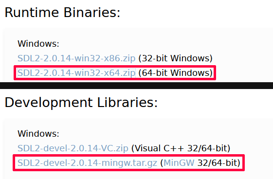
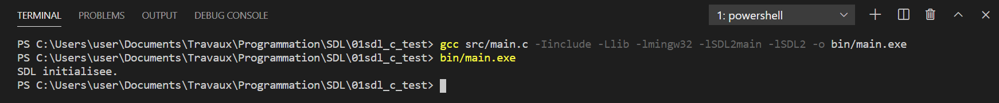

# Mémo SDL

*par flashjaysan*

## Installation

Pour utiliser la SDL, vous aurez besoin d'un compilateur C ou C++. La procédure est détaillée dans mon autre [mémo consacré au langage C](../langages/memo-c.md).

### SDL

Rendez-vous sur le site de la [SDL](https://www.libsdl.org/download-2.0.php).

Téléchargez les Development Libraries pour MinGW ainsi que les Runtime Binaries en version 64 bits.



Dézippez ces deux archives à l'emplacement de votre choix.

**Remarque :** Pour faciliter la configuration, choisissez un emplacement simple (par exemple `C:\SDL`).

## Préparation d'un projet

Créez un dossier vide et ouvrez-le dans Visual Studio Code.

Créez le sous-dossier `src` pour vos fichiers source.

Copiez les dossiers `include`, `lib` et `bin` de la SDL dans le dossier du projet.

**Attention !** La SDL est fournie en version 32 et 64 bits. Vous devez utiliser la version correspondante à l'architecture de votre compilateur. Les machines modernes utilisant presque toutes une base 64 bits, je vous conseille donc d'utiliser la version 64 bits de la SDL avec un compilateur 64 bits. La version 64 bits de la SDL est située dans le sous-dossier `x86_64...` tandis que la version 32 bits est située dans le sous-dossier `i686...`.

Vous devriez avoir l'arborescence de projet suivante :

- racine du projet
  - dossier `include`
    - dossier `SDL2`
	  - fichiers en-tête (`.h`) de la SDL
  - dossier `lib`
    - fichiers objets (`.a`) de la SDL
  - dossier `src`
  - dossier `bin`
    - fichier `SDL.dll`

Dans le sous-dossier `src`, créez un fichier main.c et saisissez le code suivant :

```c
#include <stdio.h>
#include <SDL2/SDL.h>

int main(int argv, char** args)
{
    if (SDL_Init(SDL_INIT_EVERYTHING) == 0)
    {
        printf("SDL initialisee.");
    }
    else
    {
        printf("Probleme avec la SDL.");
    }
    SDL_Quit();
	return 0;
}
```

**Remarque :** La SDL impose cette version de la fonction `main`. Cela ne fonctionnera pas avec la version ne prenant pas de paramètres.

Pour compiler le fichier, ouvrez le terminal dans Visual Studio Code et saisissez la commande suivante :

```
gcc src/main.c -Iinclude -Llib -lmingw32 -lSDL2main -lSDL2 -o bin/main.exe
```

**Remarques :**

- L'option `-I` du compilateur `gcc` sert à préciser l'emplacement des fichiers headers (les fichiers `.h`) d'une bibliothèque comme la SDL. Ces fichiers sont généralement situés dans un dossier nommé `include`.
- L'option `-L` du compilateur `gcc` sert à préciser l'emplacement des fichiers objets précompilés (les fichiers `.a`) d'une bibliothèque comme la SDL. Ces fichiers sont généralement situés dans un dossier nommé `lib`.

Si tout s'est bien passé, un fichier `main.exe` doit avoir été généré dans le dossier `bin`.

Pour exécuter le programme, dans le terminal de visual Studio Code, saisissez la commande suivante :

```
bin/main.exe
```


