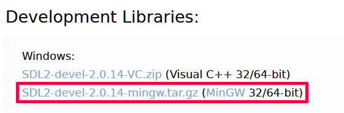
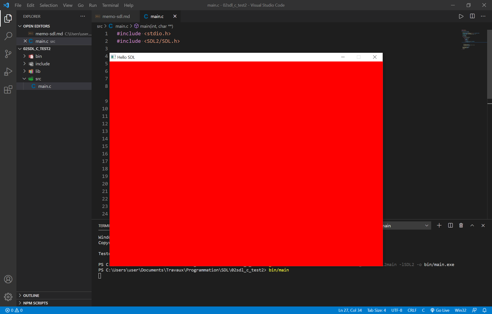

# Mémo SDL

*par flashjaysan*

## Documentation

La source d'information la plus importante dans une bibliothèque est sa documentation. Elle se trouve à cette adresse : [https://wiki.libsdl.org/APIByCategory](https://wiki.libsdl.org/APIByCategory). En cas de doute, référez-vous toujours à cette source.

## Installation

Pour utiliser la SDL, vous aurez besoin d'un compilateur C ou C++. La procédure est détaillée dans mon autre [mémo consacré au langage C](../langages/memo-c.md).

Rendez-vous sur le site de la [SDL](https://www.libsdl.org/download-2.0.php).

Téléchargez les Development Libraries pour MinGW.



Dézippez cette archive à l'emplacement de votre choix.

**Remarque :** Pour faciliter la configuration, choisissez un emplacement simple (par exemple `C:\SDL`).

## Préparation d'un projet

Créez un dossier vide et ouvrez-le dans Visual Studio Code.

Créez le sous-dossier `src` pour vos fichiers source.

Copiez les dossiers `include`, `lib` et `bin` de la SDL dans le dossier du projet.

**Attention !** La SDL est fournie en version 32 et 64 bits. Vous devez utiliser la version correspondante à l'architecture de votre compilateur. Les machines modernes utilisant presque toutes une base 64 bits, je vous conseille donc d'utiliser la version 64 bits de la SDL avec un compilateur 64 bits. La version 64 bits de la SDL est située dans le sous-dossier `x86_64...` tandis que la version 32 bits est située dans le sous-dossier `i686...`.

Vous devriez avoir l'arborescence de projet suivante :

- racine du projet
  - dossier `include`
    - dossier `SDL2`
      - fichiers en-tête (`.h`) de la SDL
  - dossier `lib`
    - fichiers objets (`.a`) de la SDL
  - dossier `src`
  - dossier `bin`
    - fichier `SDL.dll`

Dans le sous-dossier `src`, créez un fichier main.c et saisissez le code suivant :

```c
#include <stdio.h>
#include <SDL2/SDL.h>

int main(int argv, char** args)
{
    if (SDL_Init(SDL_INIT_EVERYTHING) == 0)
    {
        SDL_Log("SDL initialisee.");
    }
    else
    {
        SDL_Log("Probleme avec la SDL.");
    }
    SDL_Quit();
    return 0;
}
```

**Remarque :** La SDL impose cette version de la fonction `main`. Cela ne fonctionnera pas avec la version ne prenant pas de paramètres.

Pour compiler le fichier, ouvrez le terminal dans Visual Studio Code et saisissez la commande suivante :

```
gcc src/main.c -Iinclude -Llib -lmingw32 -lSDL2main -lSDL2 -o bin/main.exe
```

**Remarques :**

- Le premier paramètre passé au compilateur correspond au nom du fichier source à compiler. Notez que la compilation s'effectue à la racine du projet. Vous devez donc indiquer le chemin relatif du fichier source à compiler.
- L'option `-I` du compilateur `gcc` sert à préciser l'emplacement des fichiers headers (les fichiers `.h`) d'une bibliothèque comme la SDL. Ces fichiers sont généralement situés dans un dossier nommé `include`.
- L'option `-L` du compilateur `gcc` sert à préciser l'emplacement des fichiers objets précompilés (les fichiers `.a`) d'une bibliothèque comme la SDL. Ces fichiers sont généralement situés dans un dossier nommé `lib`.
- L'option `-l` indique les fichiers objets à ajouter au programme par l'éditeur de liens. Les trois fichiers objets `mingw32`, `SDL2main` et `SDL2` doivent être listés dans cet ordre précis.
- L'option `-o` permet de préciser le nom et l'emplacement où générer le fichier exécutable. Notez que la compilation s'effectue à la racine du projet. Vous devez donc indiquer le chemin relatif du fichier exécutable à générer.

Si tout s'est bien passé, un fichier `main.exe` doit avoir été généré dans le dossier `bin`.

Pour exécuter le programme, dans le terminal de visual Studio Code, saisissez la commande suivante :

```
bin/main.exe
```


modifier le fichier `main.c` avec le code suivant :

```c
#include <stdio.h>
#include <SDL2/SDL.h>

int main(int argv, char** args)
{
    SDL_Init(SDL_INIT_EVERYTHING);

    SDL_Window* window = SDL_CreateWindow("Hello SDL", SDL_WINDOWPOS_CENTERED, SDL_WINDOWPOS_CENTERED, 800, 600, 0);
    SDL_Renderer* renderer = SDL_CreateRenderer(window, -1, 0);

    _Bool isRunning = 1;
    SDL_Event event;

    while (isRunning)
    {
        while (SDL_PollEvent(&event))
        {
            switch (event.type)
            {
                case SDL_QUIT:
                    isRunning = 0;
                    break;

                case SDL_KEYDOWN:
                    if (event.key.keysym.sym == SDLK_ESCAPE)
                    {
                        isRunning = 0;
                    }
            }
        }

        SDL_RenderClear(renderer);
        SDL_SetRenderDrawColor(renderer, 255, 0, 0, 255);

        SDL_RenderPresent(renderer);
    }

    SDL_DestroyRenderer(renderer);
    SDL_DestroyWindow(window);
    SDL_Quit();

    return 0;
}
```

Compilez à nouveau et exécutez le programme. Si une fenêtre rouge s'affiche, vous êtes prêt à utiliser la SDL.



Appuyez sur `ECHAP` pour fermer le programme.

## Coloration syntaxique dans Visual Studio Code

Si ce n'est pas déjà fait, installez l'extension `C/C++` de Microsoft dans Visual Studio Code.

## Utilisation de la SDL

### Afficher des messages

Utilisez la fonction [`SDL_Log`](https://wiki.libsdl.org/SDL_Log) pour afficher des messages. Cette fonction ne nécessite pas l'initialisation de sous-système. Elle fonctionne comme la fonction standard `printf`.

```c
SDL_Log("Hello, World!");
```

### Initialisation générale

Les différents sous-systèmes fournis par la SDL doivent être initialisés.

La fonction [`SDL_Init`](https://wiki.libsdl.org/SDL_Init) initialise certains ou tous les sous-systèmes de la SDL et renvoie la valeur `0` si tout s'est bien passé ou un nombre négatif en cas d'échec.

Cette fonction prend en paramètre un motif binaire correspondant aux sous-systèmes à initialiser ou la valeur `0` si vous ne voulez initialiser aucun sous-système. Généralement, on utilise la constante `SDL_INIT_EVERYTHING` pour initialiser tous les systèmes.

```c
if (SDL_Init(SDL_INIT_EVERYTHING) != 0)
{
    printf("Erreur lord de l'initialisation de la SDL.");
    return EXIT_FAILURE;
}
```

Si vous ne voulez initialiser que certains sous-systèmes, utilisez les constantes suivantes en les combinant si besoin avec l'opérateur `|` binaire.

- `SDL_INIT_TIMER` : sous-système gestionnaire du temps.
- `SDL_INIT_AUDIO` : sous-système gestionnaire de l'audio.
- `SDL_INIT_VIDEO` : sous-système gestionnaire de la vidéo. Initialise automatiquement le sous-système gestionnaire d'évènements.
- `SDL_INIT_JOYSTICK` : sous-système gestionnaire de joysticks. Initialise automatiquement le sous-système gestionnaire d'évènements.
- `SDL_INIT_HAPTIC` : sous-système gestionnaire haptique (vibrations).
- `SDL_INIT_GAMECONTROLLER` : sous-système gestionnaire de manettes. Initialise automatiquement le sous-système gestionnaire de joysticks.
- `SDL_INIT_EVENTS` : sous-système gestionnaire d'évènements.

```c
// initialise les sous-systèmes gestionnaire de l'audio et de la vidéo
SDL_Init(SDL_INIT_AUDIO | SDL_INIT_VIDEO);
```

### Initialisation différée

Vous pouvez passer la valeur `0` à la fonction `SDL_Init` et initialiser les sous-systèmes plus tard en appelant la fonction [`SDL_InitSubSystem`](https://wiki.libsdl.org/SDL_InitSubSystem). Cette dernière fonctionne exactement comme la fonction `SDL_Init` mais vous pouvez l'appeler après l'initialisation générale selon vos besoins.

```c
SDL_Init(0);
...
SDL_InitSubSystem(SDL_INIT_AUDIO | SDL_INIT_VIDEO);
```

### Désactivation de sous-systèmes

La fonction [`SDL_QuitSubSystem`](https://wiki.libsdl.org/SDL_QuitSubSystem) vous permet de désactiver manuellement un ou plusieurs sous-système. Elle fonctionne à l'inverse de la fonction `SDL_InitSubSystem`. Si vous souhaitez désactiver tous les sous-systèmes, utilisez plutôt la fonction `SDL_Quit`.

```c
SDL_QuitSubSystem(SDL_INIT_AUDIO | SDL_INIT_VIDEO);
```

### Cloture finale

La fonction [`SDL_Quit`](https://wiki.libsdl.org/SDL_Quit) vous permet de cloturer définitivement l'utilisation de la SDL. Vous pouvez l'appeler sans risque, même quand l'initialisation a échoué. Notez que vous devez appeler cette fonction dès lors que vous avez initialisé la SDL, et ce même si vous avez désactivé les sous-systèmes manuellement avec la fonction `SDL_QuitSubSystem`. Elle ne prend pas de paramètre et ne renvoie aucune valeur.

```c
SDL_Quit();
```

## Création de la fenêtre

Après avoir initialisé les sous-systèmes nécessaires, vous devez créer une fenêtre où afficher vos graphismes.

La fonction [`SDL_CreateWindow`](https://wiki.libsdl.org/SDL_CreateWindow) vous permet de créer une fenêtre d'affichage. Cette fonction renvoie un pointeur de type [`SDL_Window`](https://github.com/libsdl-org/SDL/blob/main/src/video/SDL_sysvideo.h#L74) correspondant à la fenêtre créée.

La fonction prend les paramètres suivants :

- Un `char*` correspondant au titre de la fenêtre au format UTF-8.
- Un `int` correspondant à la position (en pixels) horizontale de la fenêtre par rapport au bord gauche de l'écran d'affichage. Utilisez la constante `SDL_WINDOWPOS_CENTERED` pour centrer horizontalement la fenêtre ou la constante `SDL_WINDOWPOS_UNDEFINED` pour laisser le système décider de la position.
- Un `int` correspondant à la position (en pixels) verticale de la fenêtre par rapport au bord supérieur de l'écran d'affichage. Utilisez la constante `SDL_WINDOWPOS_CENTERED` pour centrer verticalement la fenêtre ou la constante `SDL_WINDOWPOS_UNDEFINED` pour laisser le système décider de la position.
- Un `int` correspondant à la largeur (en pixels) de la fenêtre.
- Un `int` correspondant à la hauteur (en pixels) de la fenêtre.
- Un `Uint32` correspondant à un des motifs binaires suivants (ou une combinaison de ceux-ci avec l'opérateur `|` binaire) :
  - `0` pour les réglages par défaut.
  - `SDL_WINDOW_FULLSCREEN` pour une fenêtre en plein écran.
  - `SDL_WINDOW_FULLSCREEN_DESKTOP` pour une fenêtre en plein écran à la résolution actuelle de l'écran.
  - `SDL_WINDOW_OPENGL` pour une fenêtre utilisable avec un contexte OpenGL.
  - `SDL_WINDOW_VULKAN` pour une fenêtre utilisable avec un contexte Vulkan.
  - `SDL_WINDOW_HIDDEN` pour une fenêtre masquée.
  - `SDL_WINDOW_BORDERLESS` pour une fenêtre sans bordure.
  - `SDL_WINDOW_RESIZABLE` pour une fenêtre redimensionnable.
  - `SDL_WINDOW_MINIMIZED` pour une fenêtre minimisée.
  - `SDL_WINDOW_MAXIMIZED` pour une fenêtre maximisée.
  - `SDL_WINDOW_INPUT_GRABBED` pour une fenêtre ayant le focus.
  - `SDL_WINDOW_ALLOW_HIGHDPI` pour une fenêtre en mode high-DPI si possible.

```c
SDL_Window* window = SDL_CreateWindow(
    "Mon jeu",
    SDL_WINDOWPOS_CENTERED,
    SDL_WINDOWPOS_CENTERED,
    640,
    360,
    0
);
```

### Destruction de la fenêtre

La fonction [`SDL_DestroyWindow`](https://wiki.libsdl.org/SDL_DestroyWindow) vous permet de détruire une fenêtre de type pointeur sur un `SDL_Window`. A partir du moment où vous créez une fenêtre, vous devez la détruire avant de quitter le programme.

```c
SDL_DestroyWindow(window);
```

## Création du renderer

Après avoir créé la fenêtre d'affichage, vous devez créer un renderer.

La fonction [`SDL_CreateRenderer`](https://wiki.libsdl.org/SDL_CreateRenderer) vous permet de créer unrenderer. Cette fonction renvoie un pointeur de type [`SDL_Renderer`](https://github.com/libsdl-org/SDL/blob/main/src/video/SDL_sysvideo.h#L74) correspondant au renderer créé.

La fonction prend les paramètres suivants :

- Un `SDL_Window*` correspondant à la fenêtre ou le renderer doit s'afficher.
- Un `int` correspondant à l'index du pilote de rendu à initialiser. Utilisez la valeur `-1` pour initialiser le premier pilote prenant en charge le type de rendu.
- Un `Uint32` correspondant à un des motifs binaires suivants (ou une combinaison de ceux-ci avec l'opérateur `|` binaire) :
  - `0` pour les réglages par défaut (privilégie l'accélération matérielle).
  - `SDL_RENDERER_SOFTWARE` pour un renderer entièrement logiciel.
  - `SDL_RENDERER_ACCELERATED` pour un renderer utilisant l'accélération matérielle (la carte graphique).
  - `SDL_RENDERER_PRESENTVSYNC` pour un renderer synchronisé sur la synchro verticale.
  - `SDL_RENDERER_TARGETTEXTURE` pour un renderer prenant en charge le rendu vers une texture.

```c
SDL_Renderer* renderer = SDL_CreateRenderer(window, -1, 0);
```

### Destruction du renderer

La fonction [`SDL_DestroyRenderer`](https://wiki.libsdl.org/SDL_DestroyRenderer) vous permet de détruire un renderer de type pointeur sur un `SDL_Renderer`. A partir du moment où vous créez un renderer, vous devez le détruire avant de quitter le programme.

```c
SDL_DestroyRenderer(renderer);
```
