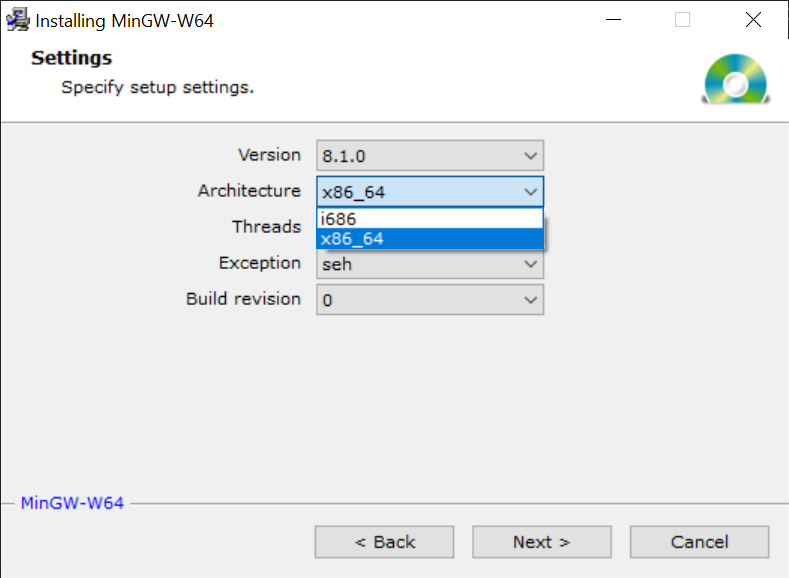
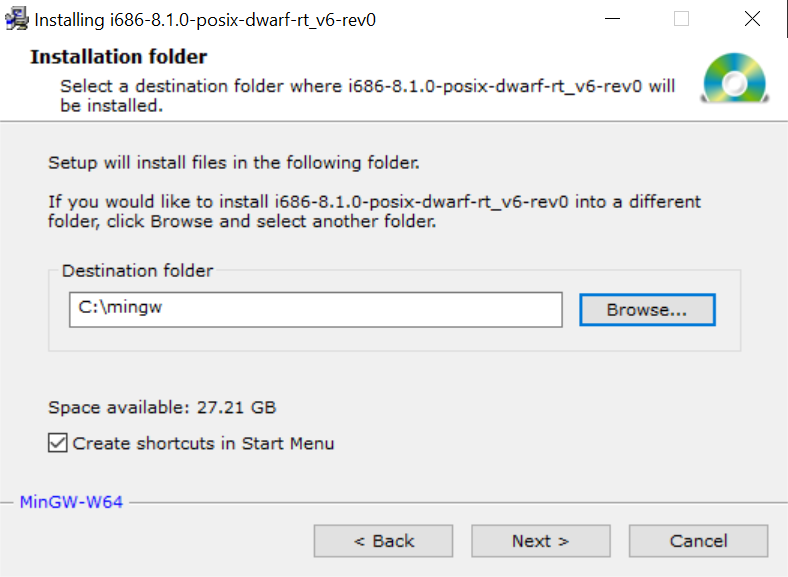
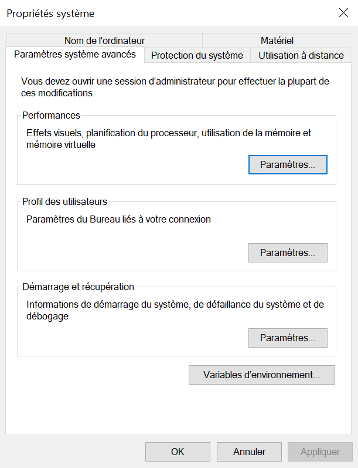
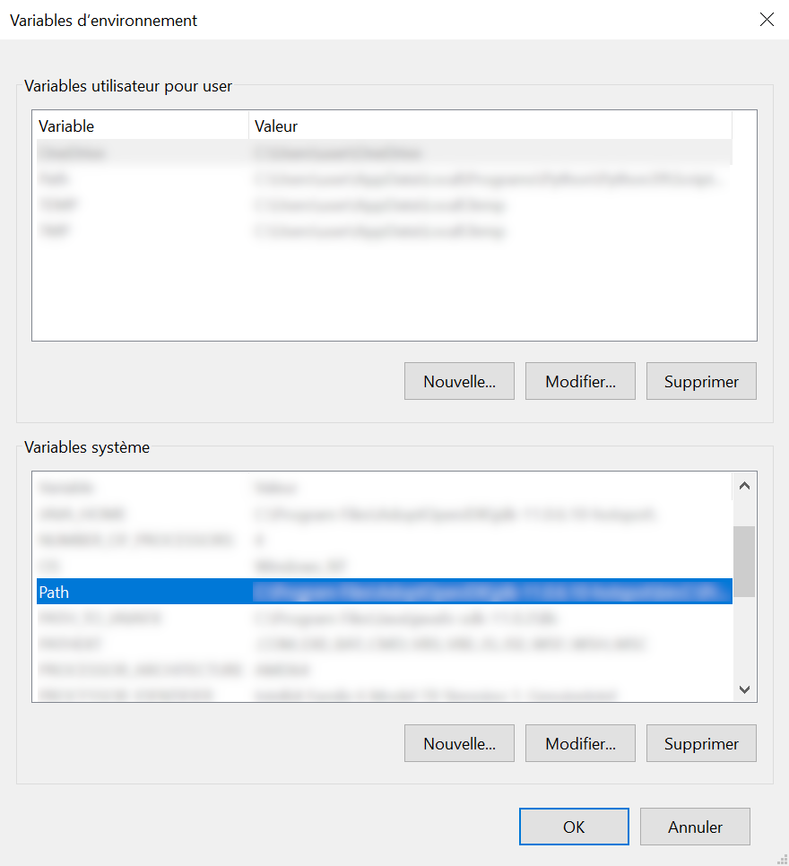
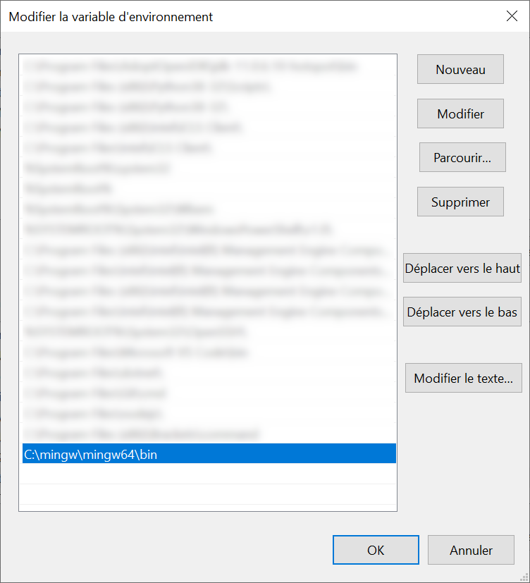
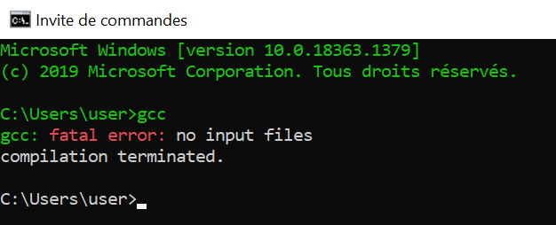
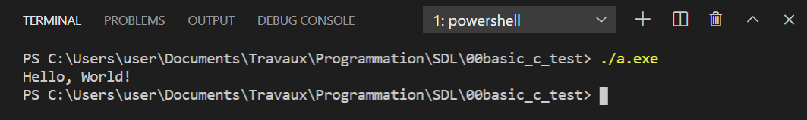

# Mémo C

*par flashjaysan*

## Installation de MinGW64

Téléchargez et installez [MinGW64](https://sourceforge.net/projects/mingw-w64/files/). Prenez simplement le fichier `MinGW-W64-install.exe`.

**Remarque :** MinGW64 est fourni en version 32 et 64 bits. Les bibliothèques supplémentaires (telles que la SDL) que vous utiliserez avec MinGW64 doivent correspondre à la version installée. Les machines modernes utilisant presque toutes une base 64 bits, je vous conseille donc d'utiliser la version 64 bits de MinGW64.

Sélectionnez l'architecture `x86_64` pour installer la version 64 bits de MinGW64 (l'architecture `i686` correspond à la version 32 bits).



Pour faciliter la configuration, choisissez un emplacement simple comme ci-dessous :



Notez l'emplacement du dossier d'installation.

#### Configurer le path

Pour éviter de saisir le chemin complet vers les outils fournis par MinGW64 à chaque fois, vous devez ajouter le chemin vers le sous-dossier  `mingw64\bin` (il contient plein de fichiers `.exe`) au path de Windows.

**Exemple :** `C:\mingw\mingw64\bin`

Dans la barre de recherche de Windows, saisissez `variables d'environnement` et choisissez l'option `Modifier les variables d'environnement système`.

Cliquez sur le bouton `Variables d'environnement...`.



Dans la section `Variables système`, faites un double clic sur la ligne `Path`.



Cliquez sur le bouton `Nouveau` et ajoutez le chemin vers le sous dossier `mingw64\bin`.



Une fois terminé, cliquez sur `OK` pour fermer toutes les fenêtres.

Le path est bien configuré si la commande `gcc` est reconnue quand vous la saisissez dans un terminal.



## Compilation en ligne de commande

Créez un fichier `main.c` et placez le code suivant dans ce fichier avec le bloc-note ou n'importe quel éditeur de code :

```c
#include <stdio.h>

int main(void)
{
    printf("Hello, World!");
    return 0;
}
```

Positionnez-vous avec l'explorateur de fichiers dans le dossier contenant le fichier précédent.

Cliquez dans la barre d'adresse de l'explorateur de fichiers et saisissez `cmd` pour faire apparaître un terminal positionné à l'emplacement du fichier.

Pour compiler le fichier source, saisissez la commande suivante :

```
gcc main.c
```

Aucun message n'apparait dans le terminal quand la compilation se passe bien. Cependant, un nouveau fichier exécutable a bien été généré. Dans le terminal, saisissez la commande `dir` pour afficher la liste des fichiers du dossier. Un fichier nommé `a.exe` doit être présent.

```
dir
```

Par défaut, le compilateur `gcc` génère un fichier exécutable nommé `a.exe` à partir de votre fichier source. Pour l'exécuter depuis le terminal, saisissez la commande suivante :

```
a.exe
```

Vous pouvez combiner la compilation et l'exécution en enchainant les deux commandes :

```
gcc main.c && a.exe
```

Pour choisir le nom de l'exécutable, utilisez la commande `-o` suivie du nom du fichier (sans espace) à générer.

```
gcc main.c -o hello.exe
```

## Compilation dans Visual Studio Code

Créez un dossier et ouvrez-le avec Visual Studio Code.

Créez un fichier `main.c` et saisissez le code suivant :

```c
#include <stdio.h>

int main(void)
{
    printf("Hello, World!");
    return 0;
}
```

Pour ouvrir le terminal de Visual Studio Code, cliquez sur le menu `View -> Terminal`. Le terminal s'affiche en bas de la fenêtre.

Pour compiler le fichier source, saisissez la commande suivante :

```
gcc main.c
```

Aucun message n'apparait dans le terminal quand la compilation se passe bien. Cependant, un nouveau fichier exécutable a bien été généré. Dans le terminal, saisissez la commande `ls` pour afficher la liste des fichiers du dossier. Un fichier nommé `a.exe` doit être présent.

```
ls
```


Par défaut, le compilateur `gcc` génère un fichier exécutable appelé `a.exe` à partir de votre fichier source. Pour l'exécuter depuis le terminal de Visual Studio Code, saisissez la commande suivante :

```
./a.exe
```



### Extension C/C++ de Microsoft

Si vous le souhaitez, installez l'extension `C/C++` de Microsoft pour bénéficier d'outils supplémentaires. Cliquez ensuite sur le menu `View -> Command Palette...` et saisissez `C/C++`. Choisissez dans la liste l'option `C/C++: Edit Configurations (UI)`.

Dans la section `Nom de la configuration`, cliquez sur le bouton `Ajouter une configuration`. Dans le nouveau champ `Nom de la configuration...`, saisissez le nom de la nouvelle configuration (par exemple `gcc`) puis cliquez sur le bouton `OK`.

Dans la section `Chemin du compilateur`, saisissez le chemin vers le compilateur gcc (par exemple `C:/mingw/mingw64/bin/gcc.exe`).

Dans la section `Mode Intellisense`, sélectionnez l'option `windows-gcc-x64`.

Fermez l'éditeur de configuration. Un fichier `c_cpp_properties.json` est créé dans un dossier `.vscode` à la racine du dossier ouvert.

Vous pouvez trouver [plus d'information ici](https://code.visualstudio.com/docs/cpp/config-mingw).

## Point d'entrée d'un programme

La fonction `main` est généralement le point d'entrée d'un programme C. Elle renvoie un entier à l'environnement d'exécution. Elle peut s'écrire sous deux formes.

La première forme ne prend pas de paramètre (contrairement au C++, en C, il est impératif de le préciser avec le mot clé `void`).

```c
int main(void) {}
```

La seconde forme prend deux paramètres.

- Un entier (généralement nommé `argc`) qui contient soit `0` soit le nombre de chaînes contenues dans le second paramètre.
- Un tableau de pointeurs de caractères (généralement nommé `argv`) qui contient des chaînes de caractères passées au programme lors de son lancement par l'environnement d'exécution. Le premier élément correspond au nom du programme.

```c
int main(int argc, char* argv[]) {}
```

Cette seconde forme est utilisée lorsque le programme doit recevoir des paramètres de l'environnement d'exécution.

Par convention, un programme s'exécutant correctement se termine en renvoyant la valeur `0` à l'environnement d'exécution. Vous pouvez le préciser explicitement à la fin de la fonction `main` en utilisant l'instruction `return 0;`.

```c
int main(void)
{
    return 0;
}
```

Depuis la norme C99, cette instruction n'est pas obligatoire. Si vous ne la placez pas dans votre programme, le compilateur considère par défaut que le programme renvoie la valeur `0`.

Pour plus de clarté, vous pouvez également renvoyer la constante `EXIT_SUCCESS` définie dans le fichier en-tête `stdlib.h`.

```c
#include <stdlib.h>

int main(void)
{
    return EXIT_SUCCESS;
}
```

**Remarque :** En cas de besoin, vous pouvez également utiliser la constante `EXIT_FAILURE` définie dans le fichier en-tête `stdlib.h` pour indiquer que le programme ne s'est pas terminé correctement.

# SECTION INCOMPLETE

## Littéraux

Un littéral booléen est simplement la valeur `0` ou `1`. Si vous utilisez le fichier en-tête `stdbool.h`, vous pouvez également utiliser les constantes `true` et `false`.

```c
_Bool faux = 0;
_Bool vrai = 1;
```

Un littéral entier peut être écrit sous forme décimale :

```c
int nombre = 12345;
```

ou sous forme hexadécimale s'il est précédé des caractères `Ox` ou `0X` :

```c
int seize = 0x10;
```

Un littéral caractère s'écrit entre apostrophes :

```c
char caractere = 'a';
```

Un littéral chaîne de caractères s'écrit entre guillemets :

```c
char* chaine = "bonjour";
```

Une chaîne de caractères possède un caractères de fin de chaîne `\0` en plus des caractères classiques.

Un littéral chaîne de caractères vide s'écrit avec deux guillemets :

```c
char* chaine_vide = "";
```

un littéral nombre à virgule est de type `double` :

```c
double nombre_a_virgule = 3.5;
```

Un littéral nombre à virgule est de type `float` s'il est suivi de la lettre `f` ou `F` :

```c
float nombre_a_virgule = 3.5f;
```

## Afficher une chaine de caractères

```c
#include <stdio.h>
#include <stdlib.h>

int main(void)
{
    printf("Bonjour.");
    return EXIT_SUCCESS;
}
```

```c
#include <stdio.h>
#include <stdlib.h>

int main(void)
{
    char* chaine = "Bonjour.";
    printf(chaine);
    return EXIT_SUCCESS;
}
```

```c
#include <stdio.h>
#include <stdlib.h>

int main(void)
{
    char* chaine = "Bonjour.";
    printf("%s", chaine);
    return EXIT_SUCCESS;
}
```

## Afficher un nombre entier

```c
#include <stdio.h>
#include <stdlib.h>

int main(void)
{
    printf("%d", 1234);
    return EXIT_SUCCESS;
}
```

```c
#include <stdio.h>
#include <stdlib.h>

int main(void)
{
    int entier = 1234;
    printf("%d", entier);
    return EXIT_SUCCESS;
}
```

## Commentaires

```c
// commentaires sur une seule ligne

/* commentaire
sur plusieurs
lignes */
```

## Types primitifs

```c
int
float
double
char
_Bool
```

## Enumérations

```c
enum nom_enum {
    CONSTANTE1, // 0
    CONSTANTE2, // 1
    CONSTANTE3 = 100, // 100
    CONSTANTE4 // 101
};

enum nom_enum enumeration = CONSTANTE3;
```

## La fonction printf

Le premier paramètre de la fonction `printf` est **toujours** de type chaine de caractères.

- `%d` affiche le paramètre suivant de type entier sous forme décimale.
- 

## La fonction scanf

Renvoie le nombre de valeurs lues.

Si le type de donnée à lire n'est pas une chaine de caractères, faites précéder le nom de la variable qui va stocker la valeur du sign `&`.


