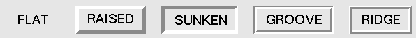
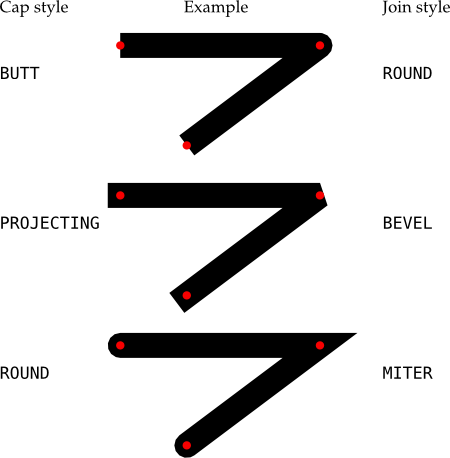

# Mémo tkinter pour Python

*par flashjaysan*

## Liens utiles

Ce document est basée sur les sites suivants :

- [http://effbot.org/tkinterbook/tkinter-index.htm](tkinterbook)
- [https://fr.wikibooks.org/wiki/Programmation_Python/Tkinter](fr.wikibooks/tkinter)
- [Documentation en français](http://tkinter.fdex.eu/index.html)
- [tkdocs](https://tkdocs.com/index.html)
- [tkinter 8.5 documentation](https://anzeljg.github.io/rin2/book2/2405/docs/tkinter/index.html)

## Présentation

Le module `tkinter` est préinstallé avec Python. Il permet de créer des interfaces graphiques facilement.

## Importer le module

Commencez par importer le module :

```python
import tkinter
```

**Attention !** Avec Python 2 le module tkinter s'importe différemment (avec une majuscule) :

```python
import Tkinter
```

Vous pouvez également contourner le problème avec le code suivant :

```python
try:
    from Tkinter import *
except ImportError:
    from tkinter import *
```

## Fenêtre principale

Avec tkinter, tout est un widget. Chaque widget doit être attaché à un widget parent à l'exception du widget racine. Vous devez donc créer le widget racine qui représentera la fenêtre principale.

```python
root = tkinter.Tk()
```

Si vous exécutez ce code, une fenêtre apparait mais se referme immédiatement et le programme se termine. Vous devez démarrer la boucle principale pour continuer à faire tourner le programme.

```python
root.mainloop()
```

**Remarque :** L'appel à la méthode `mainloop` se place généralement à la toute fin du fichier source.

Changez le titre de la fenêtre avec la méthode `title`.

```python
root.title('titre')
```

Limitez la taille minimale de la fenêtre avec la méthode `minsize`.

```python
root.minsize(width=320, height=180)
```

### Structure de base

Voici une structure de base pour commencer à utiliser le module :

```python
import tkinter

root = tkinter.Tk()

hello_label = Label(root, text="Hello, world!")
hello_label.pack()

root.mainloop()
```

La fonction `Tk` crée un *widget* (un élément d'une *interface graphique utilisateur* ou *GUI*) racine nécessaire à tout programme utilisant le module tkinter.

La fonction `Label` crée un widget label pouvant contenir un texte, une icône ou une image. Le premier paramètre doit être le widget parent qui va contenir le label. Ici, ce sera un widget contenant le texte `Hello, World!`.

La méthode `pack` du widget label le rend visible dans la fenêtre parent et lui permet de prendre la meilleure dimension pour contenir le texte.

La méthode `mainloop` du widget racine lance l'exécution de l'affichage des widgets ainsi que la boucle de gestion des évènements.

### Concepts généraux des widgets

Le système de coordonnées a pour origine le coin supérieur gauche des fenêtres. L'axe des Y est donc inversé par rapport au système mathématique classique.

Lorsque vous instanciez un widget, précisez le widget parent et si besoin, paramétrez chaque option du widget en utilisant les paramètres nommés.

```python
widget = tkinter.NomDuWidget(widget_parent, option=valeur)
```

Par la suite, accédez à chaque option en tant que clé d'un dictionnaire :

```python
widget["option"] = valeur
```

**Remarque :** Vous pouvez également utiliser la méthode `cget` pour obtenir la valeur d'une option particulière.

```python
print(widget.cget(option))
```

Utilisez la méthode `config` (ou `configure`) pour paramétrer plusieurs options à la fois.

```python
widget.config('option'=valeur, ...)
```

### Styles

L'option `relief` vous permet de définir l'apparence du widget. Choisissez parmi les constantes `tkinter.FLAT`, `tkinter.RAISED`, `tkinter.SUNKEN`, `tkinter.GROOVE` et `tkinter.RIDGE`.



**Remarque :** Par défaut, le style utilise une largeur de contour de 2 pixels. Modifiez cette taille avec l'option `borderwidth`.L'image précédente montre des widgets avec une taille de 5 pixels.

### Gestionnaires de positionnement

Un widget créé ne s'affiche pas tant que vous n'utilisez pas un gestionnaire de positionnement. Il en existe trois différents.

#### Gestionnaire de positionnement pack

Le gestionnaire le plus simple empile les widgets verticalement, centrés sur la fenêtre. Pour cela, appelez la méthode `pack` d'un widget.

```python
widget.pack()
```

Vous pouvez préciser sur quel bord de la fenêtre vous souhaitez empiler les widgets avec l'attribut `side`.

```python
widget.pack(side='left')
```

#### Gestionnaire de positionnement place

Le gestionnaire de positionnement le plus précis vous permet de positionner les widgets à une coordonnée exacte dans la fenêtre. Pour cela, appelez la méthode `place` d'un widget.

```python
widget.place(x=0, y=0)
```

#### Gestionnaire de positionnement grid

Le dernier gestionnaire de positionnement utilise une grille pour placer les widgets. C'est le gestionnaire le plus utilisé. Appelez la méthode `grid` d'un widget. Une colonne prend la largeur de l'élément le plus large présent dans cette colonne. Une ligne prend la hauteur de l'élément le plus haut présent dans la ligne. Les paramètres nommés `column` et `row` vous permettent de positionner le widget dans la grille.

```python
widget.grid(paramètres_nommés)
```

**Attention !** Ne mélangez jamais `pack` et `grid` dans un même programme.

La méthode `grid` accepte les paramètres nommés suivants :

- `column` : précise à quelle colonne l'élément doit être placé. Commence à `0`. La valeur par défaut est `0`.
- `row` : précise à quelle ligne l'élément doit être placé. Commence à `0`. La valeur par défaut est la ligne la plus élevée inoccupée.
- `columnspan` : précise le nombre de colonne que doit prendre l'élément. Permet de fusionner des cellules horizontalement.
- `rowspan` : précise le nombre de colonne que doit prendre l'élément. Permet de fusionner des cellules verticalement.
- `in_` : précise le widget parent. Ce dernier doit être un enfant du widget parent passé lors de la création du widget en cours.
- `ipadx` : précise l'espacement horizontal interne au widget.
- `ipady` : précise l'espacement vertical interne au widget.
- `padx` : précise l'espacement horizontal externe au widget.
- `pady` : précise l'espacement vertical interne au widget.
- `sticky` : précise la place que prend le widget dans la cellule. Par défaut, le widget est centré dans la cellule. Utilisez les huit points cardinaux (`tkinter.N`, `tkinter.NE`, `tkinter.NW`, `tkinter.S`, `tkinter.SE`, `tkinter.SW`, `tkinter.E`, `tkinter.W`) ainsi que la constante `tkinter.CENTER` pour positionner le widget dans un coin ou centré sur un bord. Combinez deux bords pour étirer le widget sur toute la cellule dans un sens (`tkinter.N + tkinter.S` étire verticalement le widget. `tkinter.W + tkinter.E` étire horizontalement le widget). Vous pouvez également combiner avec les autres options pour varier le positionnement.

##### Autres méthodes liées à la grille

Les méthodes suivantes relatives au placement dans une grille sont définies sur tous les widgets :

```python
widget.grid_forget()
```

Cette méthode fait disparaître le widget. Il existe toujours, il est simplement invisible. Vous pouvez utiliser la méthode `grid` sans paramètres pour le faire apparaître de nouveau, mais ses options de grille auront été oubliées.

```python
widget.grid_remove()
```

Cette méthode ressemble à la méthode `grid_forget`, mais les options de grille ne sont pas perdues. Ainsi, si vous appellez la méthode `grid` sans paramètres à nouveau, les mêmes options de grilles seront utilisées.

```python
widget.grid_info()
```

Renvoie un dictionnaire dont les clés sont les noms des options de grille du widget avec les valeurs correspondantes de ces options.

```python
widget.grid_size()
```

Renvoie un tuple à deux éléments qui contient le nombre de colonnes et de lignes dans le système de grille du widget.

```python
widget.grid_bbox(column=None, row=None, col2=None, row2=None)
```

Renvoie un tuple à 4 éléments qui décrit la boîte englobante (bounding box) de tout ou partie de la grille associée au widget. Les deux premiers nombres sont les coordonnées x et y du coin supérieur gauche de la zone, et les deux autres sa largeur et sa hauteur.

Si vous précisez les arguments `column` et `row`, la boîte englobante renvoyée décrit la zone de la cellule correspondante. Si vous renseignez aussi les arguments `col2` et `row2`, la boîte englobante renvoyée décrit la zone du grillage qui va de la colonne `column` à `col2` inclus et de la ligne `row` à `row2` inclus.

Par exemple, `widget.grid_bbox(0, 0, 1, 1)` renvoie la boîte englobante de quatre cellules et non pas une.

```python
widget.grid_location(x, y)
```

Étant donné des coordonnées (x, y) relatives au widget conteneur, cette méthode renvoie un tuple `(col, row)` qui décrit quelle cellule du système de grille du widget contient ces coordonnées à l’écran.

```python
widget.grid_propagate()
```

Normalement, tous les widgets propagent leurs dimensions, ce qui veut dire qu’ils s’ajustent pour s’adapter à leur contenu. Cependant, il arrive qu’on veuille forcer un widget à être d’une certaine taille indépendamment de la taille de son contenu. Pour faire cela, appeler `widget.grid_propagate(0)` où `widget` est le widget dont vous voulez forcer la taille.

```python
widget.grid_slaves(row=None, column=None)
```

Renvoie la liste des widgets gérés par le widget `widget`. Si aucun argument n’est fourni, la liste est exhaustive. Utilisez l’argument `row=` pour selectionner ceux qui se trouvent dans une ligne particulière. De même, utilisez `column=` pour sélectionner ceux qui se trouvent dans une colonne particulière.

```python
widget.columnconfigure(N, option=value, ...)
```

Dans la grille du widget `widget`, configure la colonne numéro `N` de telle sorte que les options fournies aient les valeurs indiquées.

- option `minsize` : précise la taille minimum de la colonne en pixels. Si il n’y a rien dans la colonne indiquée, elle n’apparaîtra pas, même si vous utilisez cette option.
- option `pad` : précise la marge en pixels à ajouter autour de la plus large cellule de la colonne.
- option `weight` : pour rendre une colonne étirable lors d’un redimensionnement, utilisez cette option en fournissant une valeur qui donne le poid relatif de cette colonne lors de la distribution de l’espace supplémentaire.

Par exemple, si un widget `widget` contient une grille, le code qui suit attribuera trois quarts (3/4) de l’espace supplémentaire à la première colonne et un quart (1/4) à la seconde:

```python
w.columnconfigure(0, weight=3)
w.columnconfigure(1, weight=1)
```

Si cette option n’est pas utilisée, les colonnes ne seront pas étirées.

```python
w.rowconfigure(N, option=value, ...)
```

Dans la grille du widget `widget`, configure la ligne numéro `N` de telle sorte que les options fournies aient les valeurs indiquées.

- option `minsize` : précise la taille minimum de la ligne en pixels. Si il n’y a rien dans la ligne indiquée, elle n’apparaîtra pas, même si vous utilisez cette option.
- option `pad` : précise la marge en pixels à ajouter autour de la plus large cellule de la ligne.
- option `weight` : pour rendre une ligne étirable lors d’un redimensionnement, utilisez cette option en fournissant une valeur qui donne le poid relatif de cette ligne lors de la distribution de l’espace supplémentaire.

Par exemple, si un widget `widget` contient une grille, le code qui suit attribuera trois quarts (3/4) de l’espace supplémentaire à la première ligne et un quart (1/4) à la seconde:

```python
w.rowconfigure(0, weight=3)
w.rowconfigure(1, weight=1)
```

Si cette option n’est pas utilisée, les lignes ne seront pas étirées.

[grid](http://tkinter.fdex.eu/doc/gp.html)

## Les widgets

### Méthodes communes à tous les widgets

Les méthodes suivantes sont communes à tous les widgets. Dans les descriptions, `widget` désigne un widget de type arbitraire.

```python
after(delai_ms, fonc=None, *args)
```

Demande à Tkinter d’appeller la fonction de rappel fonc avec les arguments args après l’écoulement du délai delai_ms donné en millisecondes. Votre fonction de rappel ne peut pas être appelée avant ce délai (même si son appel effectif peut le dépasser) et elle ne sera appelée qu’une fois.

Elle retourne un entier qui sert d’identifiant et qui peut être passé à la méthode after_cancel pour annuler la demande d’appel de fonc.

Si vous ne donnez aucune fonction de rappel, cette fonction arrête l’exécution du programme pendant la durée du délai indiqué (comme la fonction standard sleep du module time).

```python
after_cancel(id)
```

Annule la demande d’appel d’une fonction après un certain délai définie par la méthode after. L’argument id est l’identifiant numérique retourné par la méthode after.

```python
after_idle(fonc, *args)
```

Demande à Tkinter d’appeler la fonction fonc avec les arguments args la prochaine fois qu’il se trouvera en “sommeil”, c’est à dire, la prochaine fois qu’il n’aura plus aucun événement à traiter. La fonction fonc n’est appelée qu’une seule fois. Si vous souhaitez la rappeler, il faudra utiliser à nouveau cette méthode.

```python
bell()
```

Produit un son, généralement un bip.

```python
bind(sequence=None, evtGest=None, add=None)
```

Cette méthode est utilisée pour attacher un gestionnaire d’événement (une fonction) à la survenue d’un événement, précisé par sequence, sur le widget appelant (sur lequel cette méthode a été appliquée). Voir Événements: répondre aux actions de l’utilisateur. pour une vue d’ensemble sur le moyen de rendre votre application réactive aux actions de l’utilisateur.

L’argument sequence sert à décrire le type d’événement (action de l’utilisateur) auquel il faut réagir par le moyen du gestionnaire evtGest, c’est à dire en appelant cette fonction lorsque survient l’événement surveillé sur le widget. Si une liaison avait déjà été définie sur ce widget, l’ancien gestionnaire d’événement est remplacé par le nouveau sauf si vous utilisez add='+'; dans ce cas les gestionnaires définis précédement sont préservés.

```python
bind_all(sequence=None, func=None, add=None)
```

Similaire à la méthode bind(), mais s’applique à tous les widgets de l’application.

```python
bind_class(type, sequence=None, func=None, add=None)
```

Similaire à la méthode bind(), mais s’applique à tous les widgets du type indiqué par l’argument type (par exemple 'Button').

```python
bindtags(tagList=None)
```

Si vous appelez cette méthode sans argument, elle vous retournera les marques (tags) “de liaison” pour le widget appelant sous la forme d’une liste de chaînes de caractères. Une marque de liaison est le nom d’une fenêtre (qui débute par un ‘.’) ou un type de widgtet (par exemple ‘Listbox’).

Vous pouvez modifier l’ordre dans lequel les niveaux de liaison sont appelés en passant à la méthode la liste des marques de liaison que vous souhaitez que le widget utilise.

Voir Événements: répondre aux actions de l’utilisateur. pour une discussion sur les niveaux de liaison et leur relation avec les marques.

```python
cget(option)
```

Retourne la valeur courante de l’option indiquée par une chaîne de caractères. Vous pouvez aussi obtenir la valeur d’une option d’un widget w en utilisant la syntaxe w['option'].

```python
clipboard_append(text)
```

Ajoute la chaine de caractères text au presse-papiers.

```python
clipboard_clear()
```

Efface le contenu du presse-papiers. (voir la méthode clipboard_append() ci-dessus).

```python
column_configure()
```

Voir Autres méthodes du gestionnaire de grille.

```python
config(option=value, ...)
```

Identique à la méthode configure().

```python
configure(option=value, ...)
```

Sert à configurer les valeurs d’une ou plusieurs options. Pour les options dont les noms sont des mots réservés de Python (class, from, in), ajoutez un caractère «souligné» à la fin de l’option: ‘class_’, ‘from_’, ‘in_’.

Vous pouvez aussi configurer la valeur d’une option pour le widget w avec une instruction de la forme w['option'] = valeur.

Si vous appelez la méthode config() sans arguments, elle retourne un dictionnaire de toutes les options du widget appelant. Les clés sont les noms des options (incluant les alias comme bd pour borderwidth). La valeur pour chaque clé est:

- Pour la plupart des entrées, un tuple à 5 éléments: (nom de l'option, clé de l'option dans la bdd, classe de l'option dans la bdd, valeur par défaut, valeur courante); ou,
- Pour les alias (comme ‘fg’), un tuple à deux éléments: (alias, nom standard équivalent).

```python
destroy()
```

L’appel w.destroy() sur un widget w détruit w ainsi que tous ses enfants.

```python
event_add(virtevt, *sequences)
```

Cette méthode crée un événement virtuel dont le nom est la chaîne de caractères donnée comme premier argument virtevt. Chaque argument supplémentaire décrit une «séquence», c’est à dire, la description d’un événement physique (appui sur une touche, mouvement de la souris ...). Lorsque cet événement se produit, le nouvel événement virtuel est déclenché.

Voir Événements: répondre aux actions de l’utilisateur. pour une description générale des événements virtuels.

```python
event_delete(virtevt, *sequences)
```

Supprime le ou les événements physiques associés à l’événement virtuel dont le nom est précisé en premier argument par la chaîne virtevt. Si tous les événements physiques sont supprimés de l’événement virtuel, cet événement virtuel ne sera plus déclenché.

```python
event_generate(sequence, **kw)
```

Cette méthode déclenche l’événement (sans que le stimulus externe n’ait eu lieu). La gestion de l’événement n’est pas différete de celle qui est engagée avec un stimuli externe. L’argument sequence décrit l’événement à déclencher. Vous pouvez configurer les valeurs des attributs de l’objet événement qui sera passé au gestionnaire en fournissant des arguments de la forme attr=valeur, où attr est le nom d’un attribut de l’objet Event.

Voir Événements: répondre aux actions de l’utilisateur. pour une discussion complète des événements.

```python
event_info(virtual=None)
```

Si vous appelez cette méthode sans argument, vous obtenez la liste de tous les événements virtuels qui sont actuellement définis.

Pour récupérer les événements physiques associés à un événement virtuel, précisez son nom et vous obtiendrez la liste de tous les événements physiques associés ou None s’il n’y en a pas.

```python
focus_displayof()
```

Retourne le nom de la fenêtre qui possède actuellement le focus sur le même écran que le widget appelant. Retourne None Si aucune telle fenêtre n’a le focus.

Voir Focus: réception des saisies clavier pour une description générale du focus.

```python
focus_force()
```

Force le focus sur le widget appelant. Ce n’est pas très poli. Il vaut mieux attendre que le gestionnaire de fenêtre donne lui-même le focus. Voir aussi la méthode grab_set_global() ci-dessous.

```python
focus_get()
```

Retourne le widget qui possède actuellement le focus s’il y en a, autrement retourne None.

```python
focus_lastfor()
```

Cette méthode retourne le nom du widget qui est le dernier a avoir eu le focus dans la fenêtre mère qui contient le widget appelant. Si aucun widget de la fenêtre mère n’a eu le focus, elle retourne le nom de la fenêtre mère. Si l’application n’a pas le focus, elle retournera le nom du widget qui aura le focus lorsque l’application l’obtiendra de nouveau.

```python
focus_set()
```

Si l’application qui contient le widget appelant a le focus, le focus est dirigé vers ce widget. Sinon, Tk le donnera au widget lorsque l’application aura le focus à nouveau.

```python
grab_current()
```

If there is a grab in force for w’s display, return its identifier, otherwise return None. Reportez-vous à Événements: répondre aux actions de l’utilisateur. pour une discussion sur les «grabs» (à faire)

```python
grab_release()
```

If w has a grab in force, release it.

```python
grab_set()
```

Widget w grabs all events for w’s application. If there was another grab in force, it goes away. Reportez-vous à Événements: répondre aux actions de l’utilisateur. pour une discussion sur les «grabs» (à faire).

```python
grab_set_global()
```

Widget w grabs all events for the entire screen. This is considered impolite and should be used only in great need. Any other grab in force goes away. Try to use this awesome power only for the forces of good, and never for the forces of evil, okay?

```python
grab_status()
```

If there is a local grab in force (set by .grab_set()), this method returns the string ‘local’. If there is a global grab in force (from .grab_set_global()), it returns ‘global’. If no grab is in force, it returns None.

```python
grid_forget()
```

Voir Autres méthodes du gestionnaire de grille.

```python
grid_propagate()
```

Voir Autres méthodes du gestionnaire de grille.

```python
grid_remove()
```

Voir Autres méthodes du gestionnaire de grille.

```python
image_names()
```

Retourne les noms de toutes les images de l’application (sous la forme d’une séquence de chaînes de caractères) qui contient le widget appelant.

```python
keys()
```

Retourne les noms des options du widget sous la forme d’une liste de chaînes de caractères.

```python
lift(aboveThis=None)
```

Si l’argument est None, la fenêtre qui contient le widget appelant est déplacée tout en haut de la pile des fenêtres. Pour déplacer la fenêtre juste au-dessus d’une fenêtre principale f, la fournir en argument.

```python
lower(belowThis=None)
```

Si l’argument est None, la fenêtre qui contient le widget appelant est déplacée tout en bas de la pile des fenêtres. Pour déplacer la fenêtre juste en dessous d’une fenêtre principale f, la fournir en argument.

```python
mainloop()
```

Cette méthode doit être appelée (généralement après avoir créé tous les widgets statiques) afin de démarrer le traitement des événements. Vous pouvez arrêter ce traitement en boucle en utilisant la méthode quit() ci-dessous. Vous pouvez aussi appeler cette méthode à l’intérieur d’un gestionnaire d’événement pour redémarrer le traitement des événements (main loop).

```python
nametowidget(nom)
```

Retourne le widget dont le chemin de nommage est nom. Voir Le nommage des Fenêtres (Window). Si le nom est inconnu, cette méthode lancera une exception du type KeyError.

```python
option_add(motif, value, priorite=None)
```

Cette méthode ajoute des valeurs par défaut à la base de données des options de Tkinter. L’argument motif est une chaîne de caractères qui précise l’option à configurer par défaut pour un ou plusieurs widgets. L’argument priorite peut prendre l’une des valeurs suivantes:

- 20: Pour les propriétés par défaut des widgets.
- 40: Pour les propriétés par défaut qui concerne des applications particulières.
- 60: Pour les options précisées dans des fichiers d’utilisateur.
- 80: Pour les options qui sont configurées au démarrage de l’application. C’est ce niveau qui a la priorité par défaut.

Plus la valeur est grande, plus le réglage correspondant est prioritaire. Voir Normaliser l’apparence: la base de données des options pour une vue d’ensemble de la base de données des options. La syntaxe de l’argument motif est la même que celle du début d’une ligne de spécification d’option dans la base de donnée.

Par exemple, pour obtenir les effets de cette ligne de spécification:

*Button*font: times 24 bold

votre application peut contenir ces lignes:

grandeFonte = tkFont.Font(family='times', size=24, weight='bold')
root.option_add('*Button*font', grandeFonte)

Chaque bouton créé après l’exécution de ces lignes utilisera par défaut une police Times grasse de 24 points (sauf si l’option font est renseignée dans le constructeur de bouton).

```python
option_clear()
```

Cette méthode supprime toutes les champs de la base de données des options de Tkinter. Cela a pour effet de revenir à toutes les valeurs par défauts.

```python
option_get(name, classname)
```

Utilisez cette méthode pour récupérer la valeur courante d’une option de la base de données des options de Tkinter. Le premier argument est la clé de l’instance et le second la clé de la classe. S’il y a correspondance, elle retourne la valeur de l’option qui correspond le mieux. Sinon, elle retourne une chaîne vide.

Reportez-vous à Normaliser l’apparence: la base de données des options pour en savoir plus sur la façon dont les clés sont mises en correspondance avec les options.

```python
option_readfile(fileName, priority=None)
```

Afin de permettre à l’utilisateur de configurer l’interface, vous pouvez désigner le nom d’un fichier dans lequel l’utilisateur pourra mémoriser ses options préférées en utilisant le même format que celui du fichier .Xdefaults. Ainsi, lors de l’initialisation de l’application, vous pouvez indiquer ce fichier à cette méthode et les options qu’il contient seront ajoutées à la base de données des options. Si le fichier n’existe pas ou si son format est invalide, cette méthode lèvera une erreur du type TclError.

Reportez-vous à Normaliser l’apparence: la base de données des options pour une introduction à la base de données des options ainsi qu’au format des fichiers d’options.

```python
register(function)
```

Cette méthode crée un «emballage Tcl» autour d’une fonction Python, et retourne le nom de cet «emballage» sous la forme d’une chaîne de caractères. Pour un exemple d’utilisation de cette méthode, voir Gérer la validation.

```python
quit()
```

Cette méthode fait sortir de la boucle des événéments (mainloop). Voir la méthode mainloop() ci-dessous pour plus d’informations sur la boucle des événements.

```python
rowconfigure()
```

Voir Autres méthodes du gestionnaire de grille.

```python
selection_clear()
```

Si le widget appelant possède une sélection (comme une portion de texte mis en valeur dans un widget de saisie), cette sélection est effacée.

```python
selection_get()
```

Si le widget appelant possède une sélection, cette méthode retourne le texte sélectionné. Sinon, une erreur du type TclError est levée.

```python
selection_own()
```

Fait du widget appelant le «propriétaire» de la sélection dans sa zone d’affichage, la volant au propriétaire précédent s’il y en avait un.Make w the owner of the selection in w’s display, stealing it from the previous owner, if any.

```python
selection_own_get()
```

Retourne le widget qui possède actuellement la sélection sur la zone d’affichage du widget appelant. Lève une erreur de type TclError s’il n’y a aucune sélection.

```python
tk_focusFollowsMouse()
```

Normalement le focus circule en boucle sur une liste de widgets déterminés par leur hiérachie et l’ordre de leur création; voir Focus: réception des saisies clavier. Pour dire à Tkinter de forcer le focus en fonction de la position de la souris, utilisez cette méthode. Notez qu’il est difficile de supprimer ce comportement une fois qu’il a été activé.

```python
tk_focusNext()
```

Retourne le widget qui suit le widget appelant dans la liste de traversée du focus. Voir Focus: réception des saisies clavier pour plus d’information sur la traversée du focus.

```python
tk_focusPrev()
```

Retourne le widget qui précède le widget appelant dans la liste de traversée du focus.

```python
unbind(sequence, funcid=None)
```

Cette méthode supprime la liaison d’événement du widget appelant, pour un événement décrit par sequence. Si le second argument est un gestionnaire associé à cet événement, ce gestionnaire est détruit mais pas les autres s’il y en a. Si le second argument est omis, toutes les liaisons pour l’événement considéré sont supprimées.

Voir Événements: répondre aux actions de l’utilisateur. pour une discussion générale à propos des liaisons d’événements.

```python
unbind_all(sequence)
```

Supprime toutes les liaisons d’événement de l’application pour l’événement décrit par la chaîne sequence.

```python
unbind_class(className, sequence)
```

Similaire à unbind_all(), mais s’applique à tous les widgets de type className (c’est à dire ‘Entry’ ou ‘Listbox’).

```python
update()
```

Cette méthode force le rafraîchissement de l’affichage. Vous ne devriez l’utiliser que si vous savez ce que vous faites puisqu’elle peut conduire à un comportement imprévisible ou à une boucle infinie. Dans tous les cas, elle ne devrait jamais être appelée à partir d’un gestionnaire d’événement ou d’une fonction appelée par un tel gestionnaire.

```python
update_idletasks()
```

certaines tâches dans la mise à jour de l’affichage, comme l’agrandissement/réduction d’un widget, sont dites dormantes ou en sommeil (idle) parce qu’elles sont normalement reportées jusqu’au moment où l’application a terminé de s’occuper des événements et est revenue dans la boucle principale pour attendre les prochains.

Si vous souhaitez forcer le rafraîchissement de l’affichage avant que l’application soit de nouveau en sommeil, appelez cette méthode sur un widget arbitraire.

```python
wait_variable(v)
```

Attend que la valeur de la variable v soit modifiée. Cette méthode déclenche une boucle locale d’attente, elle ne bloque donc pas le reste de l’application.

```python
wait_visibility(w)
```

Attend que l’état de visibilité du widget w (typiquement une fenêtre principale) soit modifié.

```python
wait_window(w)
```

Attend que la fenêtre w soit détruite. S’utilise typiquement pour attendre qu’un utilisateur ait fini d’interagir avec une fenêtre de dialogue avant d’utiliser le résultat de ses choix.

```python
winfo_children()
```

Retourne la liste de tous les widgets enfants du widget appelant dans leur ordre de rangement dans la pile: du plus bas au plus haut.

```python
winfo_class()
```

Retoune le type du widget appelant (par exemple ‘Button’).

```python
winfo_containing(rootX, rootY, displayof=0)
```

Cette méthode est utilisée pour trouver la fenêtre qui contient le point (rootX, rootY). Si l’argument displayof est 0 (valeur par défaut), les coordonnées sont relatives à la fenêtre principale de l’application; si il vaut 1, les coordonnées sont relative à la fenêtre de haut niveau (top-level) qui contient le widget appelant. Si le point (rootX, rootY) se trouve dans l’une des fenêtre de haut niveau de l’application, cette méthode retourne cette fenêtre, autrement elle retourne None.

```python
winfo_depth()
```

Retourne le nombre de bits par pixels utilisés dans l’affichage du widget appelant.

```python
winfo_fpixels(dim)
```

Convertit et retourne la dimension dim (voir Les dimensions) en pixels de l’affichage du widget appelant sous la forme d’un float.

```python
winfo_geometry()
```

Retourne la chaîne de géométrie "Largeurxhauteur+x+y" qui décrit la taille et la position sur l’écran du widget appelant. Voir Les chaînes de géométrie.

Attention, cette chaîne n’est précise qu’une fois que l’application a traitées ses tâches en sommeil. En particulier, toutes les chaînes géométriques sont initialisées à ‘1x1+0+0’ jusqu’au moment où le widget et le gestionnaire de positionnement ont négociés tailles et positions. Voir la méthode update_idletasks() ci-dessus pour s’assurer que la géométrie du widget a été mise à jour.

```python
winfo_height()
```

Retourne la hauteur courante du widget appelant en pixels. Voir les remarques sur les mises à jour de sa géométrie faites pour la méthode winfo_geometry() ci-dessus. Vous préfererez probablement la méthode winfo_reqheight(), décrite ci-après, qui assure que la géométrie est à jour.

```python
winfo_id()
```

Retourne un entier qui identifie de manière unique le widget appelant relativement à sa fenêtre mère. Vous aurez besoin de cela pour utiliser la méthode winfo_pathname() ci-dessous.

```python
winfo_ismapped()
```

Retourne True si le widget appelant à été positionné (mapped) par un gestionnaire de positionnement (grid, pack ou place) à l’intérieur de son parent et si son parent a lui-même été positionné et ainsi de suite jusqu’à la fenêtre de plus haut niveau. Autrement, la méthode retourne False.

```python
winfo_manager()
```

Si le widget appelant n’a pas été positionné par un gestionnaire de positionnement (grid, pack ou place), cette méthode retoune une chaîne vide. Autrement, elle retourne une chaîne qui peut être ‘grid’, ‘pack’, ‘place’, ‘canvas’, ou ‘text’.

```python
winfo_name()
```

Cette méthode retourne le nom relatif (à son parent) du widget appelant. Voir Le nommage des Fenêtres (Window). Voir aussi la méthode winfo_pathname() ci-dessous pour obtenir le nom (chemin) complet.

```python
winfo_parent()
```

Retourne le nom-chemin du parent du widget appelant ou une chaîne vide si c’est une fenêtre mère. Voir Le nommage des Fenêtres (Window) pour plus de détails sur les nom-chemin des widgets.

```python
winfo_pathname(id, displayof=0)
```

Si l’argument displayof est False (ou 0), cette méthode retourne le nom du chemin hierarchique du widget d’identifiant id dans la fenêtre principale de l’application. Si displayof vaut True, l’identifiant est relatif à la fenêtre mère (top-level) qui contient le widget appelant. Voir Le nommage des Fenêtres (Window) pour une discussion à propos des nom de chemin hiérarchique des widgets.

```python
winfo_pixels(dim)
```

Pour toute dimension (voir Les dimensions), cette méthode retourne l’équivalent en pixel pour l’affichage du widget appelant. La valeur retourné est un entier.

```python
winfo_pointerx()
```

Retourne la composante x du tuple retourné par la méthode winfo_pointerxy() décrite ci-après.

```python
winfo_pointerxy()
```

Retourne un tuple (x, y) qui contient les coordonnées du pointeur de souris relativement au bord gauche de l’écran.

```python
winfo_pointery()
```

Retourne la composante y du tuple retourné par la méthode winfo_pointerxy() décrite plus tôt.

```python
winfo_reqheight()
```

Retourne la hauteur requise du widget appelant. Il s’agit de la hauteur minimale pour avoir la place d’afficher le contenu du widget. La véritable hauteur peut être différente suite à l’intervention d’un gestionnaire de positionnement.

```python
winfo_reqwidth()
```

Similaire à la méthode précédente pour la largeur du widget appelant.

```python
winfo_rgb(color)
```

Retourne le tuple (rouge, vert, bleu) qui est équivalent à la couleur passé en argument. Chaque composante du tuple est un entier de l’intervalle [0; 65536[. Par exemple, pour la couleur ‘green’, elle retourne (0, 65535, 0).

Pour en savoir plus sur les moyens de préciser les couleurs, voir Les couleurs.

```python
winfo_rootx()
```

Retourne la coordonnée horizontale x du côté gauche du widget appelant relativement à l’écran.

```python
winfo_rooty()
```

Similaire à la méthode précédente mais pour la coordonnée verticale y.

```python
winfo_screenheight()
```

Retourne la hauteur de l’écran en pixels.

```python
winfo_screenmmheight()
```

Retourne la hauteur de l’écran en millimètres.

```python
winfo_screenmmwidth()
```

Retourne la largeur de l’écran en millimètres.

```python
winfo_screenvisual()
```

Retourne une chaîne qui décrit la méthode employée pour le rendu des couleurs. Cela peut être ‘truecolor’ pour des affichages de 16 ou 24 bits, ‘pseudocolor’ pour des affichages 8 bits.

```python
winfo_screenwidth()
```

Retourne la largeur de l’écran en pixels.

```python
winfo_toplevel()
```

Retourne la fenêtre de plus haut niveau (top-level) qui contient le widget appelant. Cette fenêtre peut utiliser toutes les méthodes des widgets Toplevel, voir Toplevel - Fenêtres primaires.

```python
winfo_viewable()
```

Retourne True si le widget appelant est affichable, c’est à dire si lui et tous ces ancêtres de la même fenêtre de plus haut niveau ont été positionnés par un gestionnaire de positionnement.

```python
winfo_width()
```

Retourne la largeur courante du widget appelant en pixels. Voir les remarques sur les mises à jour de l’affichage faites lors de la description de la méthode winfo_geometry(). Vous pouvez préférer utiliser la méthode winfo_reqwidth() décrite plus tôt; la valeur obtenue est toujours à jour.

```python
winfo_x()
```

Retourne l’abscisse x (horizontale) du côté gauche du widget appelant relativement à son parent.

```python
winfo_y()
```

Similaire à la méthode précédente mais pour y.

### Widget Label

Créez un élément texte en appelant le constructeur de la classe `Label`. Le constructeur demande que l'attribut `text` soit défini.

- L'attribut `text` définit le texte à afficher.
- L'attribut `font` définit la police de caractères à utiliser. Elle est représentée sous la forme d'un tuple contenant le nom de la police, sa taille et son style (optionnel).

```python
label = tkinter.Label(fenetre_principale, text='texte')
label['font'] = ('Arial', 24, 'bold')
label.pack()
```

### Widget Button

Créez un widget bouton cliquable en appelant le constructeur de la classe `Button`.

```python
bouton = tkinter.Button(widget_parent, option=valeur, ...)
```

Options disponibles :

- `activebackground` : Couleur de fond lorsque la souris survole le bouton.
- `activeforeground` : Couleur du texte lorsque la souris survole le bouton.
- `anchor` : Précise la position du texte sur le bouton. Par défaut, le contenu est centré dans le bouton. Utilisez les huit points cardinaux (`tkinter.N`, `tkinter.NE`, `tkinter.NW`, `tkinter.S`, `tkinter.SE`, `tkinter.SW`, `tkinter.E`, `tkinter.W`) ainsi que la constante `tkinter.CENTER` pour positionner le contenu dans un coin ou centré sur un bord. Combinez deux bords pour étirer le contenu sur tout le bouton dans un sens (`tkinter.N + tkinter.S` étire verticalement le contenu. `tkinter.W + tkinter.E` étire horizontalement le contenu). Vous pouvez également combiner avec les autres options pour varier le positionnement.
- `borderwidth` ou `bd` : largeur de la bordure du bouton. Par défaut, la valeur est de 2 pixels.
- `background` ou `bg` : Couleur de fond.
- `bitmap` : Nom de l’un des bitmaps standards à afficher sur le bouton à la place du texte.
- `command` : Fonction ou méthode à appeler lorsqu’on clique sur le bouton.
- `cursor` : Pour indiquer le pointeur de la souris à afficher lorsqu’on survole le bouton.
- `default` : Si vous souhaitez désactiver le bouton (grisé et ne répondant pas au clic de la souris), utilisez `tkinter.DISABLED`. La valeur par défaut est `tkinter.NORMAL`.
- `disabledforeground` : Couleur du texte lorsque le bouton est désactivé.
- `foreground` ou `fg` : Couleur du texte.
- `font` : Police de caractère à utiliser pour le texte sur le bouton.
- `height` : Hauteur du bouton en nombre de ligne (si le bouton possède une étiquette textuelle) ou en pixel (pour les images).
- `highlightbackground` : Couleur de la ligne qui indique que le bouton n’a pas le focus.
- `highlightcolor` : Couleur de ligne qui indique que le bouton a le focus.
- `highlightthickness` : Épaisseur de la ligne de focus.
- `image` : Image a afficher sur le bouton (à la place du texte).
- `justify` : `tkinter.LEFT`, `tkinter.CENTER` ou `tkinter.RIGHT` pour indiquer la position du texte.
- `overrelief` : Le style de relief à utiliser lorsque la souris est sur le bouton. La valeur par défaut est `tkinter.RAISED`.
- `padx` : Marge additionnelle à gauche et à droite du texte.
- `pady` : Marge additionnelle en haut et bas du texte.
- `relief` : Précise le type de relief appliqué au bouton. La valeur par défaut est `tkinter.RAISED`.
- `repeatdelay` : Voir l’argument suivant.
- `repeatinterval` : Normalement, un bouton est déclenché une seule fois lorsque l’utilisateur relâche le bouton de la souris. si vous souhaitez que le bouton soit déclenché à des intervalles réguliers lorsque l’utilisateur maintient le bouton de la souris enfoncé, positionner cette option a un certain nombre de millisecondes à attendre entre chaque répétition et donner une valeur à l’option repeatdelay (ms) pour indiquer un délai après lequel le bouton est déclenché. Par exemple, si `repeatdelay=500` et `repeatinterval=100`, le bouton sera déclenché après une demi-seconde puis redéclenché tous les dixièmes de secondes juqu’à ce que l’utilisateur relâche le bouton de la souris. Si l’utilisateur relache le bouton avant la durée `repeatdelay`, le bouton se déclenche normalement.
- `state` : Positionner cette option à `tkinter.DISABLED` pour griser le bouton et le rendre inactif. Sa valeur est `tkinter.ACTIVE` lorsque la souris est sur le bouton et `tkinter.NORMAL` autrement.
- `takefocus` : Normalement, en utilisant la touche `Tab`, on peut donner le focus aux boutons et l’appui sur la barre `Espace` a le même effet qu’un clic sur le bouton. Vous pouvez mettre `takefocus` a zéro pour empêcher cela.
- `text` : Le texte à afficher sur le bouton.
- `textvariable` : Une instance d’un objet `StringVar` qui sera associé au texte du bouton. Si la variable est modifiée, un nouveau texte est affiché sur le bouton.
- `underline` : Par défaut, vaut `-1`, indiquant qu’aucun caractère du texte du bouton n’est souligné. Si sa valeur est positive ou nulle, le caractère correspondant du texte est souligné. Par exemple, `underline=1` indique que le deuxième caractère du texte sera souligné.
- `width` : Largeur du bouton en nombre de lettres (si du texte est affiché) ou en pixels (pour une image).
- `wraplength` : Si on indique une valeur positive, le texte est affiché avec autant de lignes qu’il faut pour tenir dans la largeur fixé par `wraplength`. Pour les différentes valeurs possibles, Voir Les dimensions.

Méthodes disponibles :

```python
bouton.flash()
```

Provoque quelques clignotements du bouton. Après cela, il revient dans son état initial.

```python
bouton.invoke()
```

Appelle la fonction de rappel (callback) associée à l’option `command` et renvoie ce que cette fonction renvoie. N’a pas d’effet si le bouton est désactivé ou si aucune fonction de rappel ne lui est associé.

```python
def bouton_clique():
    print('Bouton cliqué !')


bouton = tkinter.Button(root)
bouton['command'] = bouton_clique
bouton.pack()
```

### Widget Entry

Créez un champ de saisie en appelant le constructeur de la classe `Entry`. Le constructeur demande que l'attribut `text` soit défini.

- L'attribut `text` définit le texte à afficher.
- L'attribut `font` définit la police de caractères à utiliser. Elle est représentée sous la forme d'un tuple contenant le nom de la police, sa taille et son style (optionnel).

```python
champ_de_saisie = tkinter.Entry(fenetre_principale, text='texte')
champ_de_saisie['font'] = ('Arial', 24, 'bold')
champ_de_saisie.pack()
```

La méthode `get` renvoie le texte saisi.

```python
saisie = champ_de_saisie.get()
```

### Widget Text

Créez un champ de saisie multi lignes en appelant le constructeur de la classe `Text`.

#### Widget Spinbox

Créez un champ numérique incrémental en appelant le constructeur de la classe `Spinbox`.

### Widget Scale

Créez une jauge de défilement en appelant le constructeur de la classe `Scale`.


### Widget Checkbutton

Créez une case à cocher en appelant le constructeur de la classe `Checkbutton`.

### Widget Scale

Créez une jauge de défilement en appelant le constructeur de la classe `Scale`.

### Widget Radiobutton

Créez un bouton sélecteur en appelant le constructeur de la classe `Radiobutton`.

### Widget Listbox

Créez une boite de sélection en appelant le constructeur de la classe `Listbox`.

### Widget Canvas

La classe `Canvas` vous permet de créer un widget sur lequel dessiner des formes géométriques et des images.

```python
canvas = tkinter.Canvas()
canvas.config(width=200, height=200, bg='white', highlightthickness=0)
```

#### Images

La classe `PhotoImage` vous permet de charger des images aux formats PGM, PPM, GIF et PNG. Passez le chemin du fichier au paramètre nommé `file`.

```python
image = tkinter.PhotoImage(file='image.png')
```

Utilisez ensuite cette image sur un widget `Canvas` en appelant la méthode `create_image`.

```python
canvas.create_image(100, 100, image=logo)
```

**Remarque :** Les deux premiers paramètres sont des paramètres positionnels et représentent les coordonnées de l'image dans le canevas.

### Diagrammes

#### Style des extrémités (cap) et des jointures (join)

Pour obtenir des dessins plaisants, il est parfois bon de s’intéresser au style des extrémités et des jointures.

le style des extrémités (cap style) d’une ligne permet de contrôler la forme de ses terminaisons. Les styles possibles sont :

`tkinter.BUTT` : la fin d’une ligne est coupée perpendiculairement par une ligne qui passe par le point final.
`tkinter.PROJECTING` : La fin d’une ligne est coupée perpendiculairement par une ligne qui dépasse le point final de la moitié de la largeur de la ligne.
`tkinter.ROUND` : la fin est réalisée avec un demi-cercle centré sur le point final.

Le style de jointure (join style) décrit la forme que prend le lieu où deux lignes se rejoignent:

`tkinter.ROUND` : la jointure est réalisée avec un cercle centré au point de jointure.
`tkinter.BEVEL` : Une ligne droite est dessinée avec un angle intermédiaire entre les angles des lignes adjacentes.
`tkinter.MITER` : Les côtés des lignes adjacentes sont poursuivies jusqu’à ce qu’elles se rencontrent en un point.

La figure suivante illustre ces styles. Les points rouges montrent la localisation des points qui définissent les lignes.


